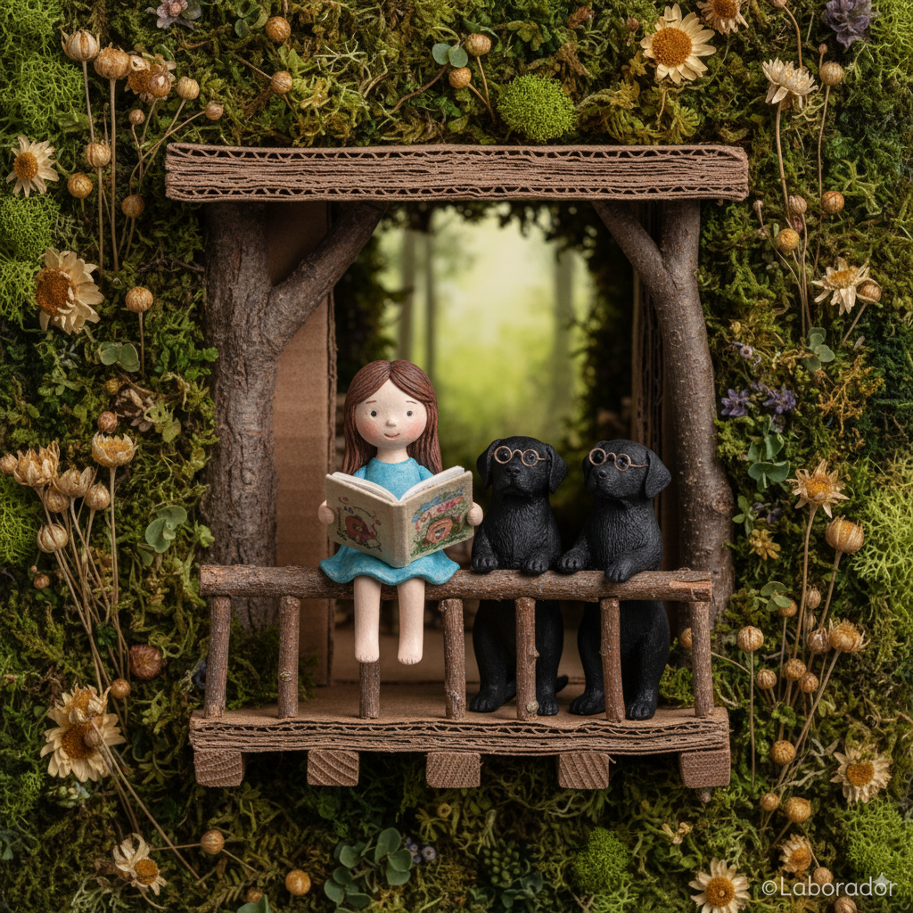
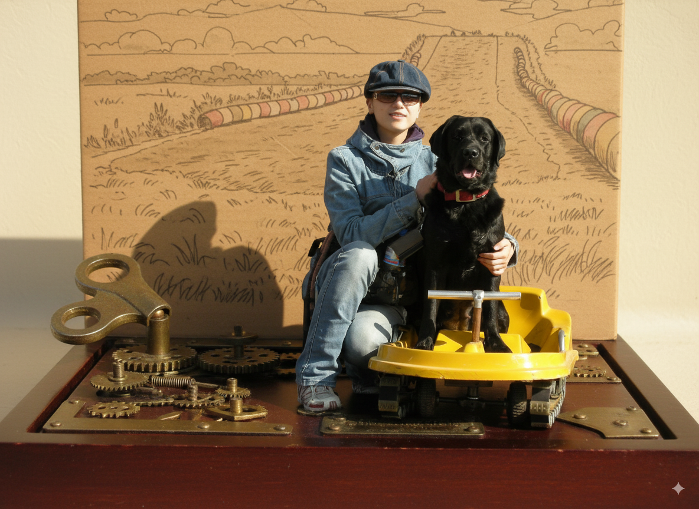
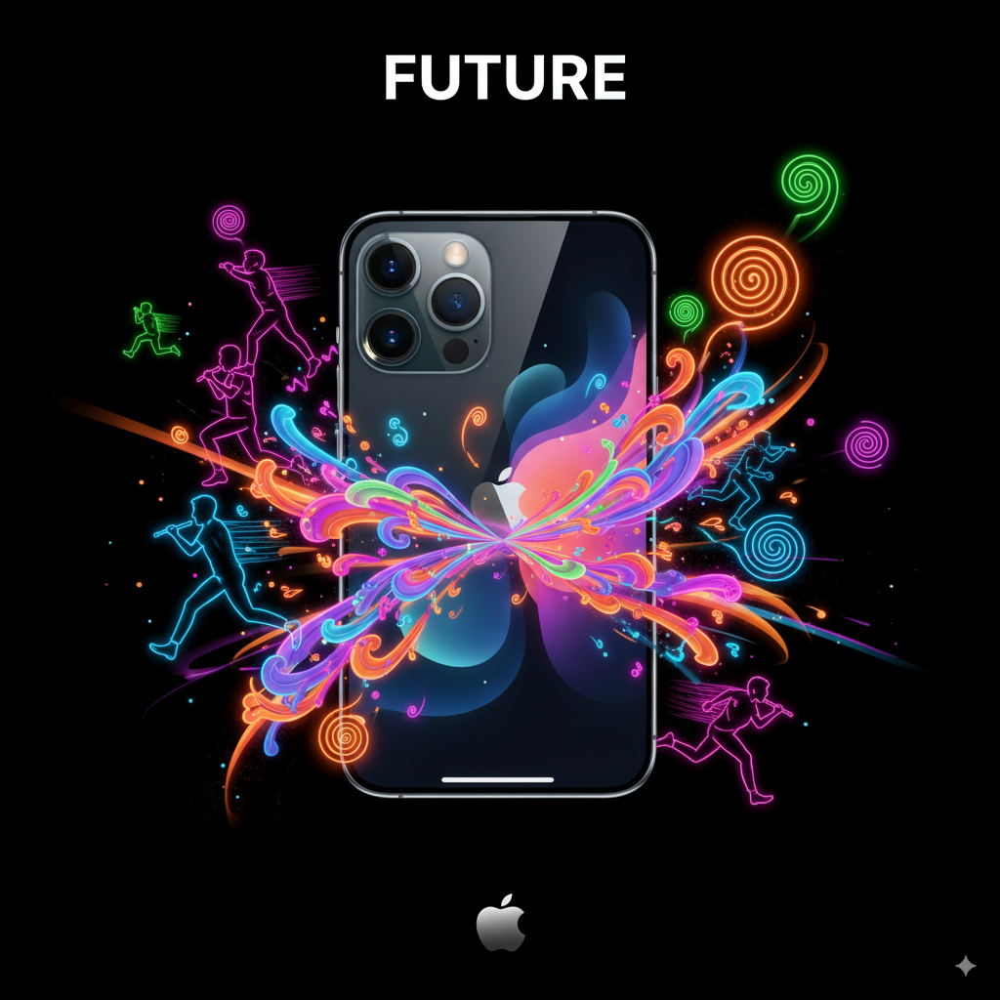
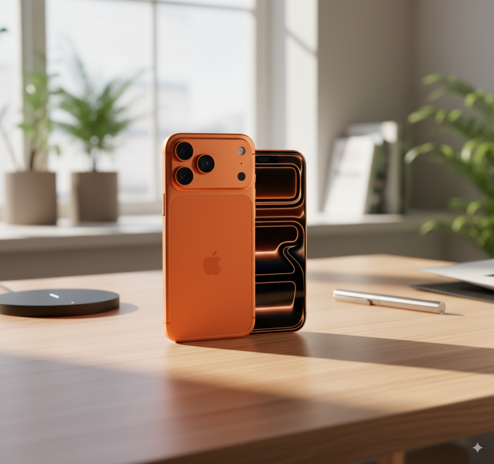

# Gemini

##    Nano banana

###       Prompt

*   [案例 21：可爱微缩场景 ](#prompt-22)
*   [案例 21：洞壁画 ](#prompt-21)
*   [案例 20：选择你的阵营 ](#prompt-20)
*   [案例 19：破碎的真相 ](#prompt-19)
*   [案例 18：清洁琴键的小人物 ](#prompt-18)
*   [案例 17：复古锡玩具立体模型风格 ](#prompt-17)
*   [案例 16：人物戏剧夸张风格 ](#prompt-16)
*   [案例 15：云的艺术 ](#prompt-15)
*   [案例 14：超写实拼图肖像 ](#prompt-14)
*   [案例 13：面包形态 ](#prompt-13)
*   [案例 12：狭窄走廊里奔跑 ](#prompt-12)
*   [案例 11：水流身份 ](#prompt-11)
*   [案例 10：按键删除周一 ](#prompt-10)
*   [案例 9：产品变成纸玻璃 ](#prompt-9)
*   [案例 8：变成一个花盆 ](#prompt-8)
*   [案例 7：创意广告 ](#prompt-7)
*   [案例 6：创意广告 ](#prompt-6)
*   [案例 5：创意广告 ](#prompt-5)
*   [案例 4：创意广告 ](#prompt-4)
*   [案例 3：拉布拉多在公园画画 ](#prompt-3)
*   [案例 2：漫画拼图 (进化论) ](#prompt-2)
*   [案例 1：手绘风格的信息图卡片 ](#prompt-1)

<a id="prompt-22"></a>
#### 案例 22：可爱的微缩场景



**提示词：**

```
{
    "style": "miniature handcrafted diorama",
    "material": "tree branches, cardboard, clay, moss, dried flowers, paper",
    "surface_texture": "organic, rough and varied (wood grain, soft moss, paper texture)",
    "lighting": {
        "type": "soft ambient natural light",
        "intensity": "low to moderate",
        "direction": "diffused overhead",
        "accent_colors": [
            "forest green",
            "earth brown",
            "soft beige",
            "muted pink"
        ],
        "reflections": false,
        "refractions": false,
        "dispersion_effects": false,
        "bloom": false
    },
    "color_scheme": {
        "primary": "natural greens and browns",
        "secondary": "soft neutral tones (cardboard, clay, paper)",
        "highlights": "light falling on the open book and cat’s glasses",
        "rim_light": "subtle natural edge light from the forest opening"
    },
    "background": {
        "color": "natural moss green",
        "vignette": false,
        "texture": "moss and dried floral structure"
    },
    "post_processing": {
        "chromatic_aberration": false,
        "glow": false,
        "high_contrast": false,
        "sharp_details": true,
        "film_grain": false
    },
    "form_composition": {
        "scene_elements": [
            "a small girl sitting on a balcony holding an open miniature book",
            "a cat with glasses observing the book's illustrations",
            "a treehouse made from twigs, cardboard, and clay",
            "balcony and surrounding forest made of moss and dried flowers"
        ],
        "scale": "miniature",
        "theme": "childlike wonder and storytelling in a handcrafted world",
        "visual_metaphor": [
            "curiosity",
            "quiet companionship",
            "imagination in nature"
        ]
    },
    "metadata": {
        "artist": "-Zho-",
        "series": "ZH4O"
    }
}
```

<a id="prompt-21"></a>
#### 案例 21：洞壁画


**提示词：**

```
A cave painting of a [subject], rendered with primitive ochres and charcoal lines on a rough stone wall. Smudged handprints, crude geometry, and flickering torchlight add a primal, ancient mood.
```

<a id="prompt-20"></a>
#### 案例 20：选择你的阵营


**提示词：**

```
A dramatic cinematic scene featuring two rival products placed side by side in a custom-designed environment that visually reflects their identities. The composition should include high contrast lighting, atmospheric effects like mist, fog, or neon glow, and hyper-detailed textures. Incorporate a powerful 3D slogan below or behind the products in bold stylized typography that fits the scene’s mood. The products must reflect the essence of [Brand A] and [Brand B] through color, lighting, and placement. Ultra-realistic, moody tones, 1:1 square format, with sharp depth of field and high resolution.
```

<a id="prompt-19"></a>
#### 案例 19：破碎的真相


**提示词：**

```
A close-up of [SUBJECT 1] holding a mirror shard to their face. The shard reflects a completely different [SUBJECT 2]. Around them, small cracks spread through the air like fractures in invisible glass, warping the space itself.
```

<a id="prompt-18"></a>
#### 案例 18：清洁琴键的小人物


**提示词：**

```
tilt-shift photo of a grand piano keyboard, side view from the left looking along the keys to the right, shallow depth of field, tiny human figures cleaning the piano keys with brushes, cloths, and buckets, whimsical and surreal scene, soft lighting, hyper-detailed, high realism
```

<a id="prompt-17"></a>
#### 案例 17：复古锡玩具立体模型风格



**提示词：**

```
transform it into part of a miniature mechanical scene from the 1940s or ’50s, featuring:

➕Shiny enamel-painted metal characters and objects.
➕Riveted details and visible joints.
➕Illustrated cardboard backdrops with vintage charm.
➕Wind-up toy-style settings with gears and wheels.
```

<a id="prompt-16"></a>
#### 案例 16：人物戏剧夸张风格


**提示词：**

```
A high-resolution vertical Pixar-style 3D character illustration.

Main character:  
Salvador Dalí — depicted as a tall, slim, and slightly exaggerated Pixar-style 3D character.  
Wearing a classic blue shirt, yellow tie, high-waisted plaid trousers with suspenders, and leather shoes.  
His iconic long upturned mustache, slick black hair, sharply arched eyebrows, and slightly eccentric posture.  
Stands with chest out, one hand on hip, head tilted slightly back in his typical theatrical flair.

Background:  
Flat, clean yellow background with subtle surface texture.  
Strong sunlight from top-left casts a distinct and enlarged shadow on the wall behind him.

Key Concept – Shadow as spiritual projection:  
The shadow cast behind him does **not** mirror his body shape.  
Instead, it takes the form of one of his most iconic artworks —  
a surreal melted clock with long dripping arms, inspired by “The Persistence of Memory”.

The melted clock shadow is positioned diagonally, starting from his shoulder,  
stretching wide and low across the yellow wall, surreal and fluid, yet unmistakably symbolic.

This shadow is **Dalí’s legacy made visible** — a symbolic extension of his identity through time, dream, and visual distortion.

Lighting & Rendering:  
Pixar-like rendering with detailed but stylized textures.  
Use subtle filmic grain, soft shadows, and warm color grading.  
Subtle sparkles or light speckles inside the shadow to evoke dreamlike texture.

Typography (top-left corner):  
“Salvador Dalí” in minimalist black sans-serif font, “Dalí” bolded.
```

<a id="prompt-15"></a>
#### 案例 15：云的艺术


**提示词：**

```
A photograph captures a daytime scene with a [SUBJECT/OBJECT] formed by scattered clouds in the sky, positioned above a [LOCATION]
```

<a id="prompt-14"></a>
#### 案例 14：超写实拼图肖像


**提示词：**

```
高分辨率的摄影棚人像，一位惊艳年轻模特「安妮海瑟薇」为主角。她拥有一头顺直的黑发，背景为白色，无任何可辨识的元素。她的脸略微侧转，但目光直视镜头，目光强烈而专注，毫无动摇。

她整张脸由拼图块组成——每一块都清晰可见，边缘整齐，具备细腻的立体感。她轻柔地用手指捏着一块刚从脸颊取下的拼图块，露出其下方一个空洞的黑色虚空。

光线集中且具方向性，几乎不产生阴影，但准确地勾勒出皮肤的轮廓与拼图结构的立体感。整体氛围超现实、精准且高度写实。

顶部有像时尚杂志一样的标题“VOGUE”（在人物后面）
```

<a id="prompt-13"></a>
#### 案例 13：面包形态


**提示词：**

```
A highly realistic sculpture of a [object], made entirely from [bread type] with ultra-detailed texture and color. The surface shows the natural properties of the bread, golden-brown, glossy, flaky or crusty, with visible layers or seeds where appropriate, studio lighting, soft
```

<a id="prompt-12"></a>
#### 案例 12：狭窄走廊里奔跑


**提示词：**

```
A thrilling 3D cartoon scene: [CHARACTER1] runs through a narrow corridor inside [Place], chased at high speed by [CHARACTER2]. Their facial expressions reflect tension and focus, with beads of sweat glistening under dramatic lighting.
```

<a id="prompt-11"></a>
#### 案例 11：水流身份


**提示词：**

```
An ultra-high resolution 8K cinematic render of the [Brand Name] logo, sculpted entirely from flowing crystal-clear water. The liquid forms every curve and edge of the brand’s logo with fluid precision, highlighted by vibrant neon accents inspired by [Brand Name]’s color identity. The background is pitch black, creating sharp contrast and drama. The lighting is dynamic, revealing sharp reflections, glowing edges, and the motion of water as it ripples and splashes. Droplets, shine, and soft glass-like textures give the logo a surreal, luxurious, and futuristic appearance — poster-quality, 1:1 format.
```

<a id="prompt-10"></a>
#### 案例 10：按键删除周一


**提示词：**

```
Detailed photographic image of a miniature person in bed feeling cranky under an opened 'Delete Monday' keyboard keycap, using the inside of the keycap as a mini bedroom complete with the usual bedroom stuff
```

<a id="prompt-9"></a>
#### 案例 9：产品变成纸玻璃


**提示词：**

```
[Product by Brand] in a surreal, minimalist paper-glass style advertisement.
The product is centered, crafted from translucent frosted glass-paper, placed against a clean white or softly tinted background.
Soft cinematic lighting creates gentle contrast and ambient shadows.
A single brand color subtly interacts with the scene through glow, mist, liquid, or foam.
Include a bold, elegant 4-word slogan near the product.
The brand logo appears subtly etched, glowing, or printed in a refined manner.
Vertical or square aspect ratio, ultra-detailed, poster-quality, visually soothing and conceptually refined.
```

<a id="prompt-8"></a>
#### 案例 8：变成一个花盆


**提示词：**

```
A high-quality photo of a cute ceramic [object/animal]-shaped planter with a glossy finish, filled with a variety of vibrant succulents and greenery including a spiky Haworthia, a rosette-shaped Echeveria, and delicate white flowers. The planter has a friendly face and sits on a soft, neutral background with diffused natural lighting, showcasing fine textures and color contrast in a clean, minimalistic composition
```

<a id="prompt-7"></a>
#### 案例 7：创意广告


**提示词：**

```
Planet [Brand name], Year 3025. A distant world shaped entirely by the essence of the brand. The landscapes echo its core identity — from surreal terrains to fantastical weather patterns. Native flora and fauna embody its signature ingredients and aesthetics. Rivers flow with iconic flavors. Architecture is inspired by its packaging and visual language, fused with futuristic technology. The atmosphere is rich in texture, cinematic lighting, and surreal detail. A dreamlike vision of brand identity reimagined as a sci-fi utopia.
```

<a id="prompt-6"></a>
#### 案例 6：创意广告



**提示词：**

```
A high-impact advertisement set against a clean, dark or high-contrast background. A [product] is centered, sharply lit and highly detailed. Around it, surreal, stylized visual [elements] illustrations explode outward (e.g., musicians, runners, curls, sunbursts), vibrant color palette, neon. bold uppercase ad copy at the top that reads [TEXT] and the brand logo at the bottom, modern Ad
```

<a id="prompt-5"></a>
#### 案例 5：创意广告



**提示词：**

```
Use the uploaded product image exactly as it is — do not alter, redraw, or reinterpret any part of it. Follow the guidelines below to create a high-quality, cinematic product presentation:

• Keep the product fully intact — all text, labels, proportions, packaging, and colors must remain exactly the same.
• Use natural or cinematic lighting to enhance the product’s appeal.
• Place the product on a realistic surface that matches its category (e.g. wooden kitchen table for bread, bathroom shelf for skincare, desk for tech gadgets).
• Add complementary props if appropriate (e.g. toast and coffee for bread, leaves and water droplets for skincare) — but do not let them touch or cover the product.
• Use a softly blurred or ambient background (e.g. kitchen, morning window light, minimal interior).
• Include soft shadows and subtle reflections for a grounded, photo-realistic effect.
• Final result should feel premium, natural, and visually appealing — with 100% fidelity to the uploaded product image.
```

<a id="prompt-4"></a>
#### 案例 4：创意广告


**提示词：**

```
A minimalist and creative advertisement set on a clean white background.
A real [Real Object] is integrated into a hand-drawn black ink doodle, using loose, playful lines. The [Doodle Concept] interacts with the object in a clever, imaginative way. Include bold black [Ad Copy] text at the top or center. Place the [Brand Logo] clearly at the bottom. The visual should be clean, fun, high-contrast, and conceptually smart.
```

<a id="prompt-3"></a>
#### 案例 3：拉布拉多在公园画画


**提示词：**

```
创作一个逼真的户外场景，其中一位日本画家正在为拉布拉多画画。场景中，画家坐在画架前，而拉布拉多则坐在对面被描绘（不带任何卡通或动漫风格）。环境应充满生机,自然且阳光明媚——比如公园或热闹的户外场所。整体风格必须完全写实，唯独画家画架上的作品例外：那应该是拉布拉多的吉卜力风格动漫肖像，与周围的写实环境形成强烈对比。请确保画中人物是写实风格，画上的肖像才是动漫风格。
```

<a id="prompt-2"></a>
#### 案例 2：漫画拼图 (进化论)


**提示词：**
```
make a colorful page of manga describing the Darwin’s theory of evolution. add some humor
```

<a id="prompt-1"></a>
#### 案例 1：手绘风格的信息图卡片


**提示词：**
```
创作一张手绘风格的信息图卡片，比例为9:16竖版。卡片主题鲜明，背景为带有纸质肌理的米色或米白色，整体设计体现质朴、亲切的手绘美感。 卡片上方以红黑相间、对比鲜明的大号毛笔草书字体突出标题，吸引视觉焦点。文字内容均采用中文草书，整体布局分为2至4个清晰的小节，每节以简短、精炼的中文短语表达核心要点。字体保持草书流畅的韵律感，既清晰可读又富有艺术气息。 卡片中点缀简单、有趣的手绘插画或图标，例如人物或象征符号，以增强视觉吸引力，引发读者思考与共鸣。 整体布局注意视觉平衡，预留足够的空白空间，确保画面简洁明了，易于阅读和理解。 <h1><span style=""color:red"">「认知」</span>决定上限 <span style=""color:red"">「圈子」</span>决定机会</h1> - 你赚不到「认知」以外的钱， - 也遇不到「圈子」以外的机会。
```
