# Gemini

##    Nano banana

###       Prompt

*   [案例 51：真人和风格对照直出 ](#prompt-51)
*   [案例 50：装饰艺术未来主义 ](#prompt-50)
*   [案例 49：霓虹效果海报 ](#prompt-49)
*   [案例 48：抽象液体排版文字 ](#prompt-48)
*   [案例 47：生物发光 ](#prompt-47)
*   [案例 46：生成电影氛围图 ](#prompt-46)
*   [案例 45：霓虹灯品牌重新构想 ](#prompt-45)
*   [案例 44：微型透明胶囊 ](#prompt-44)
*   [案例 43：半透明玻璃物品ASMR ](#prompt-43)
*   [案例 42：霓虹灯线框 ](#prompt-42)
*   [案例 41：乙烯基玩具 ](#prompt-41)
*   [案例 40：怀旧午后阳光 ](#prompt-40)
*   [案例 39：监控级别的时尚洞察力 ](#prompt-39)
*   [案例 38：透视一切 ](#prompt-38)
*   [案例 37：幽灵形态 ](#prompt-37)
*   [案例 36：创建超现实不可能的图像 ](#prompt-36)
*   [案例 35：符号冲突 ](#prompt-35)
*   [案例 34：磨砂模糊剪影 ](#prompt-34)
*   [案例 33：文艺复兴时期的解刨学研究 ](#prompt-33)
*   [案例 32：品牌产品数字广告 ](#prompt-32)
*   [案例 31：重点线条勾勒 ](#prompt-31)
*   [案例 30：3D超现实场景模型 ](#prompt-30)
*   [案例 29：标志液化 ](#prompt-29)
*   [案例 28：超级动物英雄 ](#prompt-28)
*   [案例 27：终极跨界 ](#prompt-27)
*   [案例 26：不同情绪状态的思想泡泡 ](#prompt-26)
*   [案例 25：可爱干净的底座立体模型 ](#prompt-25)
*   [案例 24：景观洞穴入口的形状 ](#prompt-24)
*   [案例 23：透明容器里有一个微型的3D世界 ](#prompt-23)
*   [案例 22：可爱微缩场景 ](#prompt-22)
*   [案例 21：洞壁画 ](#prompt-21)
*   [案例 20：选择你的阵营 ](#prompt-20)
*   [案例 19：破碎的真相 ](#prompt-19)
*   [案例 18：清洁琴键的小人物 ](#prompt-18)
*   [案例 17：复古锡玩具立体模型风格 ](#prompt-17)
*   [案例 16：人物戏剧夸张风格 ](#prompt-16)
*   [案例 15：云的艺术 ](#prompt-15)
*   [案例 14：超写实拼图肖像 ](#prompt-14)
*   [案例 13：面包形态 ](#prompt-13)
*   [案例 12：狭窄走廊里奔跑 ](#prompt-12)
*   [案例 11：水流身份 ](#prompt-11)
*   [案例 10：按键删除周一 ](#prompt-10)
*   [案例 9：产品变成纸玻璃 ](#prompt-9)
*   [案例 8：变成一个花盆 ](#prompt-8)
*   [案例 7：创意广告 ](#prompt-7)
*   [案例 6：创意广告 ](#prompt-6)
*   [案例 5：创意广告 ](#prompt-5)
*   [案例 4：创意广告 ](#prompt-4)
*   [案例 3：拉布拉多在公园画画 ](#prompt-3)
*   [案例 2：漫画拼图 (进化论) ](#prompt-2)
*   [案例 1：手绘风格的信息图卡片 ](#prompt-1)

<a id="prompt-51"></a>
#### 案例 51：真人和风格对照直出


**提示词：**
```
创建图片 {
"title": "真人 × 动画对照创意作品",
"author": "ZH4O",
"description": "一张利用垂直拼贴与留白，将同一人物的照片与插画并置的创意作品，突出媒介在语言、质感与情绪上的对比。",
"layout": {
"orientation": "vertical",
"photo": {
"position": "top-left",
"aspect_ratio": "3:4",
"style": "street photo",
"camera_angle": "eye-level, slightly tilted left",
"lens": "mild wide-angle",
"background_elements": ["road", "store signs", "urban perspective lines"]
},
"illustration": {
"position": "bottom-right",
"scale": "slightly larger",
"composition": "2/3 body, medium shot",
"pose": "similar to photo",
"motion_direction": "curve extending top-right",
"balance": "forms visual counterpoint to photo"
},
"background": {
"color": "pure white",
"purpose": "breathing space, minimalism, focus"
}
},
"color_and_lighting": {
"photo": {
"dominant_tones": "neutral warm gray",
"light_source": "natural light",
"highlight_effects": "soft overexposure, summer glare",
"key_elements": ["white dress with gauzy texture", "cement, scooter, wall as low-saturation backdrop"]
},
"illustration": {
"style": "cartoon, simplified color blocks",
"skin": "warm orange with soft pink blush",
"hair": "deep brown, almost flat color",
"dress": "white with minimal shading to indicate folds",
"contrast": "high, compressed tonal range",
"focus": "sharp character silhouette"
},
"background": {
"function": "isolates media contrast, emphasizes character and action"
}
},
"style_comparison_and_details": {
"photo": {
"gesture": "hand shading forehead",
"expression": "wide eyes, slightly pouting lips, playful with a hint of exasperation",
"context": "spontaneous, tight alley space, loose hair movement"
},
"illustration": {
"design_inspiration": "Disney/CalArts style",
"features": ["large eyes", "wide cheekbones", "pointy chin", "freckles", "blush"],
"motion_effects": "exaggerated hair and skirt movement",
"line_quality": "fluid and bouncy",
"reproduction": "pose, expression, dress bow, forehead hair accurately translated"
}
},
"visual_and_communication_value": {
"themes": ["reality to animation transformation", "character design", "personified self-portrait"],
"usability": ["IP development", "illustration demo", "fashion branding"],
"design_elements": ["space for text/logo", "poster/social media-ready"],
"narrative_strength": "uses white space as frame, pose as link, and medium contrast as core interest",
"tone": "light, stylish, socially shareable"
}
}
```
**中文提示词：**
```
创建图片 {
“title”： “真人 × 动画对照创意作品”，
“author”： “ZH4O”， ZH4O“， ZH4O
“description”： “一张利用垂直拼贴与留白，将同一人物的照片与插画并置的创意作品，突出媒介在语言、质感与情绪上的对比。",
“布局”： {
“orientation”： “垂直”，
“照片”： {
“position”： “左上角”，
“aspect_ratio”： “3：4”，
“style”： “街拍”，
“camera_angle”： “与眼睛齐平，略微向左倾斜”，
“lens”： “轻度广角”，
“background_elements”： [“road”， “shop signs”， “urban perspective lines”]
},
“插图”： {
“position”： “右下角”，
“scale”： “稍大”，
“composition”： “2/3 体，中镜头”，
“pose”： “与照片相似”，
“motion_direction”： “曲线向右延伸”，
“balance”： “形成与照片的视觉对位”
},
“背景”： {
“color”： “纯白色”，
“purpose”： “呼吸空间、极简主义、专注”
}
},
“color_and_lighting”： {
“照片”： {
“dominant_tones”： “中性暖灰色”，
“light_source”： “自然光”，
“highlight_effects”： “柔和的过度曝光，夏季眩光”，
“key_elements”： [“带有薄纱纹理的白色连衣裙”， “水泥、滑板车、墙壁作为低饱和度背景”]
},
“插图”： {
“style”： “卡通，简化的色块”，
“skin”： “暖橙色带柔和的粉红色腮红”，
“hair”： “深棕色，几乎是单色”，
“dress”： “白色，带有最小阴影以表示褶皱”，
“contrast”： “高、压缩的色调范围”，
“focus”： “清晰的角色剪影”
},
“背景”： {
“function”： “隔离媒体对比度，强调角色和动作”
}
},
“style_comparison_and_details”： {
“照片”： {
“gesture”： “手部阴影额头”，
“expression”： “睁大眼睛，微微撅起嘴唇，俏皮中带着一丝恼怒”，
“context”： “自发、狭窄的小巷空间、松散的头发移动”
},
“插图”： {
“design_inspiration”： “Disney/CalArts 风格”，
“features”： [“大眼睛”， “宽颧骨”， “尖下巴”， “雀斑”， “腮红”]，
“motion_effects”： “夸张的头发和裙子运动”，
“line_quality”： “流体和弹性”，
“reproduction”： “姿势、表情、裙子蝴蝶结、额头头发准确翻译”
}
},
“visual_and_communication_value”： {
“themes”： [“从现实到动画的转变”， “角色设计”， “拟人化自画像”]，
“可用性”： [“IP 开发”， “插图演示”， “时尚品牌”]，
“design_elements”： [“文本/徽标空间”， “海报/社交媒体就绪”]，
“narrative_strength”： “使用空白作为框架，使用姿势作为链接，使用中等对比度作为核心兴趣”，
“tone”： “轻盈、时尚、社交分享”
}
}
```

<a id="prompt-50"></a>
#### 案例 50：装饰艺术未来主义


**提示词：**
```
create image with 1:1 ratio 
[Brand] ad. Ultra-high-detail product photo in a fusion of Art Deco and Futurism. The product rest on platforms.  Background features stylized Art Deco skyscraper silhouettes morphing into Futurist speed lines, forming a diagonal left-to-right composition. Surfaces use brand Core Material and faceted glass with ambient lighting in Brand Color theme.  The product evoking motion and kinetic optimism. Dramatic low-angle lighting enhances reflections, with subtle vapor trails in the background.  Small logo on the bottom, and a tiny slogan beneath
```
**中文提示词：**
```
以 1：1 的比例创建图像
[品牌] 广告。融合了装饰艺术和未来主义的超高细节产品照片。该产品位于平台上。 背景以风格化的装饰艺术摩天大楼剪影转变为未来主义的速度线条，形成从左到右的对角线构图。表面使用品牌核心材料和多面玻璃，并在品牌颜色主题中使用环境照明。 该产品唤起了动感和动感的乐观主义。戏剧性的低角度照明增强了反射，背景中带有微妙的蒸汽痕迹。 底部有小标志，下面有一个小标语
```

<a id="prompt-49"></a>
#### 案例 49：霓虹效果海报

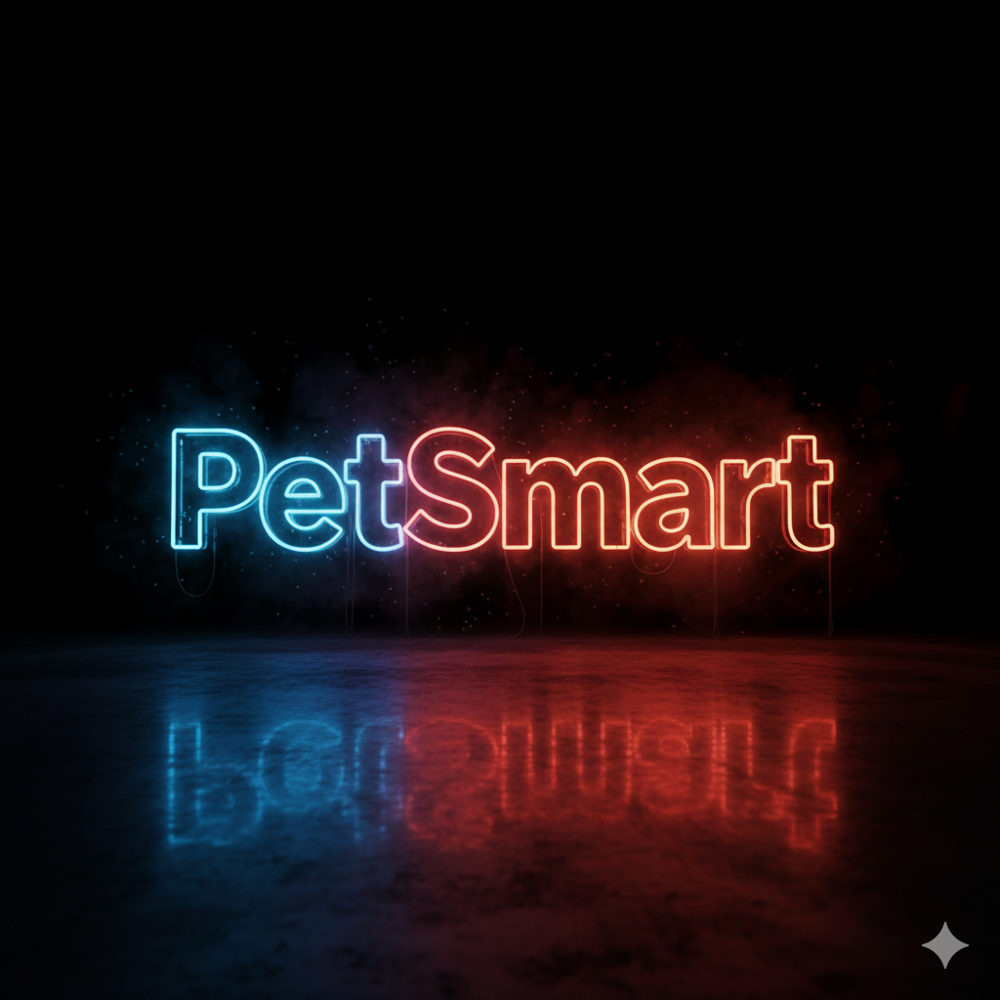

**提示词：**
```
[object] in neon glow cinematic style, surrounded by soft fog, with glowing edges and realistic reflections, dark background, volumetric lighting, high detail, strong color contrast, cinematic tone.
```
**中文提示词：**
```
"PetSmart" represented as a glowing neon cinematic scene. The logo and elements shine with vibrant blue and warm red light, symbolizing energy, care, and companionship. The word "PetSmart" appears in bold luminous letters with soft glowing edges, surrounded by subtle particles and mist. The scene features gentle reflections on a dark glossy surface, realistic lighting, volumetric glow, and a calm atmosphere that feels both futuristic and welcoming. Studio render style, high detail, cinematic composition, 3:2 aspect ratio.
```

<a id="prompt-48"></a>
#### 案例 48：抽象液体排版文字

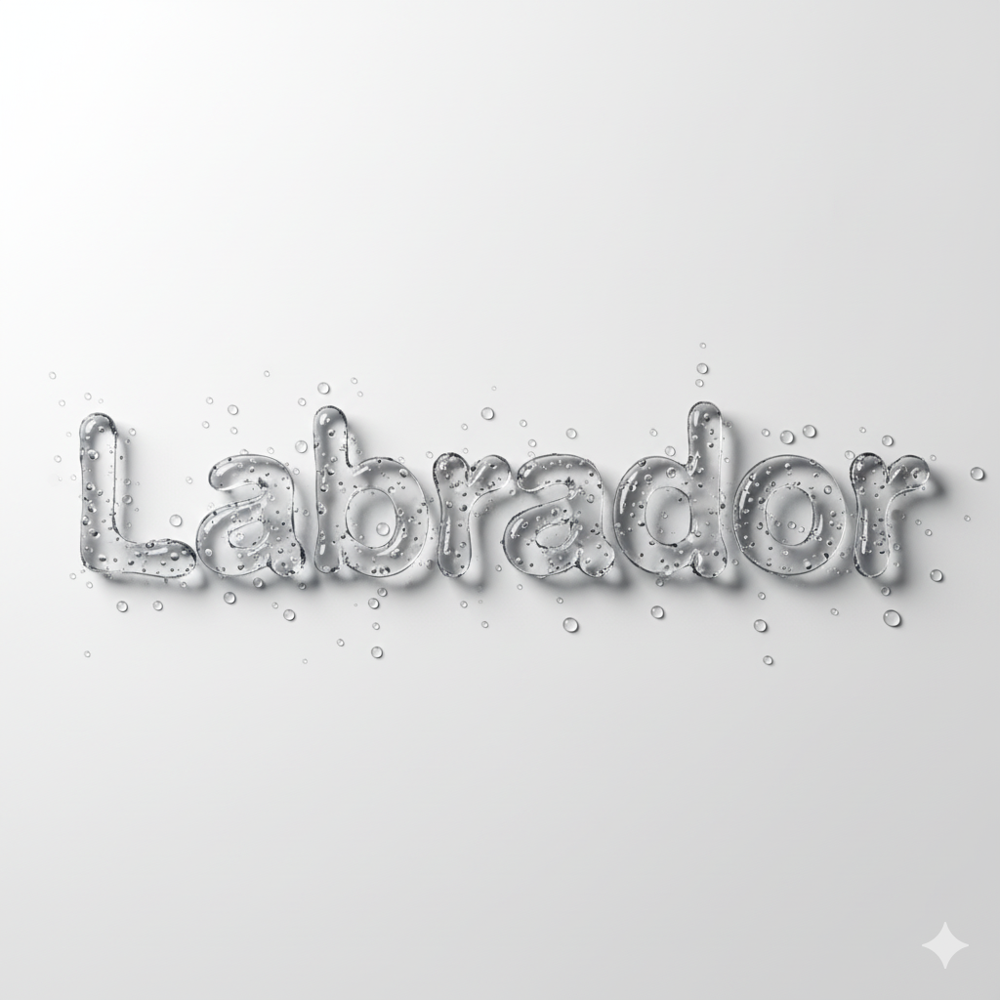

**提示词：**
```
Abstract liquid typography spelling "text", made of thick, transparent water-gel with realistic refraction and soft shadows. Each letter appears sculpted from droplets with surface tension, smooth curves, and light reflections. Water droplets scattered on the surface, minimal background, hyper-realistic lighting, photorealistic render
```
**中文提示词：**
```
抽象液体排版拼写“text”，由厚实、透明的水凝胶制成，具有逼真的折射和柔和的阴影。每个字母都由具有表面张力、平滑曲线和光反射的水滴雕刻而成。散落在表面上的水滴、极小的背景、超逼真的照明、照片级逼真的渲染
```

<a id="prompt-47"></a>
#### 案例 47：生物发光

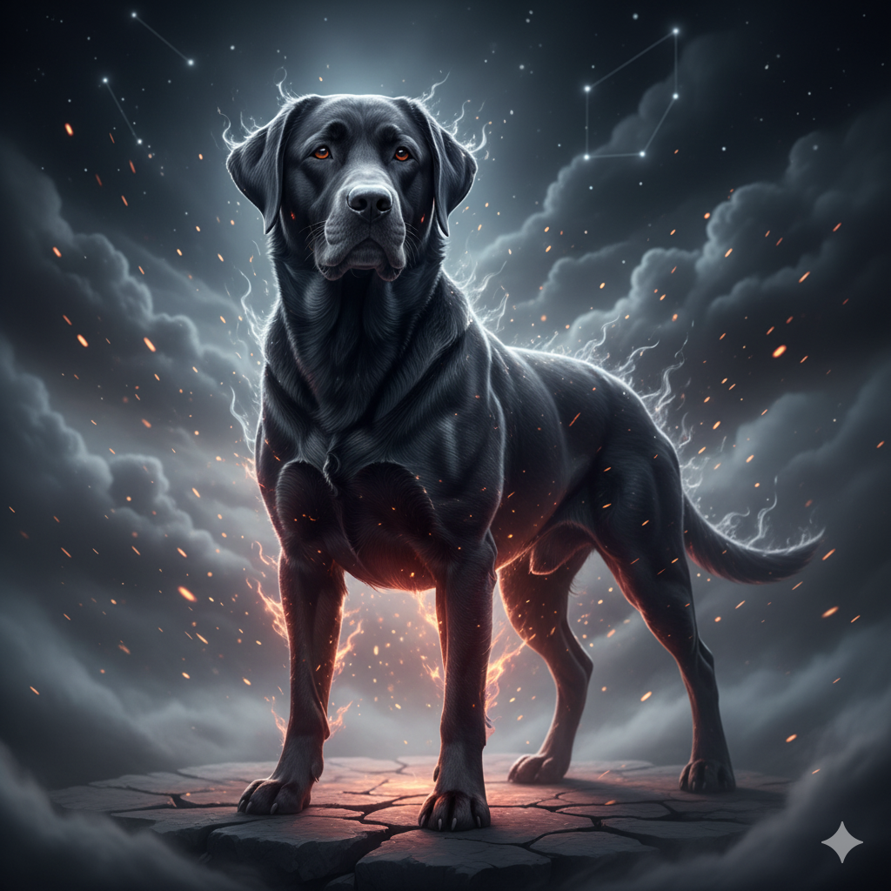

**提示词：**
```
[SUBJECT] depicted as a Mythical Creature Luminescence, with glowing edges that accentuate the fantastical and legendary aspects. Utilize [COLOR1] and [COLOR2] to enhance the mythical and enchanting qualities.
```
**中文提示词：**
```
[对象] 被描绘成一个神话生物的发光，发光的边缘突出了奇幻和传奇的一面。利用 [COLOR1] 和 [COLOR2] 来增强神话和迷人的品质。
```
**提示词：**
```
A black Labrador depicted as a divine guardian creature radiating strength and grace. Its dark fur gleams under soft silver highlights, with faint crimson and fiery orange light emanating from within, symbolizing sacred power. The edges of its body glow subtly like silver fire, illuminating the misty surroundings. The atmosphere is majestic and reverent, filled with drifting sparks and divine energy. Realistic lighting, detailed texture, cinematic tone, 3:2 aspect ratio.
```
**中文提示词：**
```
一只被描绘成神圣守护者的黑色拉布拉多，全身黑毛在柔和的银光下闪耀，体内似乎散发出深红与橙色的神圣火光。它的轮廓泛着银焰般的光辉，照亮了朦胧的背景，气氛庄严而神秘，周围漂浮着火星般的光点。画面光影真实、质感细腻、具有电影级构图感。
```

<a id="prompt-46"></a>
#### 案例 46：生成电影氛围图


**提示词：**

```
Cinematic still, A [ description of the character or action scene], with a [ background/environment], a dynamic angle, a [light effect or lighting condition], motion blur, high-resolution photography, a cinematic scene, cinematic lighting, and high contrast.
```
**中文提示词：**
```
电影静止图像、具有 [ 背景/环境] 、动态角度、[光效或照明条件]、运动模糊、高分辨率摄影、电影场景、电影照明和高对比度。
```

<a id="prompt-45"></a>
#### 案例 45：霓虹灯品牌重新构想


**提示词：**

```
Create a cinematic advertisement for “[PRODUCT NAME]” — use bioluminescent neon lighting that matches the brand’s visual identity — place the product at the center of the scene with surreal, minimalistic composition — automatically adapt the environment to reflect the product’s nature (e.g. tech, fragrance, luxury, automotive, beauty) — integrate the brand’s actual logo in high fidelity — generate a short, powerful 3-word tagline that fits the brand’s tone — long exposure lighting effects — dramatic shadows — ultra-sharp focus — dark or ambient background — aspect ratio 2:3 or 1:1 — ultra-HD resolution
```
**中文提示词：**
```
为“[产品名称]”创建电影广告 — 使用与品牌视觉形象相匹配的生物发光霓虹灯 — 以超现实、简约的构图将产品置于场景中心——自动调整环境以反映产品的性质（例如科技、香水、奢侈品、汽车、美容） — 以高保真度集成品牌的实际徽标 — 生成一个简短的、 符合品牌基调的强大 3 字标语 — 长时间曝光、灯光效果 — 戏剧性的阴影 — 超清晰焦点 — 黑暗或环境背景 — 纵横比 2：3 或 1：1 — 超高清分辨率
```

<a id="prompt-44"></a>
#### 案例 44：微型透明胶囊

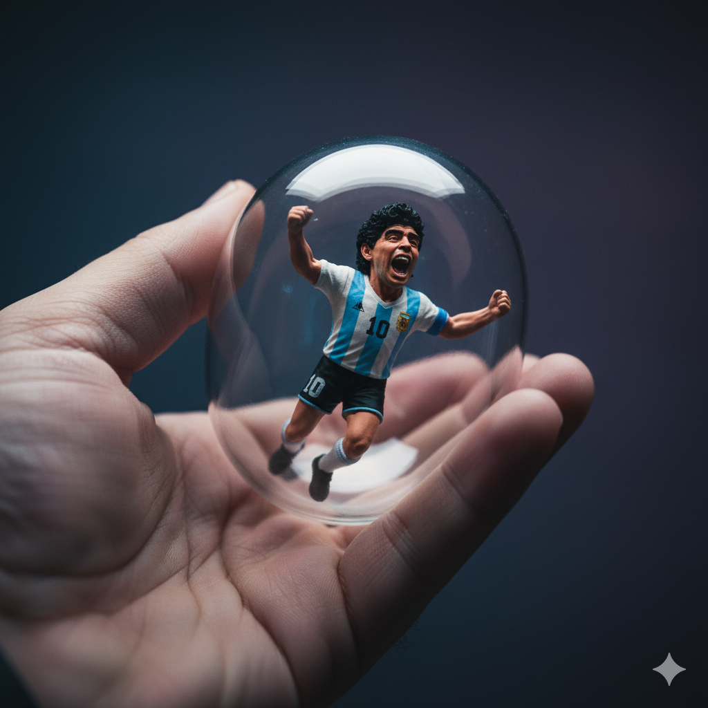

**提示词：**

```
Close-up, A hand holding a transparent capsule, inside it is a miniature model of [character name], wearing [their iconic outfit and accessories]. The character is posed in a [specific, expressive or dynamic pose], interacting with the inner surface of the capsule, as if they are frozen or confined inside. Hyper-realistic, cinematic, studio lighting setup, photographed with a macro lens.
```
**中文提示词：**
```
特写，一只手拿着一个透明的胶囊，里面是一个 [角色名称] 的微型模型，穿着 [他们的标志性服装和配饰]。角色以 [特定、富有表现力或动态的姿势] 摆姿势，与胶囊的内表面互动，就好像他们被冻结或限制在里面一样。超逼真、电影般的工作室照明设置，使用微距镜头拍摄。
```

<a id="prompt-43"></a>
#### 案例 43：半透明玻璃物品ASMR

**说明：在几秒钟内使用 GPT-4o 将任何东西重新设计成半透明玻璃，然后使用这些图像创建 ASMR 视频**


**提示词：**

```
Hyper-realistic [fruit name] made of translucent glass, smooth, rounded surface with fine air bubbles inside, placed on a clean surface, sharp lighting with strong reflections and highlights, minimal background, photorealistic, glossy texture, 3D render style, crystal-like appearance, soft shadows, macro photography
```
**中文提示词：**
```
由半透明玻璃制成的超写实 [水果名称]，光滑、圆润的表面，内部有细小的气泡，放置在干净的表面上，具有强烈反射和高光的清晰照明，最小的背景，照片级写实，有光泽的纹理，3D 渲染样式，水晶般的外观，柔和的阴影，微距摄影
```

<a id="prompt-42"></a>
#### 案例 42：霓虹灯线框

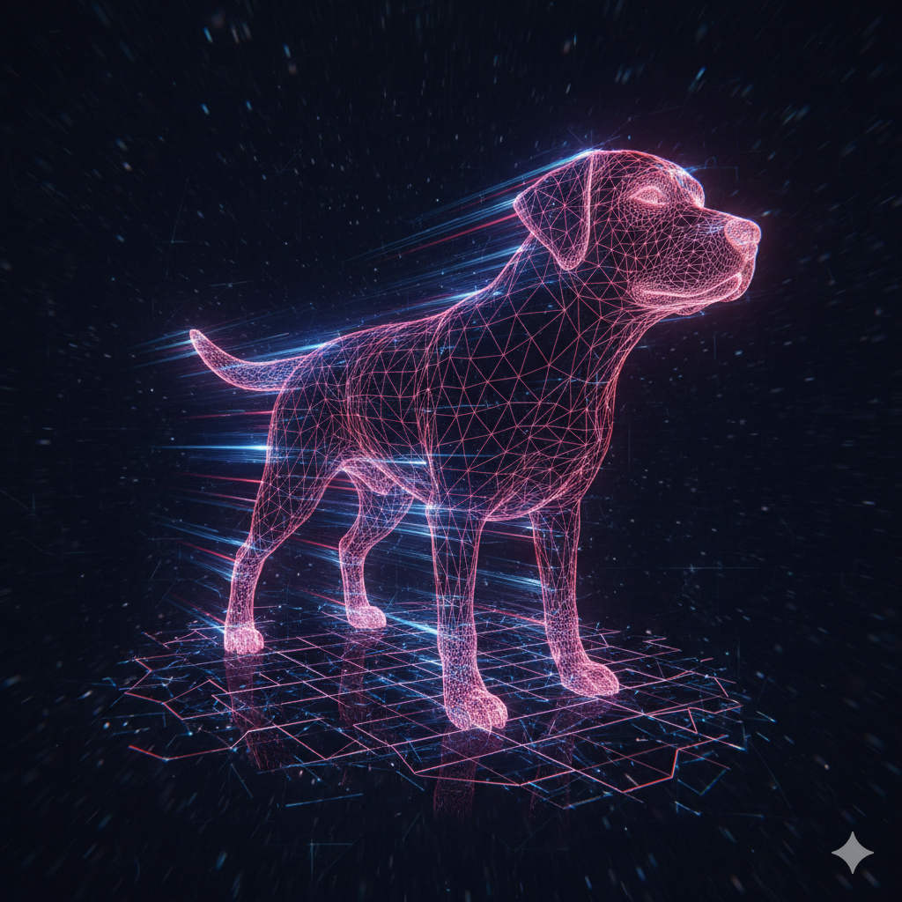

**提示词：**

```
A neon wireframe visualization of a [subject], traced in glowing [color1] and [color2] vector lines. Suspended in a digital void, the figure is surrounded by speed trails, motion blur, and shifting geometric shadows, evoking a sense of kinetic energy and futuristic momentum.
```
**中文提示词：**
```
[主体] 的霓虹灯线框可视化，以发光的 [color1] 和 [color2] 矢量线描摹。这个人物悬浮在数字虚空中，周围环绕着速度轨迹、运动模糊和不断变化的几何阴影，唤起了一种动能和未来主义的动力。
```

<a id="prompt-41"></a>
#### 案例 41：乙烯基玩具


**提示词：**

```
A comic-style caricature illustration of [subject], with an oversized head and expressive eyes, rendered in a hyper-realistic vinyl toy aesthetic. The character features exaggerated proportions, glossy textures, and playful details, blending caricature art with collectible figure charm.
```
**中文提示词：**
```
[主题]的漫画风格漫画插图，具有超大的头部和富有表现力的眼睛，以超逼真的乙烯基玩具美学呈现。该角色具有夸张的比例、光滑的纹理和俏皮的细节，将漫画艺术与收藏人物魅力融为一体。
```

<a id="prompt-40"></a>
#### 案例 40：怀旧午后阳光


**提示词：**

```
a pillow fort in the backyard, shaded by a big old tree. Sunlight filters through the leaves, and a young boy and his golden retriever naps beside a tray of lemonade and cookies. Wind chimes tinkle gently in the breeze. Warm afternoon light, playful and nostalgic, children's book illustrated feeling
```
**中文提示词：**
```
后院的一座枕头堡，被一棵大老树遮蔽。阳光透过树叶洒进来，一个小男孩和他的金毛猎犬在一盘柠檬水和饼干旁边打盹。风铃在微风中轻轻地叮叮当当。温暖的午后阳光，俏皮又怀旧，童书图画情怀
```

<a id="prompt-39"></a>
#### 案例 39：监控级别的时尚洞察力

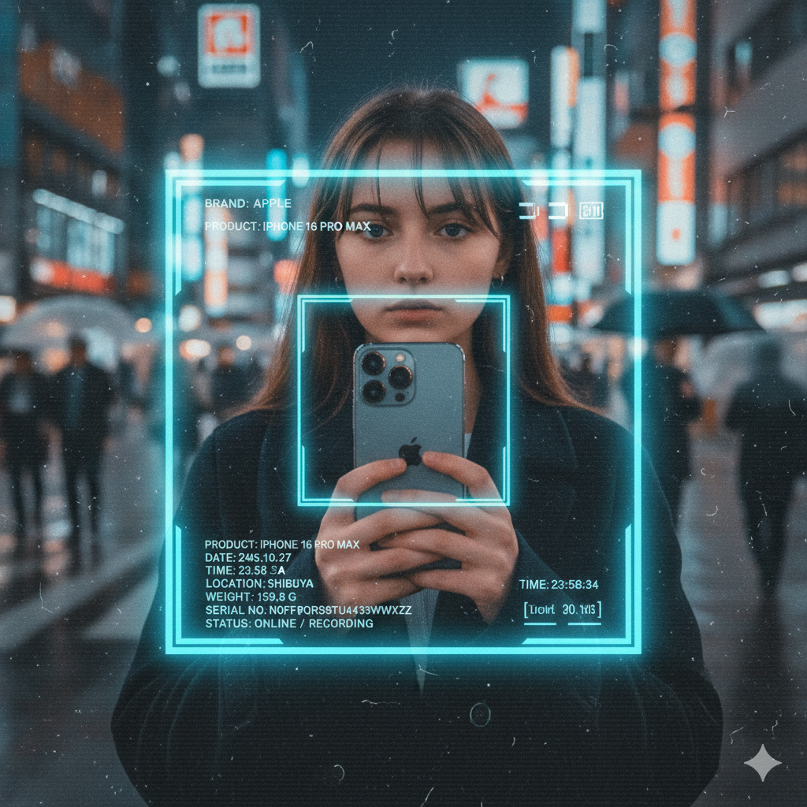

**提示词：**

```
Create image with 1:1 ratio A cctv footage, 
A closed up view of focus woman carrying  [brand] [product] on street, a square zoomed window on the product, sci fi analyzing overlay UI with infos like brand name, date, time, location name, in brand color monospaced font, product name, width, height, weight, etc, vhs effect, glitch effect, film grainy
```
**中文提示词：**
```
创建比例为 1：1 的图像闭路电视素材，
焦点女性在街上抬着 [品牌] [产品] 的特写视图，产品上的方形缩放窗口，科幻分析叠加 UI，其中包含品牌名称、日期、时间、位置名称、品牌颜色等宽字体、产品名称、宽度、高度、粗细等信息、vhs 效果、毛刺效果、胶片颗粒感
```

<a id="prompt-38"></a>
#### 案例 38：透视一切


**提示词：**

```
a fully transparent [product] made of ultra-clear iridescent glass, showing all internal components in photorealistic detail. The outer shell is glossy, refracts subtle rainbow colors, and reveals the product’s structure and mechanics. Scene lit with high-Kelvin studio lighting (~7000K) on a neutral background. The product maintains its real proportions, materials, and branding.
```
**中文提示词：**
```
由超透明虹彩玻璃制成的完全透明 [产品]，以逼真的细节展示所有内部组件。外壳有光泽，折射出微妙的彩虹色，并揭示产品的结构和机械。在中性背景上使用高开尔文工作室照明 （~7000K） 照亮的场景。该产品保持其真实的比例、材料和品牌。
```

<a id="prompt-37"></a>
#### 案例 37：幽灵形态


**提示词：**

```
A hyper-realistic photograph of a [SUBJECT] entirely made from a single, semi-rigid transparent material that drapes and folds like sheer plastic or molten glass. The object is fully recognizable in shape, yet ghostly and fluid, as if sculpted from air and frozen in motion. Set in a moody, industrial interior with aged concrete walls and diffused daylight from metal-barred windows. The lighting gently highlights the reflections, edges, and flowing curves of the transparent form. Dreamlike, minimalist, surreal design aesthetic.
```
**中文提示词：**
```
一张 [SUBJECT] 的超写实照片，完全由单一的、半刚性的透明材料制成，像纯粹的塑料或熔融玻璃一样悬垂和折叠。这个物体的形状是完全可识别的，但又幽灵般流动，仿佛从空气中雕刻出来，在运动中冻结。坐落在喜怒无常的工业室内，拥有老化的混凝土墙和从金属栅栏窗户射出的日光。灯光柔和地突出了透明形式的反射、边缘和流动曲线。梦幻般的、极简主义的、超现实主义的设计美学。
```

<a id="prompt-36"></a>
#### 案例 36：创建超现实不可能的图像

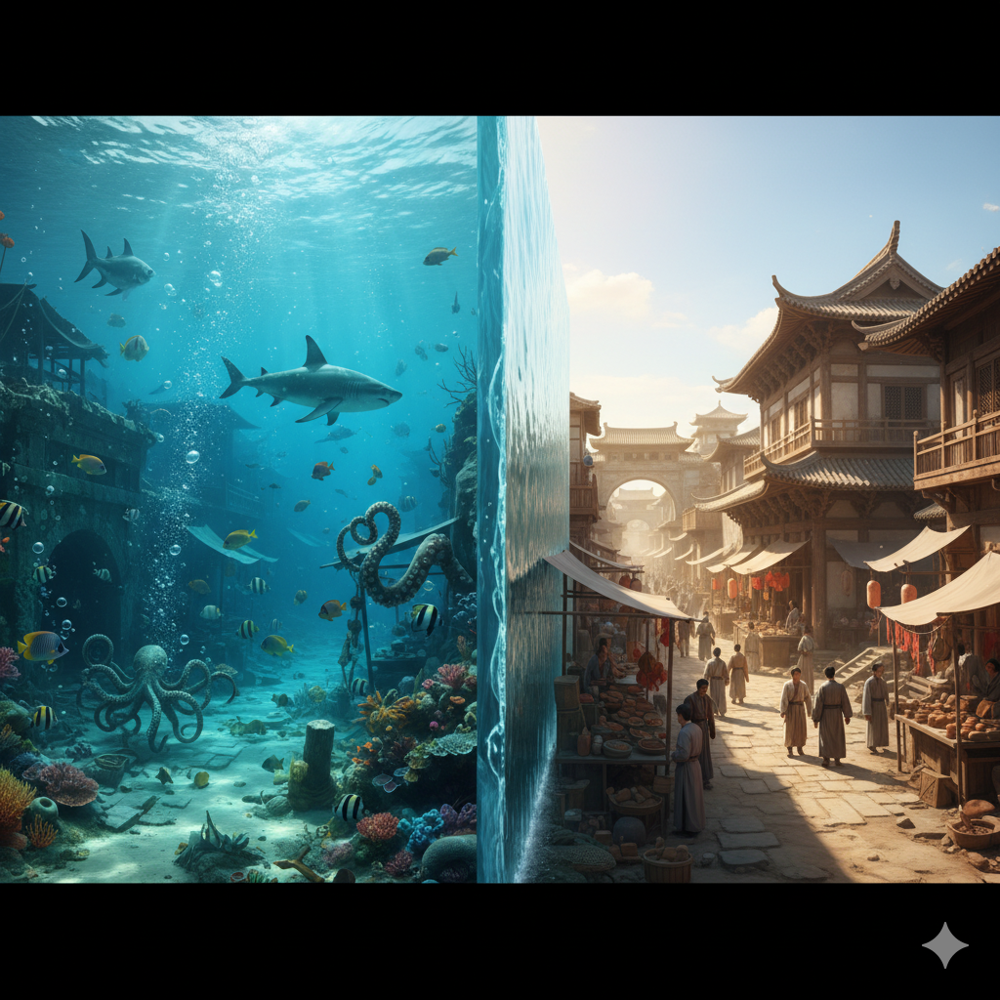

**提示词：**

```
Create a surreal split-scene where the left half is an underwater version of a [SCENE], filled with marine life (fish, sharks, octopus, coral, bubbles), and the right half is the regular dry version of the same [SCENE] continuing naturally. Separate the two halves with a vertical wall of water held by a magical force, as if the ocean is cut in half. The scene should align across both sides, maintaining realism while showcasing the impossible scenario. Emphasize lighting and reflection differences between water and air environments.
```
**中文提示词：**
```
创建一个超现实的分割场景，其中左半部分是 [SCENE] 的水下版本，充满了海洋生物（鱼、鲨鱼、章鱼、珊瑚、气泡），右半部分是同一 [SCENE] 的常规干燥版本自然延续。用一道由神奇力量支撑的垂直水墙将两半分开，仿佛海洋被切成两半。场景应在两侧对齐，在展示不可能的场景的同时保持真实感。强调水和空气环境之间的光照和反射差异。
```

<a id="prompt-35"></a>
#### 案例 35：符号冲突


**提示词：**

```
A surreal yet hyper-realistic image in levitation photography style, where elements of [subject] float chaotically and randomly above an outstretched hand, interwoven with symbolic elements that directly oppose it.

The background forms dynamically to visually embody the symbolism of the subject and its opposite, through blurred or abstract details that reflect either tension or harmony between the two—like a mirror inside a dream.

Each element floats at a unique angle and varying distance.

Background: Shifts according to the subject and its opposite

Lighting: Soft cinematic with dreamy shadows

Style: Hyper-realistic + Levitation Photography + Fantasy

Aspect Ratio: 1:1
```
**中文提示词：**
```
悬浮摄影风格的超现实而超现实的图像，其中 [主体] 的元素混乱而随机地漂浮在伸出的手上方，与直接对立的象征性元素交织在一起。

背景动态形成，通过模糊或抽象的细节在视觉上体现主题及其对立面的象征意义，这些细节反映了两者之间的张力或和谐——就像梦中的镜子。

每个元素都以独特的角度和不同的距离漂浮。

背景：根据主体及其对立面而变化

照明：柔和的电影感，带有梦幻般的阴影

风格：超写实 + 悬浮摄影 + 奇幻

长宽比：1：1
```

<a id="prompt-34"></a>
#### 案例 34：磨砂模糊剪影

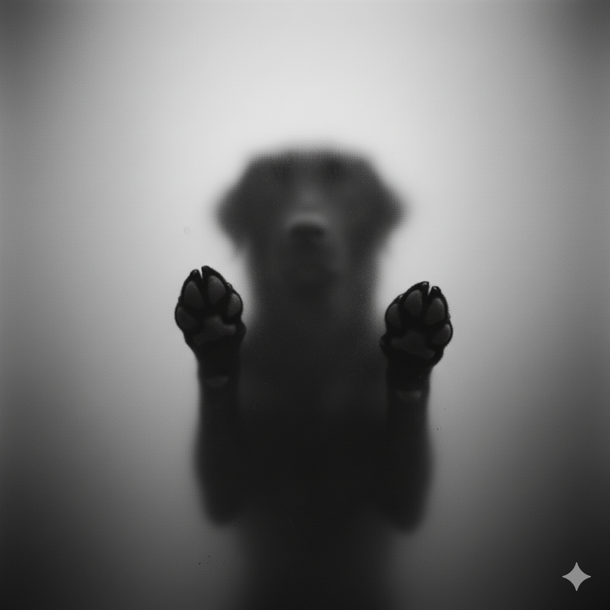

**提示词：**

```
A black and white photograph shows the blurred silhouette of a [SUBJECT] behind a frosted or translucent surface. The [PART] is sharply defined and pressed against the surface, creating a stark contrast with the rest of the hazy, indistinct figure. The background is a soft gradient of gray tones, enhancing the mysterious and artistic atmosphere
```
**中文提示词：**
```
一张黑白照片显示了磨砂或半透明表面后面 [SUBJECT] 的模糊剪影。[PART] 轮廓分明，压在表面，与朦胧、模糊的人物的其余部分形成鲜明对比。背景是灰色调的柔和渐变，增强了神秘和艺术的氛围
```

<a id="prompt-33"></a>
#### 案例 33：文艺复兴时期的解刨学研究

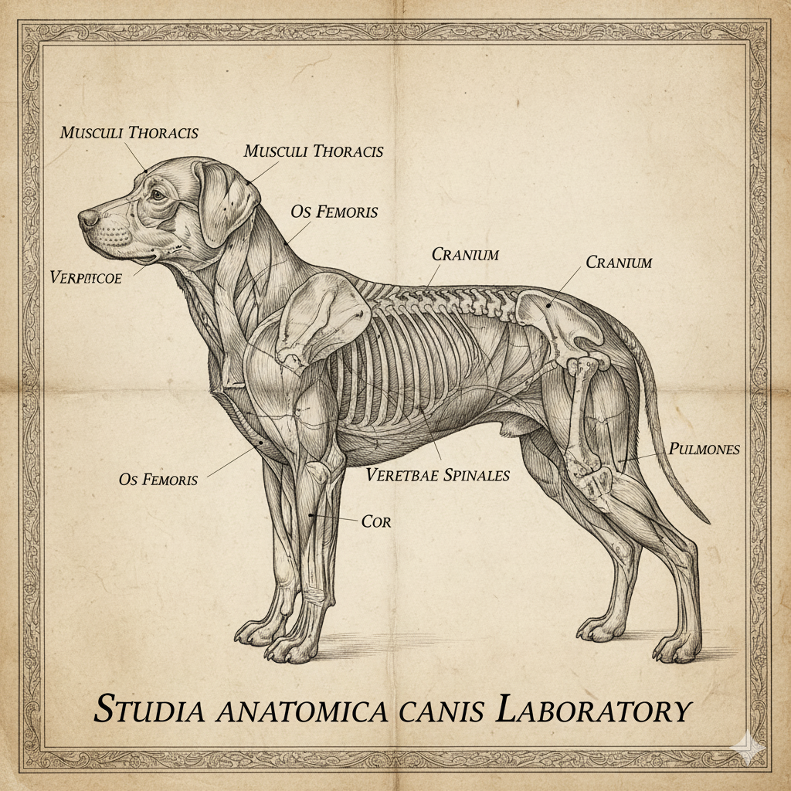

**提示词：**

```
A Renaissance anatomical study of a [subject], meticulously illustrated in fine graphite and ink cross-hatching, with transparent tissue overlays revealing skeletal and muscular systems. Labeled in elegant Latin calligraphy and presented on aged parchment, the composition exudes scholarly precision and classical beauty.
```
**中文提示词：**
```
文艺复兴时期对 [主题]的解剖学研究，用精细的石墨和墨水交叉影线精心说明，透明的组织覆盖层露出骨骼和肌肉系统。该作品以优雅的拉丁书法标记，并呈现在古老的羊皮纸上，散发着学术的精确和古典之美。
```

<a id="prompt-32"></a>
#### 案例 32：品牌产品数字广告


**提示词：**

```
A hyper-realistic, ultra-detailed 3D digital advertisement showcasing a Pepsi can bursting open at its center, sending a refreshing splash of carbonated cola into the air, with effervescent bubbles and ice cubes flying outward. The can’s metallic surface is rendered with sharp, photorealistic textures, complete with condensation droplets, light reflections, and subtle scratches. Surrounding the scene are cold, translucent ice shards and a twist of lemon zest caught mid-motion, adding a vibrant contrast. The background features a deep electric blue gradient with cinematic volumetric lighting and soft lens flares. Green mint leaves and misty vapors add a refreshing, natural accent. The entire scene is rendered in 4K UHD using advanced global illumination, HDR lighting, and realistic shadows. The composition evokes premium beverage advertising with a dramatic tone, created using tools like Unreal Engine + Octane Render for maximum visual impact.
```
**中文提示词：**
```
一个超现实的、超详细的 3D 数字广告，展示百事罐在中心爆裂，喷出清凉的碳酸可乐，气泡和冰块飞溅。罐子的金属表面具有锐利的、写实的纹理，包括冷凝水滴、光线反射和细微的划痕。场景周围是冷的透明冰片和柠檬皮在空中飞舞，增添了鲜明的对比。背景是深电光渐变，带有电影级体积照明和柔和的镜头光晕。绿色薄荷叶和雾气增添了清凉的自然点缀。整个场景使用高级全局光照、HDR 照明和真实的阴影在 4K UHD 下渲染。构图以高端饮料广告的戏剧性基调呈现，使用 Unreal Engine + Octane Render 等工具以达到最大的视觉冲击力。
```

<a id="prompt-31"></a>
#### 案例 31：重点线条勾勒


**提示词：**

```
A digital illustration of a [SUBJECT], portrayed with a network of glowing clean pristine blue lines outlining its anatomy. The image is set against a dark background, highlighting the [SUBJECT] form and features. A specific area such as [PART] is emphasized with a red glow to indicate a point of interest or significance. The style is both educational and visually captivating, designed to resemble an advanced imaging technique
```

<a id="prompt-30"></a>
#### 案例 30：3D超现实场景模型


**提示词：**

```
3d hyperrealistic model-scenery of a long-haired woman wearing a flowing maxi dress walking up a curved staircase with an arched doorway at the end with a view to a tiny glowing moon, framed by lush climbing vines, setting over a round base made out of moss and tiny bioluminescent mushrooms, ethereal lighting, staging aesthetics, dark plain background --ar 4:5 --c 6 --s 100
```

```
3d hyperrealistic model-scenery of a long-haired woman wearing a flowing maxi dress walking up a staircase with a lush tree beside it, a two-story building in the background, setting over a round base made out of turquoise water and sand strip, warm lighting, staging aesthetics, plain background --c 6 --v 7.0 --ar 4:5
```

<a id="prompt-29"></a>
#### 案例 29：标志液化

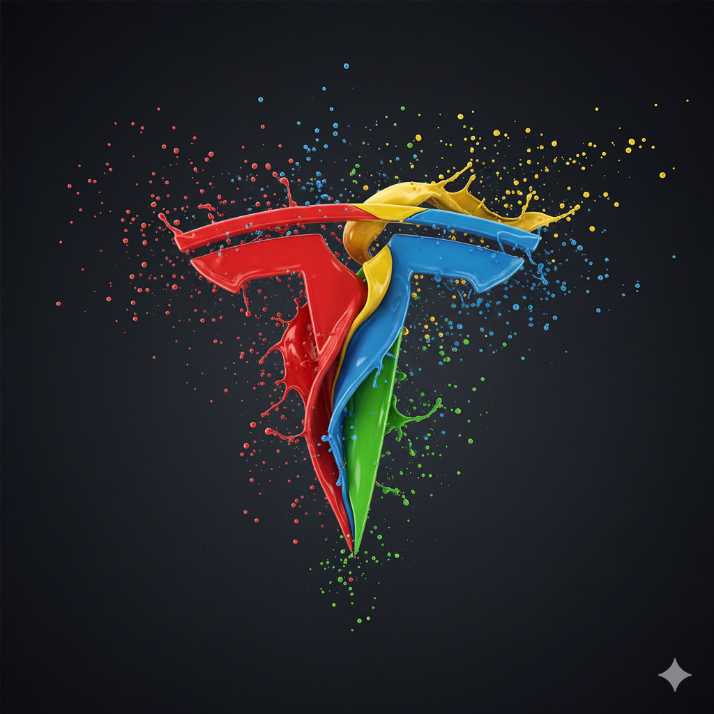

**提示词：**

```
Create a photograph of a [BRAND] logo formed from four vibrant paint splashes: red, blue, green, and yellow, captured mid-motion. Each color flows dynamically across different parts of the logo, as if sculpted from liquid paint. Droplets are suspended in the air around it, enhancing the illusion of movement. Set against a dark background with soft, vivid lighting that accentuates the glossy texture and fluid motion

Use appropriate colors for the logos.
```

<a id="prompt-28"></a>
#### 案例 28：超级动物英雄


**提示词：**

```
A hyper-realistic square 1:1 portrait of a [YOUR ANIMAL] standing in a heroic pose, facing slightly left. The animal wears a textured dark gray superhero suit, form-fitting and matte, with visible fabric grain and subtle seams.

On its chest, inside a golden metallic Superman-style diamond emblem, is a fabric-embroidered version of the [COUNTRY] national flag (realistic stitching, slightly raised).

Draped over the animal’s shoulder is a flowing cape designed from the [COUNTRY] flag, with rich fabric folds and natural weight.

Behind the subject, use a realistic fabric backdrop displaying the full [COUNTRY] flag, slightly out of focus to add depth, with soft shadows to enhance realism.

Lighting should be warm and directional (studio-style), emphasizing the animal’s fur texture, suit material, and the contours of a subtly muscular chest. The overall tone is dramatic and cinematic, with a warm color grading and no excessive contrast. The head must be fully visible — no cropping.
```

<a id="prompt-27"></a>
#### 案例 27：终极跨界

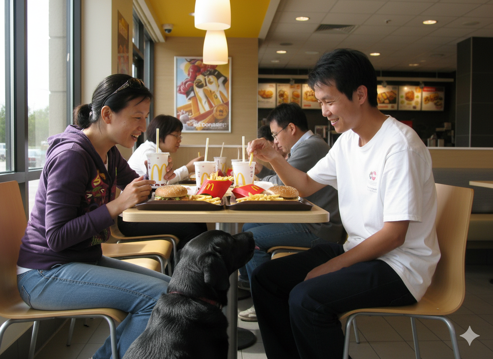

**提示词：**

```
Imagine [CHARAKTER 1] and [Charakter 2] casually sitting together at a table in a [FAST FOOD BRAND] restaurant. The atmosphere is relaxed and light-hearted, with the two characters engaged in an amusing or deep conversation over trays of food and drinks.
```

<a id="prompt-26"></a>
#### 案例 26：不同情绪状态的思想泡泡

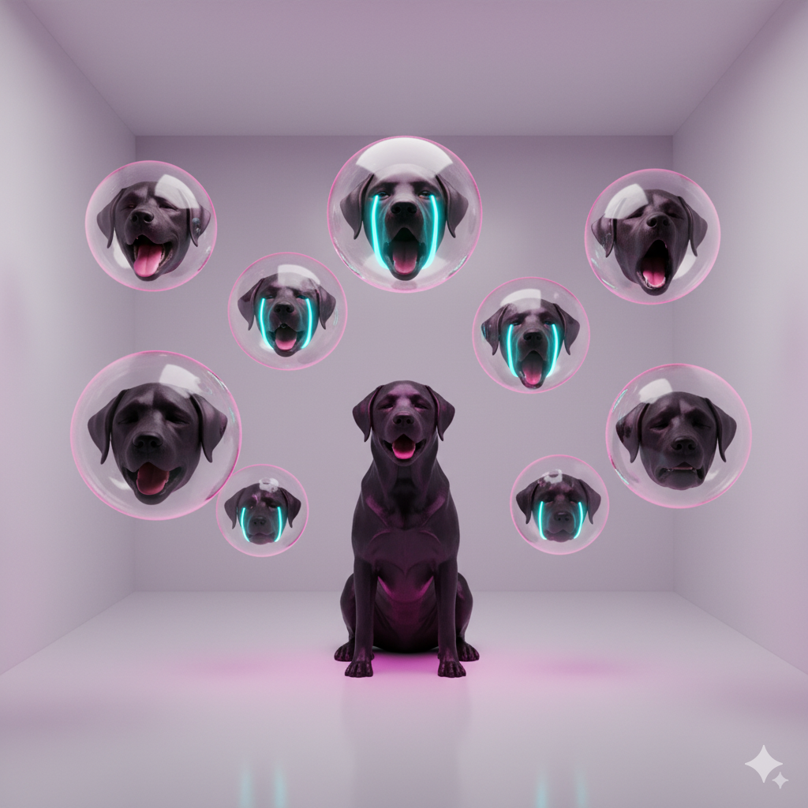

**提示词：**

```
A [SUBJECT] sits alone in a minimalistic room filled with floating, semi-transparent thought bubbles. Each bubble contains a fragment of their face from different emotional states — smiling, crying, screaming — forming a psychological self-portrait suspended in mid-air.
```

<a id="prompt-25"></a>
#### 案例 25：可爱干净的底座立体模型


**提示词：**

```
Highly detailed 3D-rendered chibi figurine diorama of [Character A] and [Character B], captured in a [scene/action], inside a [thematic display case shape] with [material]. The background features [visual effects: debris, aura, lightning, scenery], dynamic pose. The title "[custom phrase]" is embossed at the top in [font/style], matching the tone. Lighting is [studio, cinematic, ambient], color palette of [main colors]. Designed in a collectible, stylized, viral-friendly aesthetic.
```

<a id="prompt-24"></a>
#### 案例 24：景观洞穴入口的形状

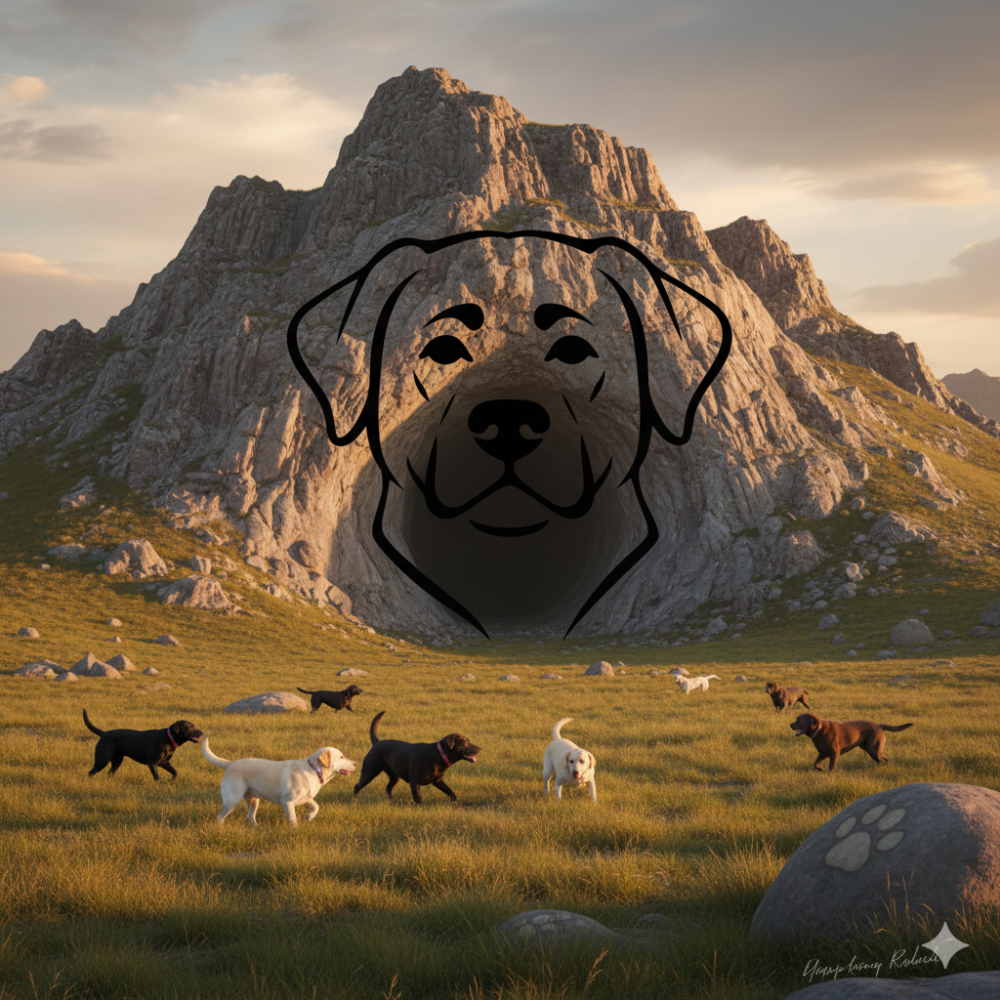

**提示词：**

```
Prompt: An image of a [TYPE] landscape, featuring a cave entrance that is shaped exactly like the outline of a [SHAPE]. The cave should blend naturally into the rugged terrain of the mountain, with the entrance forming a clear and unmistakable [SHAPE] shape. This [SHAPE] shape should be simple and defined, without intricate details, emphasizing just the overall [SHAPE] outline. The surrounding environment should include [DETAILS], but these elements should not distract from the cave's   [SHAPE]-shaped entrance. The lighting in the scene should enhance the visibility and distinctiveness of the [SHAPE]-shaped cave entrance.
```

<a id="prompt-23"></a>
#### 案例 23：透明容器里有一个微型的3D世界

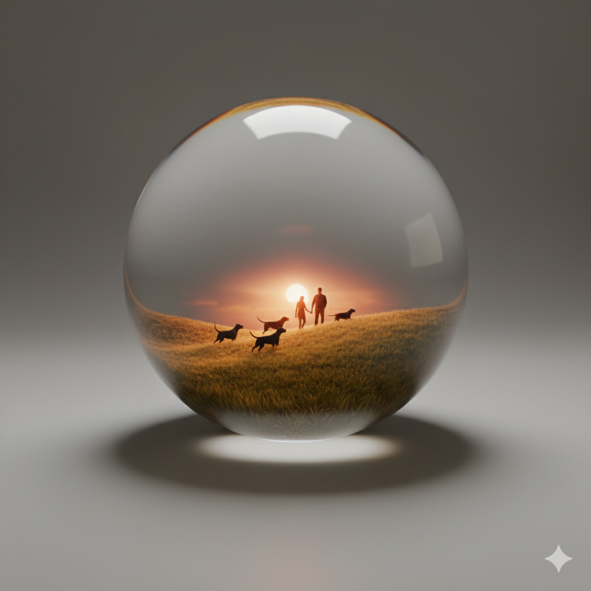

**提示词：**

```
A giant [transparent or glossy] [object/container] with a miniature 3D diorama inside it, depicting [a symbolic or narrative scene], studio-lit with soft shadows, placed on a neutral matte surface. Emphasize visual contrast between the scale of the capsule and the detail within. Highlight texture, light refraction, and emotional tone (e.g., surreal, poetic, or sci-fi).
```
**示例：**

```
A giant glossy Water dropletwith a miniature 3D diorama inside it, depicting a Harvesting scene, studio-lit with soft shadows, placed on a neutral matte surface. Emphasize visual contrast between the scale of the capsule and the detail within. Highlight texture, light refraction, and emotional tone hyper-realistic.
```

<a id="prompt-22"></a>
#### 案例 22：可爱的微缩场景


**提示词：**

```
{
    "style": "miniature handcrafted diorama",
    "material": "tree branches, cardboard, clay, moss, dried flowers, paper",
    "surface_texture": "organic, rough and varied (wood grain, soft moss, paper texture)",
    "lighting": {
        "type": "soft ambient natural light",
        "intensity": "low to moderate",
        "direction": "diffused overhead",
        "accent_colors": [
            "forest green",
            "earth brown",
            "soft beige",
            "muted pink"
        ],
        "reflections": false,
        "refractions": false,
        "dispersion_effects": false,
        "bloom": false
    },
    "color_scheme": {
        "primary": "natural greens and browns",
        "secondary": "soft neutral tones (cardboard, clay, paper)",
        "highlights": "light falling on the open book and cat’s glasses",
        "rim_light": "subtle natural edge light from the forest opening"
    },
    "background": {
        "color": "natural moss green",
        "vignette": false,
        "texture": "moss and dried floral structure"
    },
    "post_processing": {
        "chromatic_aberration": false,
        "glow": false,
        "high_contrast": false,
        "sharp_details": true,
        "film_grain": false
    },
    "form_composition": {
        "scene_elements": [
            "a small girl sitting on a balcony holding an open miniature book",
            "a cat with glasses observing the book's illustrations",
            "a treehouse made from twigs, cardboard, and clay",
            "balcony and surrounding forest made of moss and dried flowers"
        ],
        "scale": "miniature",
        "theme": "childlike wonder and storytelling in a handcrafted world",
        "visual_metaphor": [
            "curiosity",
            "quiet companionship",
            "imagination in nature"
        ]
    },
    "metadata": {
        "artist": "-Zho-",
        "series": "ZH4O"
    }
}
```

<a id="prompt-21"></a>
#### 案例 21：洞壁画


**提示词：**

```
A cave painting of a [subject], rendered with primitive ochres and charcoal lines on a rough stone wall. Smudged handprints, crude geometry, and flickering torchlight add a primal, ancient mood.
```

<a id="prompt-20"></a>
#### 案例 20：选择你的阵营

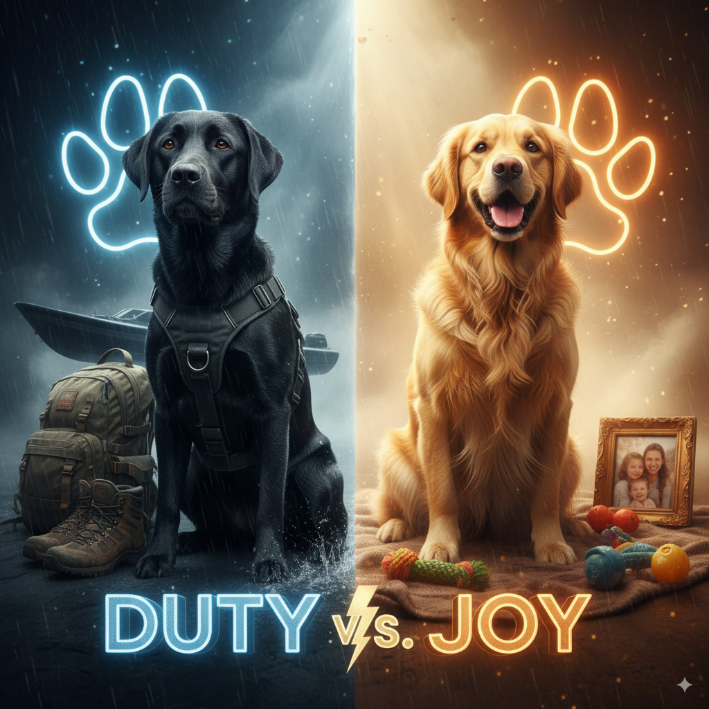

**提示词：**

```
A dramatic cinematic scene featuring two rival products placed side by side in a custom-designed environment that visually reflects their identities. The composition should include high contrast lighting, atmospheric effects like mist, fog, or neon glow, and hyper-detailed textures. Incorporate a powerful 3D slogan below or behind the products in bold stylized typography that fits the scene’s mood. The products must reflect the essence of [Brand A] and [Brand B] through color, lighting, and placement. Ultra-realistic, moody tones, 1:1 square format, with sharp depth of field and high resolution.
```

<a id="prompt-19"></a>
#### 案例 19：破碎的真相


**提示词：**

```
A close-up of [SUBJECT 1] holding a mirror shard to their face. The shard reflects a completely different [SUBJECT 2]. Around them, small cracks spread through the air like fractures in invisible glass, warping the space itself.
```

<a id="prompt-18"></a>
#### 案例 18：清洁琴键的小人物


**提示词：**

```
tilt-shift photo of a grand piano keyboard, side view from the left looking along the keys to the right, shallow depth of field, tiny human figures cleaning the piano keys with brushes, cloths, and buckets, whimsical and surreal scene, soft lighting, hyper-detailed, high realism
```

<a id="prompt-17"></a>
#### 案例 17：复古锡玩具立体模型风格


**提示词：**

```
transform it into part of a miniature mechanical scene from the 1940s or ’50s, featuring:

➕Shiny enamel-painted metal characters and objects.
➕Riveted details and visible joints.
➕Illustrated cardboard backdrops with vintage charm.
➕Wind-up toy-style settings with gears and wheels.
```

<a id="prompt-16"></a>
#### 案例 16：人物戏剧夸张风格


**提示词：**

```
A high-resolution vertical Pixar-style 3D character illustration.

Main character:  
Salvador Dalí — depicted as a tall, slim, and slightly exaggerated Pixar-style 3D character.  
Wearing a classic blue shirt, yellow tie, high-waisted plaid trousers with suspenders, and leather shoes.  
His iconic long upturned mustache, slick black hair, sharply arched eyebrows, and slightly eccentric posture.  
Stands with chest out, one hand on hip, head tilted slightly back in his typical theatrical flair.

Background:  
Flat, clean yellow background with subtle surface texture.  
Strong sunlight from top-left casts a distinct and enlarged shadow on the wall behind him.

Key Concept – Shadow as spiritual projection:  
The shadow cast behind him does **not** mirror his body shape.  
Instead, it takes the form of one of his most iconic artworks —  
a surreal melted clock with long dripping arms, inspired by “The Persistence of Memory”.

The melted clock shadow is positioned diagonally, starting from his shoulder,  
stretching wide and low across the yellow wall, surreal and fluid, yet unmistakably symbolic.

This shadow is **Dalí’s legacy made visible** — a symbolic extension of his identity through time, dream, and visual distortion.

Lighting & Rendering:  
Pixar-like rendering with detailed but stylized textures.  
Use subtle filmic grain, soft shadows, and warm color grading.  
Subtle sparkles or light speckles inside the shadow to evoke dreamlike texture.

Typography (top-left corner):  
“Salvador Dalí” in minimalist black sans-serif font, “Dalí” bolded.
```

<a id="prompt-15"></a>
#### 案例 15：云的艺术


**提示词：**

```
A photograph captures a daytime scene with a [SUBJECT/OBJECT] formed by scattered clouds in the sky, positioned above a [LOCATION]
```

<a id="prompt-14"></a>
#### 案例 14：超写实拼图肖像


**提示词：**

```
高分辨率的摄影棚人像，一位惊艳年轻模特「安妮海瑟薇」为主角。她拥有一头顺直的黑发，背景为白色，无任何可辨识的元素。她的脸略微侧转，但目光直视镜头，目光强烈而专注，毫无动摇。

她整张脸由拼图块组成——每一块都清晰可见，边缘整齐，具备细腻的立体感。她轻柔地用手指捏着一块刚从脸颊取下的拼图块，露出其下方一个空洞的黑色虚空。

光线集中且具方向性，几乎不产生阴影，但准确地勾勒出皮肤的轮廓与拼图结构的立体感。整体氛围超现实、精准且高度写实。

顶部有像时尚杂志一样的标题“VOGUE”（在人物后面）
```

<a id="prompt-13"></a>
#### 案例 13：面包形态


**提示词：**

```
A highly realistic sculpture of a [object], made entirely from [bread type] with ultra-detailed texture and color. The surface shows the natural properties of the bread, golden-brown, glossy, flaky or crusty, with visible layers or seeds where appropriate, studio lighting, soft
```

<a id="prompt-12"></a>
#### 案例 12：狭窄走廊里奔跑


**提示词：**

```
A thrilling 3D cartoon scene: [CHARACTER1] runs through a narrow corridor inside [Place], chased at high speed by [CHARACTER2]. Their facial expressions reflect tension and focus, with beads of sweat glistening under dramatic lighting.
```

<a id="prompt-11"></a>
#### 案例 11：水流身份


**提示词：**

```
An ultra-high resolution 8K cinematic render of the [Brand Name] logo, sculpted entirely from flowing crystal-clear water. The liquid forms every curve and edge of the brand’s logo with fluid precision, highlighted by vibrant neon accents inspired by [Brand Name]’s color identity. The background is pitch black, creating sharp contrast and drama. The lighting is dynamic, revealing sharp reflections, glowing edges, and the motion of water as it ripples and splashes. Droplets, shine, and soft glass-like textures give the logo a surreal, luxurious, and futuristic appearance — poster-quality, 1:1 format.
```

<a id="prompt-10"></a>
#### 案例 10：按键删除周一


**提示词：**

```
Detailed photographic image of a miniature person in bed feeling cranky under an opened 'Delete Monday' keyboard keycap, using the inside of the keycap as a mini bedroom complete with the usual bedroom stuff
```

<a id="prompt-9"></a>
#### 案例 9：产品变成纸玻璃

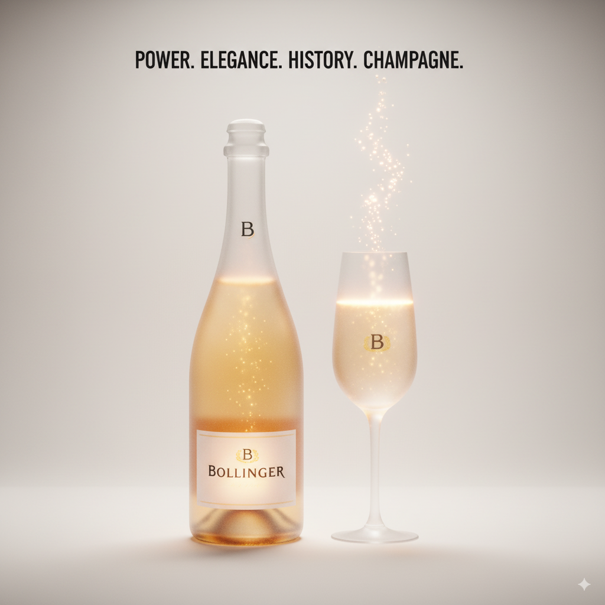

**提示词：**

```
[Product by Brand] in a surreal, minimalist paper-glass style advertisement.
The product is centered, crafted from translucent frosted glass-paper, placed against a clean white or softly tinted background.
Soft cinematic lighting creates gentle contrast and ambient shadows.
A single brand color subtly interacts with the scene through glow, mist, liquid, or foam.
Include a bold, elegant 4-word slogan near the product.
The brand logo appears subtly etched, glowing, or printed in a refined manner.
Vertical or square aspect ratio, ultra-detailed, poster-quality, visually soothing and conceptually refined.
```

<a id="prompt-8"></a>
#### 案例 8：变成一个花盆


**提示词：**

```
A high-quality photo of a cute ceramic [object/animal]-shaped planter with a glossy finish, filled with a variety of vibrant succulents and greenery including a spiky Haworthia, a rosette-shaped Echeveria, and delicate white flowers. The planter has a friendly face and sits on a soft, neutral background with diffused natural lighting, showcasing fine textures and color contrast in a clean, minimalistic composition
```

<a id="prompt-7"></a>
#### 案例 7：创意广告

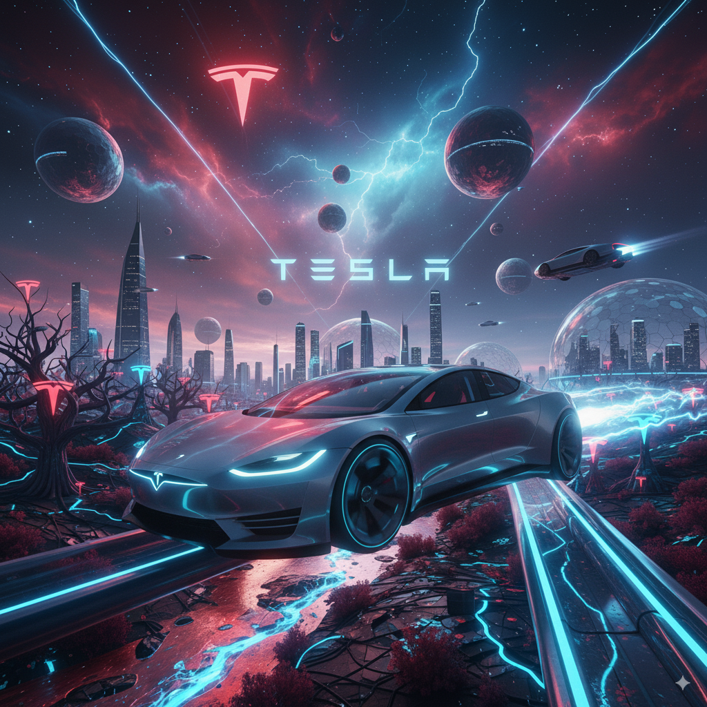

**提示词：**

```
Planet [Brand name], Year 3025. A distant world shaped entirely by the essence of the brand. The landscapes echo its core identity — from surreal terrains to fantastical weather patterns. Native flora and fauna embody its signature ingredients and aesthetics. Rivers flow with iconic flavors. Architecture is inspired by its packaging and visual language, fused with futuristic technology. The atmosphere is rich in texture, cinematic lighting, and surreal detail. A dreamlike vision of brand identity reimagined as a sci-fi utopia.
```

<a id="prompt-6"></a>
#### 案例 6：创意广告


**提示词：**

```
A high-impact advertisement set against a clean, dark or high-contrast background. A [product] is centered, sharply lit and highly detailed. Around it, surreal, stylized visual [elements] illustrations explode outward (e.g., musicians, runners, curls, sunbursts), vibrant color palette, neon. bold uppercase ad copy at the top that reads [TEXT] and the brand logo at the bottom, modern Ad
```

<a id="prompt-5"></a>
#### 案例 5：创意广告


**提示词：**

```
Use the uploaded product image exactly as it is — do not alter, redraw, or reinterpret any part of it. Follow the guidelines below to create a high-quality, cinematic product presentation:

• Keep the product fully intact — all text, labels, proportions, packaging, and colors must remain exactly the same.
• Use natural or cinematic lighting to enhance the product’s appeal.
• Place the product on a realistic surface that matches its category (e.g. wooden kitchen table for bread, bathroom shelf for skincare, desk for tech gadgets).
• Add complementary props if appropriate (e.g. toast and coffee for bread, leaves and water droplets for skincare) — but do not let them touch or cover the product.
• Use a softly blurred or ambient background (e.g. kitchen, morning window light, minimal interior).
• Include soft shadows and subtle reflections for a grounded, photo-realistic effect.
• Final result should feel premium, natural, and visually appealing — with 100% fidelity to the uploaded product image.
```

<a id="prompt-4"></a>
#### 案例 4：创意广告


**提示词：**

```
A minimalist and creative advertisement set on a clean white background.
A real [Real Object] is integrated into a hand-drawn black ink doodle, using loose, playful lines. The [Doodle Concept] interacts with the object in a clever, imaginative way. Include bold black [Ad Copy] text at the top or center. Place the [Brand Logo] clearly at the bottom. The visual should be clean, fun, high-contrast, and conceptually smart.
```

<a id="prompt-3"></a>
#### 案例 3：拉布拉多在公园画画

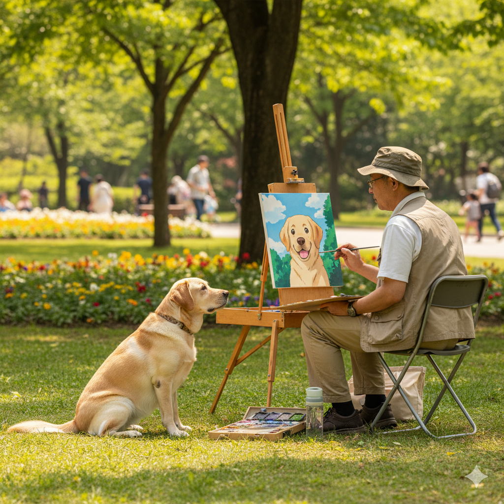

**提示词：**

```
创作一个逼真的户外场景，其中一位日本画家正在为拉布拉多画画。场景中，画家坐在画架前，而拉布拉多则坐在对面被描绘（不带任何卡通或动漫风格）。环境应充满生机,自然且阳光明媚——比如公园或热闹的户外场所。整体风格必须完全写实，唯独画家画架上的作品例外：那应该是拉布拉多的吉卜力风格动漫肖像，与周围的写实环境形成强烈对比。请确保画中人物是写实风格，画上的肖像才是动漫风格。
```

<a id="prompt-2"></a>
#### 案例 2：漫画拼图 (进化论)


**提示词：**
```
make a colorful page of manga describing the Darwin’s theory of evolution. add some humor
```

<a id="prompt-1"></a>
#### 案例 1：手绘风格的信息图卡片


**提示词：**
```
创作一张手绘风格的信息图卡片，比例为9:16竖版。卡片主题鲜明，背景为带有纸质肌理的米色或米白色，整体设计体现质朴、亲切的手绘美感。 卡片上方以红黑相间、对比鲜明的大号毛笔草书字体突出标题，吸引视觉焦点。文字内容均采用中文草书，整体布局分为2至4个清晰的小节，每节以简短、精炼的中文短语表达核心要点。字体保持草书流畅的韵律感，既清晰可读又富有艺术气息。 卡片中点缀简单、有趣的手绘插画或图标，例如人物或象征符号，以增强视觉吸引力，引发读者思考与共鸣。 整体布局注意视觉平衡，预留足够的空白空间，确保画面简洁明了，易于阅读和理解。 <h1><span style=""color:red"">「认知」</span>决定上限 <span style=""color:red"">「圈子」</span>决定机会</h1> - 你赚不到「认知」以外的钱， - 也遇不到「圈子」以外的机会。
```
