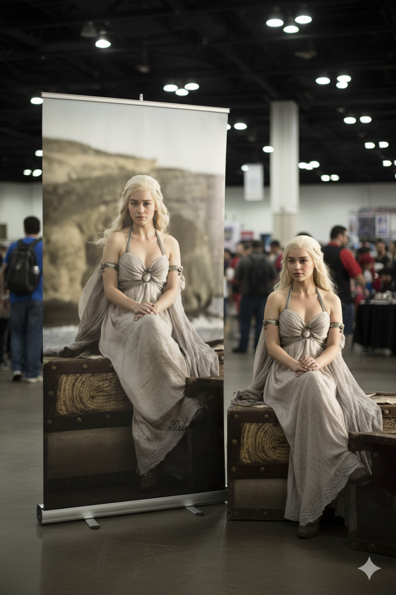
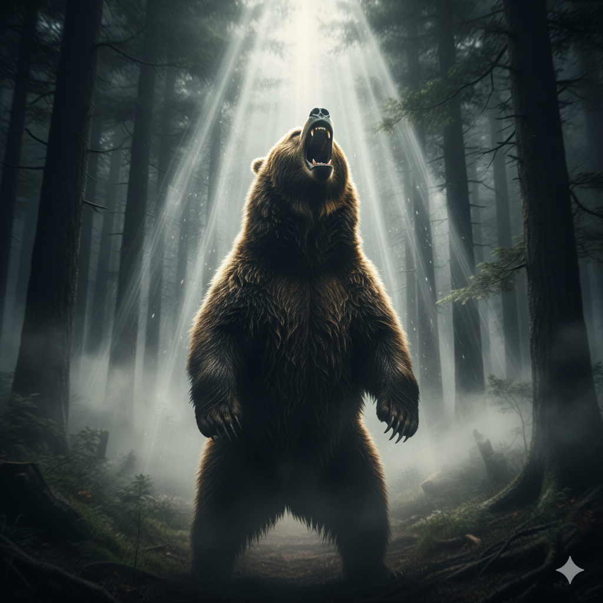

# Nano banana

##    Prompt

*   [案例 87：卧室镜子自拍 ](#prompt-87)
*   [案例 86：品牌创意3D广告 ](#prompt-86)
*   [案例 85：随手拍秒变专业摄影大片？！Nano-Banana 拯救你的废片！ ](#prompt-85)
*   [案例 84：一句咒语任何风格变写实 ](#prompt-84)
*   [案例 83：产品包装贴合 ](#prompt-83)
*   [案例 82：模拟在 Cosplay 会场现场拍摄场景 ](#prompt-82)
*   [案例 81：你抱着年幼版自己的复古风自拍 ](#prompt-81)
*   [案例 80：都市上空巨大的涡旋冲破暴风云层 ](#prompt-80)
*   [案例 79：照片级真实感室内躺姿人像 ](#prompt-79)
*   [案例 78：角色创建 ](#prompt-78)
*   [案例 77：产品超逼真的CGI镜头 ](#prompt-77)
*   [案例 76：照片级逼真的概念食物艺术肖像 ](#prompt-76)
*   [案例 75：6张复古宝丽来照片 ](#prompt-75)
*   [案例 74：电影级3D动感广告 ](#prompt-74)
*   [案例 73：创建自己的3D漫画 ](#prompt-73)
*   [案例 72：秋天的落叶拼成图案 ](#prompt-72)
*   [案例 71：字母动物 ](#prompt-71)
*   [案例 70：超写实3D漫画肖像 ](#prompt-70)
*   [案例 69：制作证件照 ](#prompt-69)
*   [案例 68：制作大头贴 ](#prompt-68)
*   [案例 67：ZBrush建模屏显与万代风格包装盒 ](#prompt-67)
*   [案例 66：制作工作室拍摄肖像照 ](#prompt-66)
*   [案例 65：透明扭蛋场景模型 ](#prompt-65)
*   [案例 64：3D超写实食品广告 ](#prompt-64)
*   [案例 63：Q版木雕人偶 ](#prompt-63)
*   [案例 62：品牌着陆页-年轻女性运动后的面部特写 ](#prompt-62)
*   [案例 61：沙滩胶囊城市 ](#prompt-61)
*   [案例 60：电影镜头拍摄 ](#prompt-60)
*   [案例 59：讽刺版的你 ](#prompt-59)
*   [案例 58：产品成为霓虹灯下的梦想 ](#prompt-58)
*   [案例 57：电影场景 ](#prompt-57)
*   [案例 56：冬日国家 ](#prompt-56)
*   [案例 55：品牌在悬浮平台上 ](#prompt-55)
*   [案例 54：灯泡中的城市 ](#prompt-54)
*   [案例 53：工业内部品牌广告 ](#prompt-53)
*   [案例 52：纸上的小卡通角色 ](#prompt-52)
*   [案例 51：真人和风格对照直出 ](#prompt-51)
*   [案例 50：装饰艺术未来主义 ](#prompt-50)
*   [案例 49：霓虹效果海报 ](#prompt-49)
*   [案例 48：抽象液体排版文字 ](#prompt-48)
*   [案例 47：生物发光 ](#prompt-47)
*   [案例 46：生成电影氛围图 ](#prompt-46)
*   [案例 45：霓虹灯品牌重新构想 ](#prompt-45)
*   [案例 44：微型透明胶囊 ](#prompt-44)
*   [案例 43：半透明玻璃物品ASMR ](#prompt-43)
*   [案例 42：霓虹灯线框 ](#prompt-42)
*   [案例 41：乙烯基玩具 ](#prompt-41)
*   [案例 40：怀旧午后阳光 ](#prompt-40)
*   [案例 39：监控级别的时尚洞察力 ](#prompt-39)
*   [案例 38：透视一切 ](#prompt-38)
*   [案例 37：幽灵形态 ](#prompt-37)
*   [案例 36：创建超现实不可能的图像 ](#prompt-36)
*   [案例 35：符号冲突 ](#prompt-35)
*   [案例 34：磨砂模糊剪影 ](#prompt-34)
*   [案例 33：文艺复兴时期的解刨学研究 ](#prompt-33)
*   [案例 32：品牌产品数字广告 ](#prompt-32)
*   [案例 31：重点线条勾勒 ](#prompt-31)
*   [案例 30：3D超现实场景模型 ](#prompt-30)
*   [案例 29：标志液化 ](#prompt-29)
*   [案例 28：超级动物英雄 ](#prompt-28)
*   [案例 27：终极跨界 ](#prompt-27)
*   [案例 26：不同情绪状态的思想泡泡 ](#prompt-26)
*   [案例 25：可爱干净的底座立体模型 ](#prompt-25)
*   [案例 24：景观洞穴入口的形状 ](#prompt-24)
*   [案例 23：透明容器里有一个微型的3D世界 ](#prompt-23)
*   [案例 22：可爱微缩场景 ](#prompt-22)
*   [案例 21：洞壁画 ](#prompt-21)
*   [案例 20：选择你的阵营 ](#prompt-20)
*   [案例 19：破碎的真相 ](#prompt-19)
*   [案例 18：清洁琴键的小人物 ](#prompt-18)
*   [案例 17：复古锡玩具立体模型风格 ](#prompt-17)
*   [案例 16：人物戏剧夸张风格 ](#prompt-16)
*   [案例 15：云的艺术 ](#prompt-15)
*   [案例 14：超写实拼图肖像 ](#prompt-14)
*   [案例 13：面包形态 ](#prompt-13)
*   [案例 12：狭窄走廊里奔跑 ](#prompt-12)
*   [案例 11：水流身份 ](#prompt-11)
*   [案例 10：按键删除周一 ](#prompt-10)
*   [案例 9：产品变成纸玻璃 ](#prompt-9)
*   [案例 8：变成一个花盆 ](#prompt-8)
*   [案例 7：创意广告 ](#prompt-7)
*   [案例 6：创意广告 ](#prompt-6)
*   [案例 5：创意广告 ](#prompt-5)
*   [案例 4：创意广告 ](#prompt-4)
*   [案例 3：拉布拉多在公园画画 ](#prompt-3)
*   [案例 2：漫画拼图 (进化论) ](#prompt-2)
*   [案例 1：手绘风格的信息图卡片 ](#prompt-1)

<a id="prompt-87"></a>
### 案例 87：卧室镜子自拍


**提示词：**
```
{
  "scene": {
    "description": "Indoor mirror selfie in a contemporary bedroom or dressing area.",
    "lighting": "Soft, warm ambient interior lighting, flattering and even.",
    "environment": "Neutral background, slightly blurred, suggesting closet doors or plain walls."
  },
  "subject": {
    "reference": "use uploaded face image for likeness, an exact likeness",
    "pose": {
      "type": "Standing mirror selfie.",
      "action": "Subject is confidently lifting the hem of her sweater with both hands to expose her toned midriff.",
      "expression": "Soft, pleasant expression, subtle smile, eyes focused on the phone screen.",
      "framing": "Medium shot (hips to head)."
    },
    "wardrobe": {
      "top": {
        "garment": "Cropped cable-knit sweater",
        "color": "Cream / Ivory white",
        "details": "Distinctive hybrid design with sheer, voluminous organza ruffles on the sleeves and cuffs."
      },
      "bottom": {
        "garment": "Blue jeans",
        "fit": "Low-rise, relaxed fit.",
        "details": "Light-to-medium wash denim, worn unbuttoned and slightly pulled down at the hips."
      }
    },
    "accessories": {
      "phone": "Dark gray smartphone held in the hand, rear camera visible in the mirror."
    }
  },
  "camera_technical": {
    "device": "Smartphone rear camera via mirror",
    "look": "Clean, high-quality mobile photography, vertical orientation (3:4).",
    "focus": "Sharp focus on the subject's face and torso."
  }
}
```
**中文提示词：**
```
{
  "scene": {
    "description": "室内镜前自拍场景，地点为现代风格的卧室或更衣区。",
    "lighting": "柔和温暖的室内光线，光线均匀、肤色显得自然柔美。",
    "environment": "背景为中性色调，略微虚化，可见衣柜门或平整墙面。"
  },
  "subject": {
    "reference": "使用上传的照片作为参考，保持与其相似的面容与气质。",
    "pose": {
      "type": "站立姿势的镜前自拍。",
      "action": "人物自信地用双手轻轻提起毛衣下摆，露出紧致的小蛮腰与腹肌线条。",
      "expression": "柔和自然的微笑，神情自信温柔，目光注视着手机屏幕。",
      "framing": "中景构图（从臀部到头部）。"
    },
    "wardrobe": {
      "top": {
        "garment": "短款麻花针织毛衣",
        "color": "奶白色",
        "details": "袖子拼接透明的薄纱荷叶边设计，展现时尚与少女感。"
      },
      "bottom": {
        "garment": "低腰牛仔裤",
        "fit": "休闲宽松版型",
        "details": "浅蓝色牛仔布，裤头微微解开并轻拉至胯部位置。"
      }
    },
    "accessories": {
      "phone": "深灰色智能手机，镜中可见其后置摄像头。"
    }
  },
  "camera_technical": {
    "device": "通过镜子使用智能手机后置摄像头拍摄。",
    "look": "清晰、高质量的手机摄影，竖构图（3:4比例）。",
    "focus": "清晰对焦在人脸和上半身。"
  }
}
```

<a id="prompt-86"></a>
### 案例 86：品牌创意3D广告


**提示词：**
```
Creative 3D ad for [Brand Name], with surreal object made from it, matching background color, real slogan below, logo on top, miniature person interacting, minimal and clever concept 
```
**中文提示词：**
```
为 [品牌名称] 制作的创意 3D 广告，由超现实的物体制成，背景颜色匹配，下面是真实的口号，上面是徽标，微型人物互动，简约而巧妙的概念
```

<a id="prompt-85"></a>
### 案例 85：随手拍秒变专业摄影大片？！Nano-Banana 拯救你的废片！


**提示词：**
```
Transform the person in the photo into highly stylized ultra-realistic portrait, with sharp facial features and flawless fair skin, standing confidently against a bold green gradient background. Dramatic, cinematic lighting highlights her facial structure, evoking the look of a luxury fashion magazine cover. Editorial photography style, high-detail, 4K resolution, symmetrical composition, minimalistic background
```

<a id="prompt-84"></a>
### 案例 84：一句咒语任何风格变写实


**提示词：**
```
turn this illustration into realistic version
```

<a id="prompt-83"></a>
### 案例 83：产品包装贴合


**中文提示词：**
```
把图一贴在图二易拉罐上，并放在极简设计的布景中，专业摄影
```

<a id="prompt-82"></a>
### 案例 82：模拟在 Cosplay 会场现场拍摄场景



**提示词：**
```
{
  "meta": {
    "version": "1.2-strict",
    "task": "cosplay_convention_coser_plus_rollup_banner_same_pose",
    "aspect_ratio": "3:2",
    "alt_aspect_ratios": ["4:5", "9:16"],
    "resolution": "4k",
    "seed": null
  },
  "character": {
    "name": "",
    "franchise": "",
    "reference_image": "",
    "is_humanoid": "auto",
    "iconic_elements": [],
    "color_palette": [],
    "pose_hint": ""
  },
  "banner": {
    "type": "roll_up_retractable_banner",
    "size": "85x200cm_vertical",
    "base": "aluminum_cassette_with_stabilizer_feet",
    "support": "rear_tension_pole",
    "top_bar": "aluminum_clamp_bar",
    "print_area": "edge_to_edge_no_border",
    "substrate": "PET_film_200mic_matte_anti_glare",
    "finish": "satin_matte",
    "curl_control": "minimal",
    "content_policy": "original_character_exact",
    "no_legible_text_or_logos": true,
    "sharpness_priority": "max",
    "placement": "banner_left_coser_right_small_gap_full_body"
  },
  "coser": {
    "gender_presentation": "unspecified",
    "body_type": "unspecified",
    "age_group": "adult",
    "makeup_style": "convention_ready",
    "wig_style": "match_character_exact_if_humanoid_else_color_reference",
    "outfit_detail": "screen_accurate_exact_if_humanoid_else_gijinka_translation",
    "props": [],
    "pose_sync": "same_banner_pose_not_mirrored",
    "pose_translation_ruleset": "default_v1"
  },
  "controls": {
    "reference_adherence_weight": 1.0,
    "pose_control": "openpose_or_equivalent",
    "pose_control_weight": 1.0,
    "detail_lock_weight": 1.0
  },
  "match_fidelity": {
    "outfit_match_mode": "exact_1_to_1",
    "color_lock": "use_only_character_palette",
    "prop_presence": "require_all_from_reference",
    "prop_hand_lock": "same_hand_and_orientation_as_banner",
    "orientation_lock": "same_as_banner_not_mirrored",
    "ban_substitution": true,
    "ban_variations": true,
    "priority_order": [
      "pose_alignment",
      "hairstyle_and_parting",
      "outfit_cut_and_panels",
      "lace/trim/pattern",
      "props_and_hand_assignment",
      "color_blocking",
      "footwear",
      "jewelry_accessories"
    ]
  },
  "venue": {
    "location": "anime_game_convention_hall",
    "booth_style": "artist_alley_plus_brand_backdrops",
    "background_density": "medium_bokeh_crowd",
    "lighting": "expo_softboxes_plus_overhead",
    "white_balance": "neutral",
    "no_brand_text": true
  },
  "camera": {
    "focal_length_mm": 45,
    "aperture": "f/3.2",
    "angle": "eye_level_slight_low",
    "framing": "full_body_coser_beside_roll_up_banner_base_and_top_bar_visible",
    "depth_of_field": "shallow_subjects_sharp_background_bokeh",
    "motion_blur": "none",
    "color_grade": "cinematic_neutral"
  },
  "logic": {
    "branching": {
      "if_is_humanoid": "faithful_cosplay_hair_costume_props_match_reference_exact_1_to_1",
      "if_nonhumanoid": "gijinka_translate_iconic_elements_colors_props_keep_banner_as_original_nonhuman_with_pose_silhouette_match"
    },
    "pose_alignment": {
      "guides": [
        "match_primary_silhouette_lines",
        "match_limb_angles_and_weight_shift",
        "align_head_tilt_and_gaze_direction",
        "match_finger_curl_and_hand_shape",
        "mirror_key_prop_orientation=off"
      ],
      "enforce": [
        "entire_banner_structure_visible_including_base_and_top_bar",
        "no_border_edge_to_edge_print_matte_anti_glare",
        "banner_left_coser_right_small_gap_full_body",
        "coser_pose_sync=same_banner_pose_not_mirrored"
      ]
    },
    "pose_translation_ruleset": {
      "default_v1": {
        "limb_map": {
          "foreleg_or_mech_arm": "human_arm_with_gauntlet_or_armor",
          "hind_leg_or_tailed_balance": "human_stance_wide_or_tiptoe_for_balance",
          "wings_extended": "human_arms_extended_with_cape_fin_panels",
          "quad_stance": "human_forward_lean_split_stance",
          "hover_or_flight": "human_on_tiptoe"
        },
        "prop_map": {
          "v_fin_or_headcrest": "hairband_or_headpiece_with_v_crest",
          "tail": "belt_ribbon_or_trailing_sash",
          "claws": "gauntlets_with_claw_caps",
          "cannon_or_gun": "foam_prop_or_3d_printed_replica",
          "emblem": "chest_plate_or_badge"
        },
        "silhouette_guides": [
          "prioritize_spine_curve_and_shoulders",
          "match_primary_negative_space_between_limbs",
          "align_weapon_or_wing_angle_with_prop_analogs"
        ]
      }
    },
    "safety": {
      "wardrobe": "convention_safe",
      "rating": "PG_13",
      "forbid": [
        "nsfw",
        "explicit_brand_logos",
        "legible_copyright_text",
        "legible_text"
      ]
    }
  },
  "negative": [
    "easel",
    "tripod_easel",
    "foam_board",
    "kiss_cut_border",
    "white_border_poster",
    "tabletop_poster",
    "standee_cutout",
    "curling_edges_exaggerated",
    "brand_logos",
    "legible_text",
    "alternate_outfit",
    "redesign",
    "reinterpretation",
    "style_variation",
    "blindfold",
    "eye_mask",
    "sunglasses",
    "maid_dress",
    "apron",
    "missing_prop",
    "wrong_color_scheme",
    "different_hairstyle",
    "wig_color_mismatch",
    "different_pose",
    "mirrored_pose",
    "extra_limbs",
    "hand_deformation",
    "blurry_banner",
    "overexposed_highlights",
    "duplicated_subjects"
  ],
  "templates": {
    "prompt_if_humanoid": "A cinematic documentary-style photo at an anime/game convention hall. A life-size roll-up banner on an aluminum retractable stand (visible cassette base with feet, rear tension pole, clamp top bar) displays the original {{character.name}} from {{character.franchise}} exactly as in the uploaded reference. A real human cosplayer stands next to it wearing an EXACT 1:1 screen-accurate cosplay that matches the banner in every observable detail: hairstyle and hair parting, hair length, makeup, neckline shape, sleeve type, lace/trim pattern, skirt tiering, color blocking, jewelry, footwear, and all signature props held in the SAME hand and orientation. NO redesign, NO additions, NO omissions. The cosplayer's pose is the SAME as the banner (NOT mirrored): match limb angles, weight shift, head tilt, gaze direction, and finger shapes. Lock colors to {{character.color_palette}} with no deviations. Medium crowd bokeh, soft expo lighting, matte anti-glare print. Camera: {{camera.focal_length_mm}}mm, {{camera.aperture}}, eye-level slight low angle, shallow DoF; the entire banner including base and top bar is visible. No legible text or logos anywhere.",
    "prompt_if_nonhumanoid": "A cinematic documentary-style photo at an anime/game convention hall. A life-size roll-up banner on an aluminum retractable stand (visible cassette base with feet, rear tension pole, clamp top bar) shows the original non-humanoid {{character.name}} from {{character.franchise}} exactly as in the uploaded reference. Next to it stands a human cosplayer in a STRICT gijinka (humanized) translation derived from the reference: translate iconic colors and parts ({{character.iconic_elements}}) into wearable armor plates, accessories, and hair ornaments with ONE-TO-ONE motif retention; map nonhuman limbs to human equivalents to match the SAME silhouette and pose (NOT mirrored). Include prop analogs in the SAME hand and orientation. Lock colors to {{character.color_palette}} with no deviations. Medium crowd bokeh, soft expo lighting, matte anti-glare print. Camera: {{camera.focal_length_mm}}mm, {{camera.aperture}}, eye-level slight low angle, shallow DoF; the entire banner including base and top bar is visible. No legible text or logos anywhere."
  },
  "compose": {
    "select_template": {
      "if": "character.is_humanoid == true",
      "then": "templates.prompt_if_humanoid",
      "else": "templates.prompt_if_nonhumanoid"
    },
    "append": [
      "venue",
      "camera",
      "logic.pose_alignment.enforce",
      "negative",
      "logic.safety.forbid"
    ]
  }
}
```

<a id="prompt-81"></a>
### 案例 81：你抱着年幼版自己的复古风自拍


**提示词：**
```
retro selfies of you holding a baby version of you
```
**中文提示词：**
```
你抱着幼年版自己的复古风自拍
```

<a id="prompt-80"></a>
### 案例 80：都市上空巨大的涡旋冲破暴风云层


**提示词：**
```
A massive spiral vortex tears through storm clouds above a futuristic illuminated city, revealing blue sky beyond a visual metaphor for artificial general intelligence breaking through the turbulence of current limitations to reach clarity beyond human comprehension. 
```
**中文提示词：**
```
在一座灯火璀璨的未来都市上空，巨大的螺旋状涡旋冲破暴风云层，显露出后方的蓝天 —— 这一视觉隐喻象征着通用人工智能突破当前局限的重重阻碍，抵达人类难以理解的清晰境界。
```

<a id="prompt-79"></a>
### 案例 79：照片级真实感室内躺姿人像


**提示词：**
```
{
"photorealistic_indoor_reclining_portrait",
  "style": "Natural editorial portrait; lifelike texture; minimal, tasteful retouching.",
  "output": { "aspect_ratio": "9:16", "resolution_px": [1440, 2560], "color_profile": "sRGB" },

  "subject": {
    "category": "human",
    "gender_presentation": "female",
    "ethnicity": "East Asian",
    "age_bracket": "young_adult",
    "body": {
      "build": "slim with realistic proportions",
      "bust": "fuller bust (natural C–D cup), proportional to frame; gentle natural slope, supportive shaping—no extreme push-up",
      "skin_tone": "light neutral with natural variation"
    },
    "pose": {
      "orientation": "reclining on back, relaxed",
      "right_arm": "raised above head, fingers lightly touching hairline",
      "left_arm": "bent across torso, hand resting on midriff",
      "head": "slightly tilted toward camera left"
    },
    "face": {
      "shape": "oval with mild asymmetry and natural cheek volume",
      "expression": "soft and open",
      "gaze": "direct to camera"
    },
    "eyes": {
      "description": "natural-size, lively but realistic",
      "color": "neutral gray-blue (low saturation)",
      "size_ratio": { "iris_fraction_of_visible_eye": 0.29, "pupil_fraction_of_iris": 0.27 },
      "details": {
        "limbal_ring_strength": 0.08,
        "sclera_brightness_Lstar": 78,
        "sclera_texture": "fine veins and faint tear meniscus on lower lid",
        "catchlights": "two soft rectangular window reflections about 10% of iris width",
        "specular_quality": "satin (no glassy glare)",
        "iris_texture": "visible stromal fibers and subtle color noise"
      }
    },
    "makeup": "sheer base preserving pores; soft peach blush; brown mascara/liner; taupe eyeshadow; hydrated nude lips",
    "hair": { "length": "long", "style": "half-up with bun, slight wave; a few flyaways visible", "color": "natural black" },
    "wardrobe": {
      "outfit": "blue top with Gucci shorts",
      "top": "powder-blue cropped bustier with sweetheart neckline and structured cups; off-shoulder or slim straps; tasteful cleavage; opaque lined fabric; subtle corset seams; cropped length reveals a sliver of midriff",
      "bottom": "Gucci blue GG-monogram denim shorts (small-scale jacquard, navy/indigo on blue; correct 'GG' orientation; no extra text)",
      "accessories": {
        "jewelry": "thin black velvet choker with tiny pendant, small stud earrings, simple rings",
        "wrists": "white fabric scrunchie on right; delicate bracelets on left"
      }
    }
  },
     "environment": {
    "location": "bedroom",
    "set": "plush bed with slightly wrinkled off-white linens and pillows",
    "background_props": "upper right: dark round tray with small white ceramic tea set on textured brown surface"
  },

  "lighting": {
    "scheme": "window key + sheet bounce",
    "source": "large window through sheer curtains (or 120 cm softbox with double diffusion)",
    "quality": "very soft with defined direction",
    "direction": "45° from camera right and slightly top; white bedding as fill about 1.5 stops under key",
    "temperature": "5200K",
    "effect": "gentle modeling with soft nose/lip shadow; crisp but soft eye catchlights; no bloom"
  },

  "camera": {
    "sensor": "full-frame",
    "lens": { "focal_length_mm": 85 },
    "distance_m": 1.8,
    "exposure": {
      "aperture_f": 3.2,
      "iso": 200,
      "shutter_s": 0.005,
      "metering": "spot on cheekbone; ETTR then -0.3 EV to protect highlights on fabric"
    },
    "focus": {
      "target": "near eye",
      "depth_of_field": "moderate (eyes and bust plane in focus; bedding softly blurred)"
    },
    "framing": {
      "orientation": "vertical",
      "angle": "overhead with slight tilt toward face; avoid wide-angle distortion",
      "composition": "9:16 crop framed head to upper hips so bustier and Gucci shorts are visible without foreshortening"
    }
  },

  "color_grade": {
    "look": "true-to-life neutrals with blue accent",
    "contrast": "medium-low",
    "palette": "powder/indigo blues, ivory, soft brown",
    "notes": "retain skin undertones; avoid cyan cast; ensure Gucci blue reads clean without oversaturation"
  },

  "postprocess": {
    "skin": "retain pores and micro-shine; remove only transient blemishes; keep faint under-eye texture",
    "eyes": "no iris enlargement; subtle iris clarity and micro-contrast; limbal ring kept weak",
    "sharpen": "moderate on eyes/brows/hair strands and denim weave/monogram",
    "grain": "fine film grain at 1.5–2%",
    "effects": "disable beauty filters, frequency-separation blur, glow/bloom; no HDR skin"
  },

  "realism_cues": [
    "flyaway hairs around hairline",
    "subtle nasolabial and philtrum depth",
    "natural knuckle/tendon texture on left hand",
    "visible denim weave and aligned monogram on shorts",
    "fabric creases and bedding wrinkles"
  ],

  "negative_prompt": [
    "doll, BJD, porcelain skin, neotenous proportions, plastic/waxy texture",
    "oversized/anime/doe eyes, iris enlargement, glassy eyes",
    "bright cyan/ice-blue contacts, heavy limbal ring, unnaturally white sclera",
    "poreless skin, beauty filter, airbrushed, skin smoothing",
    "bloom/Orton glow, excessive skin luster",
    "CGI, 3D render, illustration, toon shading, LoRA: doll/BJD",
    "wide-angle facial distortion, extreme symmetry filter",
    "random text overlays, misspelled logos, watermarks",
    "see-through fabrics, wardrobe malfunction, underboob/sideboob, explicit NSFW",
    "distorted anatomy, extra fingers"
  ],

}
```
**中文提示词：**
```
{
"照片级真实感室内躺姿人像",
  "风格": "自然杂志风人像；逼真质感；简约且精致的修图（保留真实细节）",
  "输出参数": { "宽高比": "9:16", "分辨率（像素）": [1440, 2560], "色彩配置文件": "sRGB" },

  "拍摄主体": {
    "类别": "人物",
    "性别呈现": "女性",
    "人种": "东亚人",
    "年龄段": "年轻成人",
    "身形": {
      "体型": "纤瘦且比例真实",
      "胸部": "丰满（自然C-D罩杯），与整体身形比例协调；线条自然柔和，有承托感，无过度聚拢效果",
      "肤色": "浅中性色，带有自然肤色差异（非均匀色块）"
    },
    "姿势": {
      "整体姿态": "仰卧，姿态放松",
      "右臂": "举过头顶，手指轻触发际线",
      "左臂": "弯曲横过躯干，手搭在腹部",
      "头部": "略微向镜头左侧倾斜"
    },
    "面部": {
      "脸型": "椭圆形，略带不对称感，脸颊饱满度自然",
      "表情": "柔和、舒展",
      "目光": "直视镜头"
    },
    "眼部": {
      "描述": "大小自然，灵动且真实",
      "颜色": "中性灰蓝色（低饱和度）",
      "大小比例": { "虹膜占可见眼球比例": 0.29, "瞳孔占虹膜比例": 0.27 },
      "细节": {
        "虹膜边缘环清晰度": 0.08（近乎隐形）,
        "眼白亮度（L*值）": 78,
        "眼白质感": "细微血管，下眼睑有淡泪痕",
        "眼神光": "两处柔和的长方形窗户反光，宽度约为虹膜的10%",
        "光泽质感": "丝缎质感（无玻璃般的强光反射）",
        "虹膜纹理": "可见基质纤维，带有细微色彩颗粒感"
      }
    },
    "妆容": "轻薄底妆（保留毛孔）；柔和桃色腮红；棕色睫毛膏/眼线；灰褐色眼影；水润裸色唇膏",
    "发型": { "长度": "长发", "造型": "半扎丸子头，略带波浪；可见几根碎发", "颜色": "自然黑色" },
    "服饰": {
      "整体搭配": "蓝色上衣配古驰（Gucci）短裤",
      "上衣": "粉蓝色短款抹胸，心形领口，带立体罩杯；露肩或细肩带设计；领口弧度优雅；面料厚实不透视（带里衬）；带有精致束腰缝线；短款设计露出一小截腹部",
      "下装": "古驰（Gucci）蓝色双G提花牛仔短裤（小尺寸提花图案，藏青/靛蓝色花纹印于蓝色基底上；双G标志方向正确；无多余文字图案）",
      "配饰": {
        "珠宝": "黑色细天鹅绒项圈（带小巧吊坠）、小巧耳钉、简约戒指",
        "腕部饰品": "右手戴白色布艺发圈；左手戴精致手链"
      }
    }
  },

  "环境": {
    "场景": "卧室",
    "布景": "柔软的床，铺有略带褶皱的米白色床品和枕头",
    "背景道具": "右上角：深色圆形托盘（置于纹理棕色表面上），托盘内放有小型白色陶瓷茶具"
  },

  "光线": {
    "布光方案": "窗户主光+床单反光补光",
    "光源": "透过薄窗帘的大窗户（或120厘米双扩散柔光箱）",
    "光线质感": "极其柔和，且方向明确",
    "光线方向": "从镜头右侧45°角、略高于主体的位置入射；白色床品作为补光（亮度比主光低1.5档）",
    "色温": "5200K（标准白光）",
    "光影效果": "柔和的轮廓塑造（鼻子/唇部阴影自然）；清晰且柔和的眼神光；无光晕溢出"
  },

  "相机参数": {
    "传感器": "全画幅",
    "镜头": { "焦距（毫米）": 85 },
    "拍摄距离（米）": 1.8,
    "曝光参数": {
      "光圈值": 3.2,
      "感光度（ISO）": 200,
      "快门速度（秒）": 0.005（即1/200秒）,
      "测光方式": "点测光（测光点为颧骨）；向右曝光（ETTR）后降低0.3档曝光值，以保护面料高光细节"
    },
    "对焦": {
      "对焦目标": "靠近镜头一侧的眼睛",
      "景深": "中等（眼睛与胸部处于同一焦平面，保持清晰；床品轻微虚化）"
    },
    "构图": {
      "画面方向": "竖版",
      "拍摄角度": "俯拍，镜头略微向面部倾斜；避免广角畸变",
      "裁切比例": "9:16裁切，画面覆盖头部至髋部上方，确保抹胸与古驰短裤完整呈现，且无透视变形"
    }
  },

  "调色": {
    "风格": "真实中性色调，以蓝色为点缀色",
    "对比度": "中低",
    "色调 palette": "粉蓝/靛蓝色、米白色、柔和棕色",
    "注意事项": "保留皮肤原有底色；避免青蓝色色偏；确保古驰蓝色呈现纯净质感，无过度饱和"
  },

  "后期处理": {
    "皮肤处理": "保留毛孔与细微油光；仅去除临时瑕疵（如痘痘）；保留淡淡的眼下纹理",
    "眼部处理": "不放大虹膜；轻微增强虹膜清晰度与微对比度；保留弱虹膜边缘环",
    "锐化": "对眼睛/眉毛/发丝、牛仔面料纹理/提花图案进行适度锐化",
    "颗粒感": "添加1.5%-2%的细腻胶片颗粒",
    "效果禁用": "关闭美颜滤镜、频率分离模糊、光晕/柔光效果；不使用HDR皮肤处理"
  },

  "真实感细节提示": [
    "发际线处的碎发",
    "自然的鼻唇沟与人中立体感",
    "左手手指关节/肌腱的真实纹理",
    "短裤上清晰的牛仔面料纹理与对齐的提花图案",
    "面料褶皱与床品自然褶皱"
  ],

  "负面提示（需避免）": [
    "玩偶感、球形关节娃娃（BJD）、瓷娃娃质感皮肤、幼态化比例、塑料/蜡质质感",
    "过大眼睛/动漫眼/小鹿眼、虹膜放大、玻璃质感眼睛",
    "亮青色/冰蓝色美瞳、明显虹膜边缘环、不自然的雪白眼白",
    "无毛孔皮肤、美颜滤镜效果、磨皮过度、皮肤光滑失真",
    "光晕效果/奥顿柔光效果（Orton glow）、皮肤过度油光",
    "CGI效果、3D渲染、插画风格、卡通 shading、玩偶/球形关节娃娃（BJD）相关模型（LoRA）",
    "广角镜头面部畸变、过度对称滤镜效果",
    "随机文字叠加、logo拼写错误、水印",
    "透视装/面料过透、服饰走光、露下胸/侧胸、不雅内容（NSFW）",
    "肢体结构扭曲、多手指"
  ]
}
```

<a id="prompt-78"></a>
### 案例 78：角色创建


**提示词：**
```
3d rendering, c4d, cartoon style, [ACTION-DRIVEN CHARACTER IN EXAGGERATED POSE, EXPRESSING IRONY OR DEFIANCE], [MINIMAL BACKGROUND OF CONTEXTUAL SETTING], minimalist art style, simple design, high resolution, no low-quality details, high detail,best quality, professional photography, depth of field, soft lighting, sharp focus, cinematic lighting, cinematic camera settings
```
**中文提示词：**
```
3D 渲染、C4D、卡通风格、[动作驱动角色的夸张姿势，表达讽刺或反抗]、[情境设置的最小背景]、极简艺术风格、简约设计、高分辨率、无低质量细节、高细节、最佳质量、专业摄影、景深、柔和灯光、清晰对焦、电影灯光、电影摄像机设置]
```

<a id="prompt-77"></a>
### 案例 77：产品超逼真的CGI镜头


**提示词：**
```
Ultra-realistic CGI shot of a giant [PRODUCT NAME HERE], seamlessly integrated into a matching real-world environment that reflects the product’s identity, surrounded by context-specific city or nature elements, cinematic composition with natural shadows and photorealistic reflections, high Kelvin sunlight for neutral lighting, captured in HDR 8K DSLR quality, surreal yet believable visual integration, brand logo clearly visible, slogan dynamically adapted to the product’s character, dramatic and immersive atmosphere, aspect ratio 2:3
```
**中文提示词：**
```
超逼真的CGI镜头，拍摄一个巨大的 [此处填写产品名称]，无缝融入到反映产品特性的现实环境中，周围环绕着特定环境的城市或自然元素，具有自然阴影和逼真反射的电影构图，高开尔文阳光用于中性照明，以 HDR 8K DSLR 质量捕捉，超现实但可信的视觉融合，品牌标识清晰可见，标语根据产品特性动态调整，戏剧性和沉浸式氛围，宽高比为 2:3
```

<a id="prompt-76"></a>
### 案例 76：照片级逼真的概念食物艺术肖像


**提示词：**
```
Photorealistic conceptual food art portrait, a minimalist representation of a [SITE OF THE HOUSE] recreated entirely with [TYPE OF FOOD]. The main structure is built from [MAIN INGREDIENTS], with details such as [KEY ELEMENTS] made from [SECONDARY INGREDIENTS]. Optional features include [ADDITIONAL OBJECTS OR FURNITURE] created from [EXTRA INGREDIENTS].

Set against a [COLOR] background to emphasize the surreal food sculpture. Bright soft studio lighting, evenly diffused, casting subtle natural shadows that highlight the textures of [FOOD TEXTURES]. Fine atmospheric detail enhance realism.

Captured with a Canon EOS 5D, 85mm f/1.8 lens, shallow depth of field focusing on the cake-bed sculpture, crisp detail with soft falloff in the background. Composition framed at tabletop eye-level, medium close-up, perfectly centered. Clean high-resolution food photography style, vibrant natural colors, editorial dessert photography aesthetic
```
**中文提示词：**
```
照片级逼真的概念食物艺术肖像，极简主义地再现了[房屋位置]，完全由[食物种类]重新打造。主体结构由[主要成分]构成，细节部分，例如[关键元素]，则由[次要成分]制成。可选功能包括由[额外成分]打造的[附加物品或家具]。

以[颜色]为背景，突显超现实的食物雕塑。明亮柔和的摄影棚灯光，均匀散射，投射出微妙的自然阴影，凸显[食物纹理]的质感。精致的氛围细节增强了真实感。

使用佳能 EOS 5D 85mm f/1.8 镜头拍摄，浅景深聚焦于蛋糕床雕塑，细节清晰，背景边缘柔和。构图以桌面视线高度为准，中距特写，完美居中。清晰的高分辨率美食摄影风格，鲜艳自然的色彩，堪称甜品摄影的美学典范。
```

<a id="prompt-75"></a>
### 案例 75：6张复古宝丽来照片


**提示词：**
```
Create an artistic collage of 6 vintage Polaroid photos, attached with a decorative rope and mini clothespins, like a home photo gallery. Each Polaroid frame has a slight fading and an old paper effect. The background is a soft pastel wall with light shadows, creating a cozy and creatively chaotic atmosphere.
Emotions and poses:
 * Light laughter — eyes closed, natural joy.
 * Dreamy gaze upwards, relaxed pose.
 * Playful wink.
 * Calm smile with a head tilted to the side.Dynamic gesture hands raised high, full of energy.

* Romantic half-glance over the shoulder.

The atmosphere is an art-retro style with elements of a '70s fashion magazine, soft diffused lighting, and muted warm and golden tones. Each photograph looks like a unique behind-the-scenes shot, with a touch of nostalgia and a sense of personal history.
```
**中文提示词：**
```
用6张复古宝丽来照片，用装饰绳和迷你衣夹固定，打造一个艺术拼贴画，就像一个家庭相册。每个宝丽来相框都略微褪色，并呈现出旧纸效果。背景是一面柔和的粉彩色墙，点缀着浅淡的阴影，营造出一种舒适而又充满创意的混乱氛围。
情绪和姿势：
* 轻松的笑声——闭上眼睛，自然的快乐。
* 梦幻般的目光向上凝视，放松的姿势。
* 顽皮的眨眼。
* 平静的微笑，头部歪向一侧。动态的手势，双手高举，充满活力。

* 浪漫地回头瞥了一眼。

店内弥漫着复古艺术的氛围，融合了70年代时尚杂志的元素，柔和的漫射灯光，以及柔和的暖金色色调。每一张照片都像是一张独特的幕后花絮，洋溢着一丝怀旧气息，也透露着个人的点滴历史。
```

<a id="prompt-74"></a>
### 案例 74：电影级3D动感广告


**提示词：**
```
Cinematic 3D action-packed advertisement of [PRODUCT], captured in a dramatic mid-motion scene that embodies its core energy. Use bold studio lighting with intense highlights and deep shadows, dynamic particles, and slow-motion effects to amplify impact. The environment should feel surreal yet hyperrealistic, designed to reflect the product’s personality (crunchy, energetic, fast, luxurious, refreshing, etc.). Integrate the brand logo crafted from product elements if possible, and place a sleek creative slogan beneath it that matches the mood. Composition in 1:1 aspect ratio, hyper-detailed, sharp, bold, and designed to go viral.
```
**中文提示词：**
```
[PRODUCT] 的电影级 3D 动感广告，以戏剧化的中景捕捉，展现其核心能量。运用大胆的影棚灯光、强烈的高光和深邃的阴影、动态粒子和慢动作效果来增强视觉冲击力。环境应营造超现实却又超现实的感觉，旨在体现产品的个性（清爽、活力、快速、奢华、清爽等）。尽可能融入由产品元素精心打造的品牌标识，并在其下方放置一个与氛围相符的时尚创意口号。构图采用 1:1 的宽高比，细节丰富、锐利大胆，旨在打造病毒式传播的效果。
```

<a id="prompt-73"></a>
### 案例 73：创建自己的3D漫画


**提示词：**
```
A highly stylized 3D caricature of me, with expressive facial features, and playful exaggeration. Rendered in a smooth, polished style with clean materials and soft ambient lighting. Bold color background to emphasize the character’s charm and presence.
```
**中文提示词：**
```
这是我高度风格化的3D漫画形象，面部特征生动，夸张的笔触俏皮。渲染风格流畅优美，材质干净，环境光柔和。背景采用大胆的色彩，突出人物的魅力和气质。
```

<a id="prompt-72"></a>
### 案例 72：秋天的落叶拼成图案


**中文提示词：**
```
中景，有阳光的午后，胶片质感，拍摄地面，秋天的落叶、树枝、银杏叶和桂花在平面上拼成了一个小猫的样子，旁边放着一杯一次性咖啡杯
```

<a id="prompt-71"></a>
### 案例 71：字母动物


**提示词：**
```
A stylized capital letter [Letter] with a cartoon [Animal] intertwined with it, on a solid color background.
```
**中文提示词：**
```
在纯色背景上，一个艺术化设计的大写字母【字母】与一只卡通【动物】相互缠绕的图案。
```

<a id="prompt-70"></a>
### 案例 70：超现实3D漫画肖像


**提示词：**
```
Hyper-realistic 3D caricature of [NAME], featuring an expressive, oversized head, a short body, and a detailed, energetic facial expression. Wearing [OUTFIT / SIGNATURE LOOK], striking a [POSE / ACTION]. Studio lighting, cartoonish proportions, Pixar-style 3D rendering, ultra-detailed fabric and skin textures. The body is slightly smaller than the head. 1080x1080 square format.
```
**中文提示词：**
```
[姓名] 的超写实3D漫画肖像，特点为表情丰富的超大头部、较短的身躯，以及细节丰富且充满活力的面部表情。人物身着 [服装 / 标志性造型]，摆出 [姿势 / 动作]。采用工作室灯光效果，呈现卡通化比例，运用皮克斯风格 3D 渲染技术，织物与皮肤纹理细节极致丰富。身躯比例略小于头部，画面为 1080x1080 的正方形格式。
```

<a id="prompt-69"></a>
### 案例 69：制作证件照


**中文提示词：**
```
截取图片人像头部，帮我做成2寸证件照，要求:
1、蓝底
2、职业正装
3、正脸
4、微笑
```

<a id="prompt-68"></a>
### 案例 68：制作大头贴


**中文提示词：**
```
用这张照片，做一个3*3的photo booth grid，每张要用不同的姿势和表情不许重复
```

<a id="prompt-67"></a>
### 案例 67：手办-ZBrush建模屏显与万代风格包装盒


**提示词：**
```
create a 1/7 scale commercialized figure of thecharacter in the image, in a realistic styie and environment.
Place the figure on a computer desk, using a circular transparent acrylic base without any text.
On the computer screen, display the ZBrush modeling process of the figure.
Next to the computer screen, place a BANDAl-style toy packaging box printedwith the original artwork.
```
**中文提示词：**
```
NanoBanana手办提示词：
在现实的风格和环境中，创建图像中角色的 1/7 比例商业化人物形象。
将图形放置在电脑桌上，使用没有任何文字的圆形透明丙烯酸底座。
在电脑屏幕上，显示人物的ZBrush建模过程。
在电脑屏幕旁边，放置一个印有原创艺术品的BANDAl风格玩具包装盒。
```

<a id="prompt-66"></a>
### 案例 66：制作工作室拍摄肖像照


**中文提示词：**
```
给图里的人生成工作室拍摄肖像照片,黑色背景,黑色T恤,采用侧光和半身像的构图
```

<a id="prompt-65"></a>
### 案例 65：透明扭蛋场景模型


**提示词：**
```
A detailed transparent gashapon capsule diorama, held between fingers, featuring [NAME] in their [ICONIC POSE / STYLE]. Inside: [short description of figure’s look, clothing, and accessories], with background elements such as [relevant setting: stadium, stage, lecture hall, etc.]. Lighting should be dramatic and cinematic, matching their theme (e.g., golden spotlight, concert glow, academic ambience). The capsule has a transparent top and a colored base (choose fitting color: e.g., royal blue, gold, black, red), decorated with [motifs related to the person]. The base is labeled with [NAME or NICKNAME] in a matching font style. The design should look like a miniature collectible, with photorealistic detail, soft bokeh, and a square 1080x1080 composition.
```
**中文提示词：**
```
一个详细的透明扭蛋场景模型，由手指捏握，扭蛋内呈现 [人物名称] 的 [标志性姿势 / 风格] 形象。
扭蛋内部细节：[简要描述人偶的外形、服饰及配饰]，背景元素包含 [相关场景：体育场、舞台、讲堂等]。
光线设计需富有戏剧感与电影质感，并契合人物主题（例如：金色聚光灯、演唱会光影、学术氛围光效）。扭蛋顶部为透明材质，底部为彩色设计（选用契合主题的颜色，如宝蓝色、金色、黑色、红色），底部装饰有 [与该人物相关的图案元素]。
扭蛋底座以匹配风格的字体标注有 [人物名称或昵称]。整体设计需呈现迷你收藏品的质感，细节超写实，搭配柔和的虚化背景，采用 1080x1080 像素的正方形构图。
```

<a id="prompt-64"></a>
### 案例 64：3D超写实食品广告


**提示词：**
```
Smooth 3D hyperrealistic food advertisement of [TYPE OF FOOD], shown with mouthwatering glossy textures and perfect lighting, placed on a dark moody surface with soft glow and cinematic blur in the background, high Kelvin lighting for golden highlights and sharp shadows, backlit to show delicious steam and dripping sauces, behind the food a bold slogan in elegant font with three words only, restaurant logo subtly placed on the plate or in the corner, rich color grading with appetite-inducing tones, ultra sharp, professional food styling, stylized render
```
**中文提示词：**
```
[食物类型]的流畅3D超写实食品广告
- 呈现令人垂涎的光泽质感与完美光线效果
- 置于深邃氛围感的表面上，背景带有柔和光晕与电影感模糊效果
- 采用高开尔文色温光线，营造金色高光与清晰阴影
- 运用逆光拍摄，展现诱人的热气与滴落的酱汁
- 食物后方以优雅字体呈现一句仅含三个单词的醒目标语
- 餐厅标志巧妙置于餐盘之上或画面角落
- 采用浓郁的色彩分级，搭配激发食欲的色调
- 极致清晰的画面质感，专业的食物造型设计，风格化渲染效果
```

<a id="prompt-63"></a>
### 案例 63：Q版木雕人偶


**提示词：**
```
Hyper-realistic carved wooden figurine of [CHARACTER], chibi proportions (big head, short body), standing on a plain wood block. Keep key face traits and iconic [OUTFIT/PROP]. Visible wood grain and chisel marks, matte finish. Warm studio light, soft shadow, seamless beige background. Centered full-body, slight 3/4 angle, shallow depth of field (85mm look). Ultra-detailed, photoreal, warm sepia grading. Aspect ratio [3:4].
```
**中文提示词：**
```
超写实[人物]木雕人偶，Q版比例（大头短身），站立于一块普通木块上。保留关键面部特征和标志性[服装/道具]。木纹和凿痕清晰可见，哑光饰面。工作室暖光，柔和阴影，米色背景浑然一体。全身居中，略微3/4视角，浅景深（85毫米画质）。细节丰富，照片级写实，暖棕褐色调。宽高比为[3:4]。
```

<a id="prompt-62"></a>
### 案例 62：品牌着陆页-年轻女性运动后的面部特写


**提示词：**
```
Create a closeup face of a young woman after a workout, sweaty, deep blue eyes, with a bit of blurred gym background on the left side of the photo, 5:3 proportions, she's looking right at the camera, some freckles and messy hair, beautiful, editorial
```
**中文提示词：**
```
创作一张年轻女性运动后的面部特写：她满头大汗，有着深蓝色的眼睛，照片左侧是略微模糊的健身房背景，比例为5:3。她正直视镜头，脸上有一些雀斑，头发有些凌乱，整体呈现出美丽的 editorial（时尚编辑风格）效果。
```

<a id="prompt-61"></a>
### 案例 61：沙滩胶囊城市


**提示词：**
```
A vibrant, hyper-realistic miniature of [CITY] inside a transparent capsule lying on a sandy beach. The capsule is half [COLOR] (matching [COUNTRY]’s flag) with [CITY] written in white text on the colored section. Inside the capsule: iconic landmarks of [CITY], beautiful water canals or streets, small detailed boats or cars, sunny bright lighting, cinematic depth of field, dreamy atmosphere, ocean waves in the background.
```
**中文提示词：**
```
一个充满活力的、超写实的[CITY]微缩模型，放置在一个透明胶囊内，躺在沙滩上。胶囊一半是[COLOR]色（与[COUNTRY]的国旗相匹配），彩色部分上用白色文字写着[CITY]。胶囊内部：[CITY]的标志性地标、美丽的运河或街道、小巧精致的船只或汽车、阳光明媚的光线、电影般的景深、梦幻般的氛围、背景中的海浪。
```

<a id="prompt-60"></a>
### 案例 60：电影镜头拍摄


**提示词：**
```
Cinematic shot of [detailed character description], shot from [camera angle], [lighting type], [color palette], shot at close range, 35mm film grain, wide angle lens, f2.0 bokeh, shallow depth of field.
```
**中文提示词：**
```
电影镜头拍摄[详细角色描述]，从[相机角度]拍摄，[灯光类型]，[色彩搭配]，近距离拍摄，35mm 胶片颗粒，广角镜头，f2.0 浅景深，浅景深。
```

<a id="prompt-59"></a>
### 案例 59：讽刺版的你


**提示词：**
```
Based on your understanding of my personality and past interactions, create a humorous and satirical image that teases me in a playful way. The image must have comedic features, using exaggerated expressions or surreal visual metaphors. Artistic style: cartoon or caricature with high contrast and expressive details. The goal is to amuse, not insult. Ensure the satire is clever and mindful.
```
**中文提示词：**
```
根据您对我的个性和过去互动的理解，创建一个幽默、讽刺的图像，以俏皮的方式嘲笑我。图像必须具有喜剧特征，使用夸张的表情或超现实的视觉隐喻。艺术风格：具有高对比度和富有表现力的细节的卡通或漫画。目标是笑，而不是侮辱。确保讽刺是聪明和有意识的。
```

<a id="prompt-58"></a>
### 案例 58：产品成为霓虹灯下的梦想


**提示词：**
```
a surreal-realistic digital artwork of a product from the brand [Brand name]. The product should be glowing with neon outlines, stylized like a high-contrast 3D render. Place it in a dreamlike environment inspired by the brand’s identity, color scheme, and culture. Use soft shadows, deep blacks, and intense lighting for dramatic effect. 
```
**中文提示词：**
```
[Brand name] 品牌商品的超现实主义写实数字艺术作品。产品应该闪耀着霓虹灯轮廓，像高对比度的3D渲染一样风格化。将其放置在受品牌身份、配色方案和文化启发的梦幻般的环境中。使用柔和的阴影、深黑色和强烈的光照来获得戏剧性的效果。
```

<a id="prompt-57"></a>
### 案例 57：电影场景


**提示词：**
```
Close-up. Overhead shot from an extremely high vantage point, extremely low grain with iso100 film shadows on a Lomo LC-A. Realistic depth of field. Artistic composition. Overall bluish tones. Beautiful light and shadows. The black floor with the projected image of the blue sky that fills the screen. A very beautiful small-faced Japanese film actress with wet showy hair in a black dress shirt sitting cross-legged on the floor. She is wearing a long red skirt. Shiny black hair. Long eyelashes. Bright skin. Beautiful shining eyes. A smiling face. On the floor next to the actress is a white model of Saturn. The picture looks like a scene from a movie.
```
**中文提示词：**
```
特写。从极高视角拍摄的上视图，使用 Lomo LC-A 相机拍摄，ISO100 胶片，颗粒感极低，阴影真实。艺术构图。整体偏蓝色调。光影美丽。黑色地板上投射着充满屏幕的蓝色天空图像。一位非常美丽的日本小脸女演员，穿着黑色衬衫，盘腿坐在地板上，头发湿漉漉地显眼，穿着长红色裙子。闪亮的黑发。长长的睫毛。明亮肌肤。美丽的闪亮眼睛。微笑的面容。女演员旁边的地板上有一个白色的土星模型。这张照片看起来像电影中的一个场景。
```

<a id="prompt-56"></a>
### 案例 56：冬日国家


**提示词：**
```
A super detailed, realistic snow globe containing the essence of [Country Name]. Inside the globe: miniature snowy landscapes, iconic landmarks, cultural symbols, and natural elements representing [Country Name], rendered with extreme realism and rich textures. Delicate falling snow creates a magical, atmospheric effect inside the globe. The background is clean and softly lit to focus entirely on the globe. The image is 1:1 aspect ratio. At the bottom of the image, the text “[Country Name]” is clearly written in an elegant serif font
```
**中文提示词：**
```
一个超级精细、逼真的雪球，包含着[国家名称]的精髓。球内：微型的雪景、标志性建筑、文化符号以及代表[国家名称]的自然元素，以极致的逼真感和丰富的纹理呈现。细腻的飘落雪花在球内营造出神奇的、充满氛围的效果。背景干净且柔和照明，完全聚焦于雪球。图像为 1:1 的宽高比。图像底部，用优雅的衬线字体清晰地书写着“[国家名称]”
```

<a id="prompt-55"></a>
### 案例 55：品牌在悬浮平台上


**提示词：**
```
A highly detailed cinematic advertisement scene featuring [TYPE OF ALCOHOL, BRAND], standing on a surreal floating platform that visually embodies its spirit. The platform is made of materials that represent the drink’s essence (e.g. sparkling crystals for champagne, rich dark wood for whiskey, frosted ice for vodka), with dramatic reflections and melting details dripping into a calm reflective water surface. A matching glass is filled with the drink, featuring artistic textures (ice, gems, swirling liquid). Soft, colorful sunset sky with dramatic clouds in the background, high-end luxury aesthetic, photorealistic, macro details, dreamy glow, premium product photography.
```
**中文提示词：**
```
一个高度细致的影视广告场景，展示[酒类类型，品牌]，站在一个体现其精神的超现实悬浮平台上。平台由代表饮品本质的材料制成（例如香槟的闪亮水晶、威士忌的浓郁深色木材、伏特加的冰霜），戏剧性的倒影和融化的细节滴入平静的反射水面。一个匹配的玻璃杯装满了饮品，具有艺术纹理（冰块、宝石、旋转的液体）。柔和的彩色日落天空背景中有戏剧性的云朵，高端奢华美学，照片级真实感，宏观细节，梦幻般的光芒，高端产品摄影。
```

<a id="prompt-54"></a>
### 案例 54：灯泡中的城市


**提示词：**
```
Create a hyper-realistic, stylish poster featuring a light bulb lying on wet urban asphalt. Inside the bulb, place a miniature version of [CITY] with its iconic landmarks. A sleek white 3D text of the city name ‘[CITY]’ should stand prominently in front of the bulb. The background is a softly blurred cityscape with neon lights reflecting on the bulb’s glass and the wet pavement. Add volumetric moonlight for depth and atmosphere. The image should look like a high-quality DSLR photograph with sharp details, cinematic lighting, and a moody, futuristic vibe. 
```
**中文提示词：**
```
创作一张超逼真、时尚的海报，展示一个躺在湿漉漉的城市柏油路面上的灯泡。在灯泡内部放置一个[CITY]的微缩版，并包含其标志性地标。在灯泡前方，应突出显示一个光滑的白色 3D 文字，写着城市名称‘[CITY]’。背景是柔和模糊的城市景观，霓虹灯光在灯泡的玻璃和湿滑的路面上映射。添加体积光以增强深度和氛围。图像应看起来像一张高质量的数码单反相机照片，具有清晰的细节、电影般的灯光和忧郁的未来感。
```

<a id="prompt-53"></a>
### 案例 53：工业内部品牌广告


**提示词：**
```
Create a hyperrealistic, surreal 1:1 advertisement for [Brand Name].
Transform the product into a miniature industrial factory or laboratory from the inside.
Reveal detailed internal systems: pipes, workers, glowing fluids, steam, and machines — all functioning to reflect the product’s core purpose (energy, beauty, flavor, etc).
Keep the outer product branding realistic and sharp.
Set the background minimal and cinematic.
Add the brand logo at the top, and a short, powerful slogan at the bottom.
Style: studio-grade lighting, high contrast, photorealistic textures.
```
**中文提示词：**
```
创建一个超现实、1:1 比例的品牌广告。
将产品内部转化为微型工厂或实验室。
展示详细的内部系统：管道、工人、发光的液体、蒸汽和机器——所有这些都运作起来，反映产品的核心功能（能量、美丽、风味等）。
保持外层产品的品牌标识真实锐利。
将背景设置得简约且电影感十足。
在顶部添加品牌标志，底部添加一句简短有力的口号。
风格：影棚级灯光，高对比度，照片级真实纹理。
```

<a id="prompt-52"></a>
### 案例 52：纸上的小卡通角色


**提示词：**
```
Imagine you’re a tiny cartoon character who has come to life on a piece of paper! Draw yourself running away from a giant pencil that’s trying to erase you. Add colorful pencils, a desk, and maybe some flying eraser bits for extra excitement. Use your wildest imagination to make it look like you’re bursting out of the page!
```
**中文提示词：**
```
想象你是一个在纸上活过来的小卡通角色！画自己从一只试图擦掉你的巨大铅笔逃跑。添加彩色铅笔、书桌，也许还有一些飞行的橡皮屑以增加乐趣。用你最狂野的想象力让它看起来像是从页面上爆发出来！
```

<a id="prompt-51"></a>
### 案例 51：真人和风格对照直出


**提示词：**
```
创建图片 {
"title": "真人 × 动画对照创意作品",
"author": "ZH4O",
"description": "一张利用垂直拼贴与留白，将同一人物的照片与插画并置的创意作品，突出媒介在语言、质感与情绪上的对比。",
"layout": {
"orientation": "vertical",
"photo": {
"position": "top-left",
"aspect_ratio": "3:4",
"style": "street photo",
"camera_angle": "eye-level, slightly tilted left",
"lens": "mild wide-angle",
"background_elements": ["road", "store signs", "urban perspective lines"]
},
"illustration": {
"position": "bottom-right",
"scale": "slightly larger",
"composition": "2/3 body, medium shot",
"pose": "similar to photo",
"motion_direction": "curve extending top-right",
"balance": "forms visual counterpoint to photo"
},
"background": {
"color": "pure white",
"purpose": "breathing space, minimalism, focus"
}
},
"color_and_lighting": {
"photo": {
"dominant_tones": "neutral warm gray",
"light_source": "natural light",
"highlight_effects": "soft overexposure, summer glare",
"key_elements": ["white dress with gauzy texture", "cement, scooter, wall as low-saturation backdrop"]
},
"illustration": {
"style": "cartoon, simplified color blocks",
"skin": "warm orange with soft pink blush",
"hair": "deep brown, almost flat color",
"dress": "white with minimal shading to indicate folds",
"contrast": "high, compressed tonal range",
"focus": "sharp character silhouette"
},
"background": {
"function": "isolates media contrast, emphasizes character and action"
}
},
"style_comparison_and_details": {
"photo": {
"gesture": "hand shading forehead",
"expression": "wide eyes, slightly pouting lips, playful with a hint of exasperation",
"context": "spontaneous, tight alley space, loose hair movement"
},
"illustration": {
"design_inspiration": "Disney/CalArts style",
"features": ["large eyes", "wide cheekbones", "pointy chin", "freckles", "blush"],
"motion_effects": "exaggerated hair and skirt movement",
"line_quality": "fluid and bouncy",
"reproduction": "pose, expression, dress bow, forehead hair accurately translated"
}
},
"visual_and_communication_value": {
"themes": ["reality to animation transformation", "character design", "personified self-portrait"],
"usability": ["IP development", "illustration demo", "fashion branding"],
"design_elements": ["space for text/logo", "poster/social media-ready"],
"narrative_strength": "uses white space as frame, pose as link, and medium contrast as core interest",
"tone": "light, stylish, socially shareable"
}
}
```
**中文提示词：**
```
创建图片 {
“title”： “真人 × 动画对照创意作品”，
“author”： “ZH4O”， ZH4O“， ZH4O
“description”： “一张利用垂直拼贴与留白，将同一人物的照片与插画并置的创意作品，突出媒介在语言、质感与情绪上的对比。",
“布局”： {
“orientation”： “垂直”，
“照片”： {
“position”： “左上角”，
“aspect_ratio”： “3：4”，
“style”： “街拍”，
“camera_angle”： “与眼睛齐平，略微向左倾斜”，
“lens”： “轻度广角”，
“background_elements”： [“road”， “shop signs”， “urban perspective lines”]
},
“插图”： {
“position”： “右下角”，
“scale”： “稍大”，
“composition”： “2/3 体，中镜头”，
“pose”： “与照片相似”，
“motion_direction”： “曲线向右延伸”，
“balance”： “形成与照片的视觉对位”
},
“背景”： {
“color”： “纯白色”，
“purpose”： “呼吸空间、极简主义、专注”
}
},
“color_and_lighting”： {
“照片”： {
“dominant_tones”： “中性暖灰色”，
“light_source”： “自然光”，
“highlight_effects”： “柔和的过度曝光，夏季眩光”，
“key_elements”： [“带有薄纱纹理的白色连衣裙”， “水泥、滑板车、墙壁作为低饱和度背景”]
},
“插图”： {
“style”： “卡通，简化的色块”，
“skin”： “暖橙色带柔和的粉红色腮红”，
“hair”： “深棕色，几乎是单色”，
“dress”： “白色，带有最小阴影以表示褶皱”，
“contrast”： “高、压缩的色调范围”，
“focus”： “清晰的角色剪影”
},
“背景”： {
“function”： “隔离媒体对比度，强调角色和动作”
}
},
“style_comparison_and_details”： {
“照片”： {
“gesture”： “手部阴影额头”，
“expression”： “睁大眼睛，微微撅起嘴唇，俏皮中带着一丝恼怒”，
“context”： “自发、狭窄的小巷空间、松散的头发移动”
},
“插图”： {
“design_inspiration”： “Disney/CalArts 风格”，
“features”： [“大眼睛”， “宽颧骨”， “尖下巴”， “雀斑”， “腮红”]，
“motion_effects”： “夸张的头发和裙子运动”，
“line_quality”： “流体和弹性”，
“reproduction”： “姿势、表情、裙子蝴蝶结、额头头发准确翻译”
}
},
“visual_and_communication_value”： {
“themes”： [“从现实到动画的转变”， “角色设计”， “拟人化自画像”]，
“可用性”： [“IP 开发”， “插图演示”， “时尚品牌”]，
“design_elements”： [“文本/徽标空间”， “海报/社交媒体就绪”]，
“narrative_strength”： “使用空白作为框架，使用姿势作为链接，使用中等对比度作为核心兴趣”，
“tone”： “轻盈、时尚、社交分享”
}
}
```

<a id="prompt-50"></a>
### 案例 50：装饰艺术未来主义


**提示词：**
```
create image with 1:1 ratio 
[Brand] ad. Ultra-high-detail product photo in a fusion of Art Deco and Futurism. The product rest on platforms.  Background features stylized Art Deco skyscraper silhouettes morphing into Futurist speed lines, forming a diagonal left-to-right composition. Surfaces use brand Core Material and faceted glass with ambient lighting in Brand Color theme.  The product evoking motion and kinetic optimism. Dramatic low-angle lighting enhances reflections, with subtle vapor trails in the background.  Small logo on the bottom, and a tiny slogan beneath
```
**中文提示词：**
```
以 1：1 的比例创建图像
[品牌] 广告。融合了装饰艺术和未来主义的超高细节产品照片。该产品位于平台上。 背景以风格化的装饰艺术摩天大楼剪影转变为未来主义的速度线条，形成从左到右的对角线构图。表面使用品牌核心材料和多面玻璃，并在品牌颜色主题中使用环境照明。 该产品唤起了动感和动感的乐观主义。戏剧性的低角度照明增强了反射，背景中带有微妙的蒸汽痕迹。 底部有小标志，下面有一个小标语
```

<a id="prompt-49"></a>
### 案例 49：霓虹效果海报


**提示词：**
```
[object] in neon glow cinematic style, surrounded by soft fog, with glowing edges and realistic reflections, dark background, volumetric lighting, high detail, strong color contrast, cinematic tone.
```
**中文提示词：**
```
"PetSmart" represented as a glowing neon cinematic scene. The logo and elements shine with vibrant blue and warm red light, symbolizing energy, care, and companionship. The word "PetSmart" appears in bold luminous letters with soft glowing edges, surrounded by subtle particles and mist. The scene features gentle reflections on a dark glossy surface, realistic lighting, volumetric glow, and a calm atmosphere that feels both futuristic and welcoming. Studio render style, high detail, cinematic composition, 3:2 aspect ratio.
```

<a id="prompt-48"></a>
### 案例 48：抽象液体排版文字


**提示词：**
```
Abstract liquid typography spelling "text", made of thick, transparent water-gel with realistic refraction and soft shadows. Each letter appears sculpted from droplets with surface tension, smooth curves, and light reflections. Water droplets scattered on the surface, minimal background, hyper-realistic lighting, photorealistic render
```
**中文提示词：**
```
抽象液体排版拼写“text”，由厚实、透明的水凝胶制成，具有逼真的折射和柔和的阴影。每个字母都由具有表面张力、平滑曲线和光反射的水滴雕刻而成。散落在表面上的水滴、极小的背景、超逼真的照明、照片级逼真的渲染
```

<a id="prompt-47"></a>
### 案例 47：生物发光


**提示词：**
```
[SUBJECT] depicted as a Mythical Creature Luminescence, with glowing edges that accentuate the fantastical and legendary aspects. Utilize [COLOR1] and [COLOR2] to enhance the mythical and enchanting qualities.
```
**中文提示词：**
```
[对象] 被描绘成一个神话生物的发光，发光的边缘突出了奇幻和传奇的一面。利用 [COLOR1] 和 [COLOR2] 来增强神话和迷人的品质。
```
**提示词：**
```
A black Labrador depicted as a divine guardian creature radiating strength and grace. Its dark fur gleams under soft silver highlights, with faint crimson and fiery orange light emanating from within, symbolizing sacred power. The edges of its body glow subtly like silver fire, illuminating the misty surroundings. The atmosphere is majestic and reverent, filled with drifting sparks and divine energy. Realistic lighting, detailed texture, cinematic tone, 3:2 aspect ratio.
```
**中文提示词：**
```
一只被描绘成神圣守护者的黑色拉布拉多，全身黑毛在柔和的银光下闪耀，体内似乎散发出深红与橙色的神圣火光。它的轮廓泛着银焰般的光辉，照亮了朦胧的背景，气氛庄严而神秘，周围漂浮着火星般的光点。画面光影真实、质感细腻、具有电影级构图感。
```

<a id="prompt-46"></a>
### 案例 46：生成电影氛围图



**提示词：**

```
Cinematic still, A [ description of the character or action scene], with a [ background/environment], a dynamic angle, a [light effect or lighting condition], motion blur, high-resolution photography, a cinematic scene, cinematic lighting, and high contrast.
```
**中文提示词：**
```
电影静止图像、具有 [ 背景/环境] 、动态角度、[光效或照明条件]、运动模糊、高分辨率摄影、电影场景、电影照明和高对比度。
```

<a id="prompt-45"></a>
### 案例 45：霓虹灯品牌重新构想


**提示词：**

```
Create a cinematic advertisement for “[PRODUCT NAME]” — use bioluminescent neon lighting that matches the brand’s visual identity — place the product at the center of the scene with surreal, minimalistic composition — automatically adapt the environment to reflect the product’s nature (e.g. tech, fragrance, luxury, automotive, beauty) — integrate the brand’s actual logo in high fidelity — generate a short, powerful 3-word tagline that fits the brand’s tone — long exposure lighting effects — dramatic shadows — ultra-sharp focus — dark or ambient background — aspect ratio 2:3 or 1:1 — ultra-HD resolution
```
**中文提示词：**
```
为“[产品名称]”创建电影广告 — 使用与品牌视觉形象相匹配的生物发光霓虹灯 — 以超现实、简约的构图将产品置于场景中心——自动调整环境以反映产品的性质（例如科技、香水、奢侈品、汽车、美容） — 以高保真度集成品牌的实际徽标 — 生成一个简短的、 符合品牌基调的强大 3 字标语 — 长时间曝光、灯光效果 — 戏剧性的阴影 — 超清晰焦点 — 黑暗或环境背景 — 纵横比 2：3 或 1：1 — 超高清分辨率
```

<a id="prompt-44"></a>
### 案例 44：微型透明胶囊


**提示词：**

```
Close-up, A hand holding a transparent capsule, inside it is a miniature model of [character name], wearing [their iconic outfit and accessories]. The character is posed in a [specific, expressive or dynamic pose], interacting with the inner surface of the capsule, as if they are frozen or confined inside. Hyper-realistic, cinematic, studio lighting setup, photographed with a macro lens.
```
**中文提示词：**
```
特写，一只手拿着一个透明的胶囊，里面是一个 [角色名称] 的微型模型，穿着 [他们的标志性服装和配饰]。角色以 [特定、富有表现力或动态的姿势] 摆姿势，与胶囊的内表面互动，就好像他们被冻结或限制在里面一样。超逼真、电影般的工作室照明设置，使用微距镜头拍摄。
```

<a id="prompt-43"></a>
### 案例 43：半透明玻璃物品ASMR

**说明：在几秒钟内使用 GPT-4o 将任何东西重新设计成半透明玻璃，然后使用这些图像创建 ASMR 视频**


**提示词：**

```
Hyper-realistic [fruit name] made of translucent glass, smooth, rounded surface with fine air bubbles inside, placed on a clean surface, sharp lighting with strong reflections and highlights, minimal background, photorealistic, glossy texture, 3D render style, crystal-like appearance, soft shadows, macro photography
```
**中文提示词：**
```
由半透明玻璃制成的超写实 [水果名称]，光滑、圆润的表面，内部有细小的气泡，放置在干净的表面上，具有强烈反射和高光的清晰照明，最小的背景，照片级写实，有光泽的纹理，3D 渲染样式，水晶般的外观，柔和的阴影，微距摄影
```

<a id="prompt-42"></a>
### 案例 42：霓虹灯线框


**提示词：**

```
A neon wireframe visualization of a [subject], traced in glowing [color1] and [color2] vector lines. Suspended in a digital void, the figure is surrounded by speed trails, motion blur, and shifting geometric shadows, evoking a sense of kinetic energy and futuristic momentum.
```
**中文提示词：**
```
[主体] 的霓虹灯线框可视化，以发光的 [color1] 和 [color2] 矢量线描摹。这个人物悬浮在数字虚空中，周围环绕着速度轨迹、运动模糊和不断变化的几何阴影，唤起了一种动能和未来主义的动力。
```

<a id="prompt-41"></a>
### 案例 41：乙烯基玩具


**提示词：**

```
A comic-style caricature illustration of [subject], with an oversized head and expressive eyes, rendered in a hyper-realistic vinyl toy aesthetic. The character features exaggerated proportions, glossy textures, and playful details, blending caricature art with collectible figure charm.
```
**中文提示词：**
```
[主题]的漫画风格漫画插图，具有超大的头部和富有表现力的眼睛，以超逼真的乙烯基玩具美学呈现。该角色具有夸张的比例、光滑的纹理和俏皮的细节，将漫画艺术与收藏人物魅力融为一体。
```

<a id="prompt-40"></a>
### 案例 40：怀旧午后阳光


**提示词：**

```
a pillow fort in the backyard, shaded by a big old tree. Sunlight filters through the leaves, and a young boy and his golden retriever naps beside a tray of lemonade and cookies. Wind chimes tinkle gently in the breeze. Warm afternoon light, playful and nostalgic, children's book illustrated feeling
```
**中文提示词：**
```
后院的一座枕头堡，被一棵大老树遮蔽。阳光透过树叶洒进来，一个小男孩和他的金毛猎犬在一盘柠檬水和饼干旁边打盹。风铃在微风中轻轻地叮叮当当。温暖的午后阳光，俏皮又怀旧，童书图画情怀
```

<a id="prompt-39"></a>
### 案例 39：监控级别的时尚洞察力


**提示词：**

```
Create image with 1:1 ratio A cctv footage, 
A closed up view of focus woman carrying  [brand] [product] on street, a square zoomed window on the product, sci fi analyzing overlay UI with infos like brand name, date, time, location name, in brand color monospaced font, product name, width, height, weight, etc, vhs effect, glitch effect, film grainy
```
**中文提示词：**
```
创建比例为 1：1 的图像闭路电视素材，
焦点女性在街上抬着 [品牌] [产品] 的特写视图，产品上的方形缩放窗口，科幻分析叠加 UI，其中包含品牌名称、日期、时间、位置名称、品牌颜色等宽字体、产品名称、宽度、高度、粗细等信息、vhs 效果、毛刺效果、胶片颗粒感
```

<a id="prompt-38"></a>
### 案例 38：透视一切


**提示词：**

```
a fully transparent [product] made of ultra-clear iridescent glass, showing all internal components in photorealistic detail. The outer shell is glossy, refracts subtle rainbow colors, and reveals the product’s structure and mechanics. Scene lit with high-Kelvin studio lighting (~7000K) on a neutral background. The product maintains its real proportions, materials, and branding.
```
**中文提示词：**
```
由超透明虹彩玻璃制成的完全透明 [产品]，以逼真的细节展示所有内部组件。外壳有光泽，折射出微妙的彩虹色，并揭示产品的结构和机械。在中性背景上使用高开尔文工作室照明 （~7000K） 照亮的场景。该产品保持其真实的比例、材料和品牌。
```

<a id="prompt-37"></a>
### 案例 37：幽灵形态


**提示词：**

```
A hyper-realistic photograph of a [SUBJECT] entirely made from a single, semi-rigid transparent material that drapes and folds like sheer plastic or molten glass. The object is fully recognizable in shape, yet ghostly and fluid, as if sculpted from air and frozen in motion. Set in a moody, industrial interior with aged concrete walls and diffused daylight from metal-barred windows. The lighting gently highlights the reflections, edges, and flowing curves of the transparent form. Dreamlike, minimalist, surreal design aesthetic.
```
**中文提示词：**
```
一张 [SUBJECT] 的超写实照片，完全由单一的、半刚性的透明材料制成，像纯粹的塑料或熔融玻璃一样悬垂和折叠。这个物体的形状是完全可识别的，但又幽灵般流动，仿佛从空气中雕刻出来，在运动中冻结。坐落在喜怒无常的工业室内，拥有老化的混凝土墙和从金属栅栏窗户射出的日光。灯光柔和地突出了透明形式的反射、边缘和流动曲线。梦幻般的、极简主义的、超现实主义的设计美学。
```

<a id="prompt-36"></a>
### 案例 36：创建超现实不可能的图像


**提示词：**

```
Create a surreal split-scene where the left half is an underwater version of a [SCENE], filled with marine life (fish, sharks, octopus, coral, bubbles), and the right half is the regular dry version of the same [SCENE] continuing naturally. Separate the two halves with a vertical wall of water held by a magical force, as if the ocean is cut in half. The scene should align across both sides, maintaining realism while showcasing the impossible scenario. Emphasize lighting and reflection differences between water and air environments.
```
**中文提示词：**
```
创建一个超现实的分割场景，其中左半部分是 [SCENE] 的水下版本，充满了海洋生物（鱼、鲨鱼、章鱼、珊瑚、气泡），右半部分是同一 [SCENE] 的常规干燥版本自然延续。用一道由神奇力量支撑的垂直水墙将两半分开，仿佛海洋被切成两半。场景应在两侧对齐，在展示不可能的场景的同时保持真实感。强调水和空气环境之间的光照和反射差异。
```

<a id="prompt-35"></a>
### 案例 35：符号冲突


**提示词：**

```
A surreal yet hyper-realistic image in levitation photography style, where elements of [subject] float chaotically and randomly above an outstretched hand, interwoven with symbolic elements that directly oppose it.

The background forms dynamically to visually embody the symbolism of the subject and its opposite, through blurred or abstract details that reflect either tension or harmony between the two—like a mirror inside a dream.

Each element floats at a unique angle and varying distance.

Background: Shifts according to the subject and its opposite

Lighting: Soft cinematic with dreamy shadows

Style: Hyper-realistic + Levitation Photography + Fantasy

Aspect Ratio: 1:1
```
**中文提示词：**
```
悬浮摄影风格的超现实而超现实的图像，其中 [主体] 的元素混乱而随机地漂浮在伸出的手上方，与直接对立的象征性元素交织在一起。

背景动态形成，通过模糊或抽象的细节在视觉上体现主题及其对立面的象征意义，这些细节反映了两者之间的张力或和谐——就像梦中的镜子。

每个元素都以独特的角度和不同的距离漂浮。

背景：根据主体及其对立面而变化

照明：柔和的电影感，带有梦幻般的阴影

风格：超写实 + 悬浮摄影 + 奇幻

长宽比：1：1
```

<a id="prompt-34"></a>
### 案例 34：磨砂模糊剪影


**提示词：**

```
A black and white photograph shows the blurred silhouette of a [SUBJECT] behind a frosted or translucent surface. The [PART] is sharply defined and pressed against the surface, creating a stark contrast with the rest of the hazy, indistinct figure. The background is a soft gradient of gray tones, enhancing the mysterious and artistic atmosphere
```
**中文提示词：**
```
一张黑白照片显示了磨砂或半透明表面后面 [SUBJECT] 的模糊剪影。[PART] 轮廓分明，压在表面，与朦胧、模糊的人物的其余部分形成鲜明对比。背景是灰色调的柔和渐变，增强了神秘和艺术的氛围
```

<a id="prompt-33"></a>
### 案例 33：文艺复兴时期的解刨学研究


**提示词：**

```
A Renaissance anatomical study of a [subject], meticulously illustrated in fine graphite and ink cross-hatching, with transparent tissue overlays revealing skeletal and muscular systems. Labeled in elegant Latin calligraphy and presented on aged parchment, the composition exudes scholarly precision and classical beauty.
```
**中文提示词：**
```
文艺复兴时期对 [主题]的解剖学研究，用精细的石墨和墨水交叉影线精心说明，透明的组织覆盖层露出骨骼和肌肉系统。该作品以优雅的拉丁书法标记，并呈现在古老的羊皮纸上，散发着学术的精确和古典之美。
```

<a id="prompt-32"></a>
### 案例 32：品牌产品数字广告


**提示词：**

```
A hyper-realistic, ultra-detailed 3D digital advertisement showcasing a Pepsi can bursting open at its center, sending a refreshing splash of carbonated cola into the air, with effervescent bubbles and ice cubes flying outward. The can’s metallic surface is rendered with sharp, photorealistic textures, complete with condensation droplets, light reflections, and subtle scratches. Surrounding the scene are cold, translucent ice shards and a twist of lemon zest caught mid-motion, adding a vibrant contrast. The background features a deep electric blue gradient with cinematic volumetric lighting and soft lens flares. Green mint leaves and misty vapors add a refreshing, natural accent. The entire scene is rendered in 4K UHD using advanced global illumination, HDR lighting, and realistic shadows. The composition evokes premium beverage advertising with a dramatic tone, created using tools like Unreal Engine + Octane Render for maximum visual impact.
```
**中文提示词：**
```
一个超现实的、超详细的 3D 数字广告，展示百事罐在中心爆裂，喷出清凉的碳酸可乐，气泡和冰块飞溅。罐子的金属表面具有锐利的、写实的纹理，包括冷凝水滴、光线反射和细微的划痕。场景周围是冷的透明冰片和柠檬皮在空中飞舞，增添了鲜明的对比。背景是深电光渐变，带有电影级体积照明和柔和的镜头光晕。绿色薄荷叶和雾气增添了清凉的自然点缀。整个场景使用高级全局光照、HDR 照明和真实的阴影在 4K UHD 下渲染。构图以高端饮料广告的戏剧性基调呈现，使用 Unreal Engine + Octane Render 等工具以达到最大的视觉冲击力。
```

<a id="prompt-31"></a>
### 案例 31：重点线条勾勒


**提示词：**

```
A digital illustration of a [SUBJECT], portrayed with a network of glowing clean pristine blue lines outlining its anatomy. The image is set against a dark background, highlighting the [SUBJECT] form and features. A specific area such as [PART] is emphasized with a red glow to indicate a point of interest or significance. The style is both educational and visually captivating, designed to resemble an advanced imaging technique
```

<a id="prompt-30"></a>
### 案例 30：3D超现实场景模型


**提示词：**

```
3d hyperrealistic model-scenery of a long-haired woman wearing a flowing maxi dress walking up a curved staircase with an arched doorway at the end with a view to a tiny glowing moon, framed by lush climbing vines, setting over a round base made out of moss and tiny bioluminescent mushrooms, ethereal lighting, staging aesthetics, dark plain background --ar 4:5 --c 6 --s 100
```

```
3d hyperrealistic model-scenery of a long-haired woman wearing a flowing maxi dress walking up a staircase with a lush tree beside it, a two-story building in the background, setting over a round base made out of turquoise water and sand strip, warm lighting, staging aesthetics, plain background --c 6 --v 7.0 --ar 4:5
```

<a id="prompt-29"></a>
### 案例 29：标志液化


**提示词：**

```
Create a photograph of a [BRAND] logo formed from four vibrant paint splashes: red, blue, green, and yellow, captured mid-motion. Each color flows dynamically across different parts of the logo, as if sculpted from liquid paint. Droplets are suspended in the air around it, enhancing the illusion of movement. Set against a dark background with soft, vivid lighting that accentuates the glossy texture and fluid motion

Use appropriate colors for the logos.
```

<a id="prompt-28"></a>
### 案例 28：超级动物英雄


**提示词：**

```
A hyper-realistic square 1:1 portrait of a [YOUR ANIMAL] standing in a heroic pose, facing slightly left. The animal wears a textured dark gray superhero suit, form-fitting and matte, with visible fabric grain and subtle seams.

On its chest, inside a golden metallic Superman-style diamond emblem, is a fabric-embroidered version of the [COUNTRY] national flag (realistic stitching, slightly raised).

Draped over the animal’s shoulder is a flowing cape designed from the [COUNTRY] flag, with rich fabric folds and natural weight.

Behind the subject, use a realistic fabric backdrop displaying the full [COUNTRY] flag, slightly out of focus to add depth, with soft shadows to enhance realism.

Lighting should be warm and directional (studio-style), emphasizing the animal’s fur texture, suit material, and the contours of a subtly muscular chest. The overall tone is dramatic and cinematic, with a warm color grading and no excessive contrast. The head must be fully visible — no cropping.
```

<a id="prompt-27"></a>
### 案例 27：终极跨界


**提示词：**

```
Imagine [CHARAKTER 1] and [Charakter 2] casually sitting together at a table in a [FAST FOOD BRAND] restaurant. The atmosphere is relaxed and light-hearted, with the two characters engaged in an amusing or deep conversation over trays of food and drinks.
```

<a id="prompt-26"></a>
### 案例 26：不同情绪状态的思想泡泡


**提示词：**

```
A [SUBJECT] sits alone in a minimalistic room filled with floating, semi-transparent thought bubbles. Each bubble contains a fragment of their face from different emotional states — smiling, crying, screaming — forming a psychological self-portrait suspended in mid-air.
```

<a id="prompt-25"></a>
### 案例 25：可爱干净的底座立体模型


**提示词：**

```
Highly detailed 3D-rendered chibi figurine diorama of [Character A] and [Character B], captured in a [scene/action], inside a [thematic display case shape] with [material]. The background features [visual effects: debris, aura, lightning, scenery], dynamic pose. The title "[custom phrase]" is embossed at the top in [font/style], matching the tone. Lighting is [studio, cinematic, ambient], color palette of [main colors]. Designed in a collectible, stylized, viral-friendly aesthetic.
```

<a id="prompt-24"></a>
### 案例 24：景观洞穴入口的形状


**提示词：**

```
Prompt: An image of a [TYPE] landscape, featuring a cave entrance that is shaped exactly like the outline of a [SHAPE]. The cave should blend naturally into the rugged terrain of the mountain, with the entrance forming a clear and unmistakable [SHAPE] shape. This [SHAPE] shape should be simple and defined, without intricate details, emphasizing just the overall [SHAPE] outline. The surrounding environment should include [DETAILS], but these elements should not distract from the cave's   [SHAPE]-shaped entrance. The lighting in the scene should enhance the visibility and distinctiveness of the [SHAPE]-shaped cave entrance.
```

<a id="prompt-23"></a>
### 案例 23：透明容器里有一个微型的3D世界


**提示词：**

```
A giant [transparent or glossy] [object/container] with a miniature 3D diorama inside it, depicting [a symbolic or narrative scene], studio-lit with soft shadows, placed on a neutral matte surface. Emphasize visual contrast between the scale of the capsule and the detail within. Highlight texture, light refraction, and emotional tone (e.g., surreal, poetic, or sci-fi).
```
**示例：**

```
A giant glossy Water dropletwith a miniature 3D diorama inside it, depicting a Harvesting scene, studio-lit with soft shadows, placed on a neutral matte surface. Emphasize visual contrast between the scale of the capsule and the detail within. Highlight texture, light refraction, and emotional tone hyper-realistic.
```

<a id="prompt-22"></a>
### 案例 22：可爱的微缩场景


**提示词：**

```
{
    "style": "miniature handcrafted diorama",
    "material": "tree branches, cardboard, clay, moss, dried flowers, paper",
    "surface_texture": "organic, rough and varied (wood grain, soft moss, paper texture)",
    "lighting": {
        "type": "soft ambient natural light",
        "intensity": "low to moderate",
        "direction": "diffused overhead",
        "accent_colors": [
            "forest green",
            "earth brown",
            "soft beige",
            "muted pink"
        ],
        "reflections": false,
        "refractions": false,
        "dispersion_effects": false,
        "bloom": false
    },
    "color_scheme": {
        "primary": "natural greens and browns",
        "secondary": "soft neutral tones (cardboard, clay, paper)",
        "highlights": "light falling on the open book and cat’s glasses",
        "rim_light": "subtle natural edge light from the forest opening"
    },
    "background": {
        "color": "natural moss green",
        "vignette": false,
        "texture": "moss and dried floral structure"
    },
    "post_processing": {
        "chromatic_aberration": false,
        "glow": false,
        "high_contrast": false,
        "sharp_details": true,
        "film_grain": false
    },
    "form_composition": {
        "scene_elements": [
            "a small girl sitting on a balcony holding an open miniature book",
            "a cat with glasses observing the book's illustrations",
            "a treehouse made from twigs, cardboard, and clay",
            "balcony and surrounding forest made of moss and dried flowers"
        ],
        "scale": "miniature",
        "theme": "childlike wonder and storytelling in a handcrafted world",
        "visual_metaphor": [
            "curiosity",
            "quiet companionship",
            "imagination in nature"
        ]
    },
    "metadata": {
        "artist": "-Zho-",
        "series": "ZH4O"
    }
}
```

<a id="prompt-21"></a>
### 案例 21：洞壁画


**提示词：**

```
A cave painting of a [subject], rendered with primitive ochres and charcoal lines on a rough stone wall. Smudged handprints, crude geometry, and flickering torchlight add a primal, ancient mood.
```

<a id="prompt-20"></a>
### 案例 20：选择你的阵营


**提示词：**

```
A dramatic cinematic scene featuring two rival products placed side by side in a custom-designed environment that visually reflects their identities. The composition should include high contrast lighting, atmospheric effects like mist, fog, or neon glow, and hyper-detailed textures. Incorporate a powerful 3D slogan below or behind the products in bold stylized typography that fits the scene’s mood. The products must reflect the essence of [Brand A] and [Brand B] through color, lighting, and placement. Ultra-realistic, moody tones, 1:1 square format, with sharp depth of field and high resolution.
```

<a id="prompt-19"></a>
### 案例 19：破碎的真相


**提示词：**

```
A close-up of [SUBJECT 1] holding a mirror shard to their face. The shard reflects a completely different [SUBJECT 2]. Around them, small cracks spread through the air like fractures in invisible glass, warping the space itself.
```

<a id="prompt-18"></a>
### 案例 18：清洁琴键的小人物


**提示词：**

```
tilt-shift photo of a grand piano keyboard, side view from the left looking along the keys to the right, shallow depth of field, tiny human figures cleaning the piano keys with brushes, cloths, and buckets, whimsical and surreal scene, soft lighting, hyper-detailed, high realism
```

<a id="prompt-17"></a>
### 案例 17：复古锡玩具立体模型风格


**提示词：**

```
transform it into part of a miniature mechanical scene from the 1940s or ’50s, featuring:

➕Shiny enamel-painted metal characters and objects.
➕Riveted details and visible joints.
➕Illustrated cardboard backdrops with vintage charm.
➕Wind-up toy-style settings with gears and wheels.
```

<a id="prompt-16"></a>
### 案例 16：人物戏剧夸张风格


**提示词：**

```
A high-resolution vertical Pixar-style 3D character illustration.

Main character:  
Salvador Dalí — depicted as a tall, slim, and slightly exaggerated Pixar-style 3D character.  
Wearing a classic blue shirt, yellow tie, high-waisted plaid trousers with suspenders, and leather shoes.  
His iconic long upturned mustache, slick black hair, sharply arched eyebrows, and slightly eccentric posture.  
Stands with chest out, one hand on hip, head tilted slightly back in his typical theatrical flair.

Background:  
Flat, clean yellow background with subtle surface texture.  
Strong sunlight from top-left casts a distinct and enlarged shadow on the wall behind him.

Key Concept – Shadow as spiritual projection:  
The shadow cast behind him does **not** mirror his body shape.  
Instead, it takes the form of one of his most iconic artworks —  
a surreal melted clock with long dripping arms, inspired by “The Persistence of Memory”.

The melted clock shadow is positioned diagonally, starting from his shoulder,  
stretching wide and low across the yellow wall, surreal and fluid, yet unmistakably symbolic.

This shadow is **Dalí’s legacy made visible** — a symbolic extension of his identity through time, dream, and visual distortion.

Lighting & Rendering:  
Pixar-like rendering with detailed but stylized textures.  
Use subtle filmic grain, soft shadows, and warm color grading.  
Subtle sparkles or light speckles inside the shadow to evoke dreamlike texture.

Typography (top-left corner):  
“Salvador Dalí” in minimalist black sans-serif font, “Dalí” bolded.
```

<a id="prompt-15"></a>
### 案例 15：云的艺术


**提示词：**

```
A photograph captures a daytime scene with a [SUBJECT/OBJECT] formed by scattered clouds in the sky, positioned above a [LOCATION]
```

<a id="prompt-14"></a>
### 案例 14：超写实拼图肖像


**提示词：**

```
高分辨率的摄影棚人像，一位惊艳年轻模特「安妮海瑟薇」为主角。她拥有一头顺直的黑发，背景为白色，无任何可辨识的元素。她的脸略微侧转，但目光直视镜头，目光强烈而专注，毫无动摇。

她整张脸由拼图块组成——每一块都清晰可见，边缘整齐，具备细腻的立体感。她轻柔地用手指捏着一块刚从脸颊取下的拼图块，露出其下方一个空洞的黑色虚空。

光线集中且具方向性，几乎不产生阴影，但准确地勾勒出皮肤的轮廓与拼图结构的立体感。整体氛围超现实、精准且高度写实。

顶部有像时尚杂志一样的标题“VOGUE”（在人物后面）
```

<a id="prompt-13"></a>
### 案例 13：面包形态


**提示词：**

```
A highly realistic sculpture of a [object], made entirely from [bread type] with ultra-detailed texture and color. The surface shows the natural properties of the bread, golden-brown, glossy, flaky or crusty, with visible layers or seeds where appropriate, studio lighting, soft
```

<a id="prompt-12"></a>
### 案例 12：狭窄走廊里奔跑


**提示词：**

```
A thrilling 3D cartoon scene: [CHARACTER1] runs through a narrow corridor inside [Place], chased at high speed by [CHARACTER2]. Their facial expressions reflect tension and focus, with beads of sweat glistening under dramatic lighting.
```

<a id="prompt-11"></a>
### 案例 11：水流身份


**提示词：**

```
An ultra-high resolution 8K cinematic render of the [Brand Name] logo, sculpted entirely from flowing crystal-clear water. The liquid forms every curve and edge of the brand’s logo with fluid precision, highlighted by vibrant neon accents inspired by [Brand Name]’s color identity. The background is pitch black, creating sharp contrast and drama. The lighting is dynamic, revealing sharp reflections, glowing edges, and the motion of water as it ripples and splashes. Droplets, shine, and soft glass-like textures give the logo a surreal, luxurious, and futuristic appearance — poster-quality, 1:1 format.
```

<a id="prompt-10"></a>
### 案例 10：按键删除周一


**提示词：**

```
Detailed photographic image of a miniature person in bed feeling cranky under an opened 'Delete Monday' keyboard keycap, using the inside of the keycap as a mini bedroom complete with the usual bedroom stuff
```

<a id="prompt-9"></a>
### 案例 9：产品变成纸玻璃


**提示词：**

```
[Product by Brand] in a surreal, minimalist paper-glass style advertisement.
The product is centered, crafted from translucent frosted glass-paper, placed against a clean white or softly tinted background.
Soft cinematic lighting creates gentle contrast and ambient shadows.
A single brand color subtly interacts with the scene through glow, mist, liquid, or foam.
Include a bold, elegant 4-word slogan near the product.
The brand logo appears subtly etched, glowing, or printed in a refined manner.
Vertical or square aspect ratio, ultra-detailed, poster-quality, visually soothing and conceptually refined.
```

<a id="prompt-8"></a>
### 案例 8：变成一个花盆


**提示词：**

```
A high-quality photo of a cute ceramic [object/animal]-shaped planter with a glossy finish, filled with a variety of vibrant succulents and greenery including a spiky Haworthia, a rosette-shaped Echeveria, and delicate white flowers. The planter has a friendly face and sits on a soft, neutral background with diffused natural lighting, showcasing fine textures and color contrast in a clean, minimalistic composition
```

<a id="prompt-7"></a>
### 案例 7：创意广告


**提示词：**

```
Planet [Brand name], Year 3025. A distant world shaped entirely by the essence of the brand. The landscapes echo its core identity — from surreal terrains to fantastical weather patterns. Native flora and fauna embody its signature ingredients and aesthetics. Rivers flow with iconic flavors. Architecture is inspired by its packaging and visual language, fused with futuristic technology. The atmosphere is rich in texture, cinematic lighting, and surreal detail. A dreamlike vision of brand identity reimagined as a sci-fi utopia.
```

<a id="prompt-6"></a>
### 案例 6：创意广告


**提示词：**

```
A high-impact advertisement set against a clean, dark or high-contrast background. A [product] is centered, sharply lit and highly detailed. Around it, surreal, stylized visual [elements] illustrations explode outward (e.g., musicians, runners, curls, sunbursts), vibrant color palette, neon. bold uppercase ad copy at the top that reads [TEXT] and the brand logo at the bottom, modern Ad
```

<a id="prompt-5"></a>
### 案例 5：创意广告


**提示词：**

```
Use the uploaded product image exactly as it is — do not alter, redraw, or reinterpret any part of it. Follow the guidelines below to create a high-quality, cinematic product presentation:

• Keep the product fully intact — all text, labels, proportions, packaging, and colors must remain exactly the same.
• Use natural or cinematic lighting to enhance the product’s appeal.
• Place the product on a realistic surface that matches its category (e.g. wooden kitchen table for bread, bathroom shelf for skincare, desk for tech gadgets).
• Add complementary props if appropriate (e.g. toast and coffee for bread, leaves and water droplets for skincare) — but do not let them touch or cover the product.
• Use a softly blurred or ambient background (e.g. kitchen, morning window light, minimal interior).
• Include soft shadows and subtle reflections for a grounded, photo-realistic effect.
• Final result should feel premium, natural, and visually appealing — with 100% fidelity to the uploaded product image.
```

<a id="prompt-4"></a>
### 案例 4：创意广告


**提示词：**

```
A minimalist and creative advertisement set on a clean white background.
A real [Real Object] is integrated into a hand-drawn black ink doodle, using loose, playful lines. The [Doodle Concept] interacts with the object in a clever, imaginative way. Include bold black [Ad Copy] text at the top or center. Place the [Brand Logo] clearly at the bottom. The visual should be clean, fun, high-contrast, and conceptually smart.
```

<a id="prompt-3"></a>
### 案例 3：拉布拉多在公园画画


**提示词：**

```
创作一个逼真的户外场景，其中一位日本画家正在为拉布拉多画画。场景中，画家坐在画架前，而拉布拉多则坐在对面被描绘（不带任何卡通或动漫风格）。环境应充满生机,自然且阳光明媚——比如公园或热闹的户外场所。整体风格必须完全写实，唯独画家画架上的作品例外：那应该是拉布拉多的吉卜力风格动漫肖像，与周围的写实环境形成强烈对比。请确保画中人物是写实风格，画上的肖像才是动漫风格。
```

<a id="prompt-2"></a>
### 案例 2：漫画拼图 (进化论)


**提示词：**
```
make a colorful page of manga describing the Darwin’s theory of evolution. add some humor
```

<a id="prompt-1"></a>
### 案例 1：手绘风格的信息图卡片


**提示词：**
```
创作一张手绘风格的信息图卡片，比例为9:16竖版。卡片主题鲜明，背景为带有纸质肌理的米色或米白色，整体设计体现质朴、亲切的手绘美感。 卡片上方以红黑相间、对比鲜明的大号毛笔草书字体突出标题，吸引视觉焦点。文字内容均采用中文草书，整体布局分为2至4个清晰的小节，每节以简短、精炼的中文短语表达核心要点。字体保持草书流畅的韵律感，既清晰可读又富有艺术气息。 卡片中点缀简单、有趣的手绘插画或图标，例如人物或象征符号，以增强视觉吸引力，引发读者思考与共鸣。 整体布局注意视觉平衡，预留足够的空白空间，确保画面简洁明了，易于阅读和理解。 <h1><span style=""color:red"">「认知」</span>决定上限 <span style=""color:red"">「圈子」</span>决定机会</h1> - 你赚不到「认知」以外的钱， - 也遇不到「圈子」以外的机会。
```