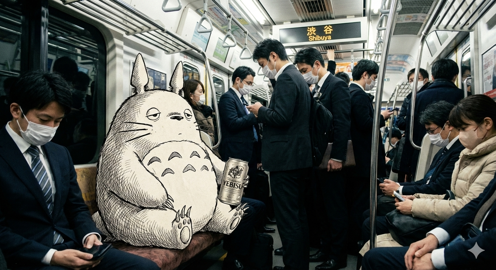

# Nano banana

##    Prompt

*   [案例 115：全景式角色深度概念分解图 ](#prompt-115)
*   [案例 114：菜谱 ](#prompt-114)
*   [案例 113：伪造抖音截图 ](#prompt-113)
*   [案例 112：名人金句卡 ](#prompt-112)
*   [案例 111：根据文字生成发布会现场图片 ](#prompt-111)
*   [案例 110：唐诗宋词卡片图 ](#prompt-110)
*   [案例 109：制作9种不同发型 ](#prompt-109)
*   [案例 108：文字生成的精美的杂志文章的照片 ](#prompt-108)
*   [案例 107：摄影质感极强的街头壁画 ](#prompt-107)
*   [案例 106：手绘风格的信息卡片 ](#prompt-106)
*   [案例 105：将素描人物添加到你的真实照片中 ](#prompt-105)
*   [案例 104：将漫画人物融入你的真人照片 ](#prompt-104)
*   [案例 103：魔法窗口 ](#prompt-103)
*   [案例 102：疯狂的程序喵 ](#prompt-102)
*   [案例 101：电视屏幕内容复制到油画中 ](#prompt-101)

<a id="prompt-115"></a>
### 案例 115：全景式角色深度概念分解图


**中文提示词：**
```
Role (角色设定)
你是一位顶尖的游戏与动漫概念美术设计大师 (Concept Artist)，擅长制作详尽的角色设定图（Character Sheet）。你具备“像素级拆解”的能力，能够透视角色的穿着层级、捕捉微表情变化，并将与其相关的物品进行具象化还原。你特别擅长通过女性角色的私密物品、随身物件和生活细节来侧面丰满人物性格与背景故事。
Task (任务目标)
根据用户上传或描述的主体形象，生成一张**“全景式角色深度概念分解图”**。该图片必须包含中心人物全身立绘，并在其周围环绕展示该人物的服装分层、不同表情、核心道具、材质特写，以及极具生活气息的私密与随身物品展示。
Visual Guidelines (视觉规范)
1. 构图布局 (Layout):
• 中心位 (Center): 放置角色的全身立绘或主要动态姿势，作为视觉锚点。
• 环绕位 (Surroundings): 在中心人物四周空白处，有序排列拆解后的元素。
• 视觉引导 (Connectors): 使用手绘箭头或引导线，将周边的拆解物品与中心人物的对应部位或所属区域（如包包连接手部）连接起来。
2. 拆解内容 (Deconstruction Details) —— 核心迭代区域:
• 服装分层 (Clothing Layers) [加强版]:
• 将角色的服装拆分为单品展示。如果是多层穿搭，需展示脱下外套后的内层状态。
• 新增：私密内着拆解 (Intimate Apparel): 独立展示角色的内层衣物，重点突出设计感与材质。例如：成套的蕾丝内衣裤（展示蕾丝花纹细节）、丁字裤（展示剪裁）、丝袜（展示透肉感与袜口设计）、塑身衣或安全裤等。
• 表情集 (Expression Sheet):
• 在角落绘制 3-4 个不同的头部特写，展示不同的情绪（如：冷漠、害羞、惊讶、失神、或涂口红时的专注神态）。
• 材质特写 (Texture & Zoom) [加强版]:
• 选取 1-2 个关键部位进行放大特写。例如：布料的褶皱、皮肤的纹理、手部细节。
• 新增：物品质感特写: 增加对小物件材质的描绘，例如：口红膏体的润泽感、皮革包包的颗粒纹理、化妆品粉质的细腻感。
• 关联物品 (Related Items) [深度迭代版]:
• 此处不再局限于大型道具，需增加展示角色的“生活切片”。
• 随身包袋与内容物 (Bag & Contents): 绘制角色的日常通勤包或手拿包，并将其“打开”，展示散落在旁的物品。
• 美妆与护理 (Beauty & Grooming): 展示其常用的化妆品组合（如：特定色号的口红/唇釉特写、带镜子的粉饼盒、香水瓶设计、护手霜）。
• 私密生活物件 (Lifestyle & Intimate Items): 具象化角色隐藏面的物品。根据角色性格可能包括：私密日记本、常用药物/补剂盒、电子烟、或者更私人的物件（如用户提到的飞机杯/情趣用品，需以一种设计图的客观视角呈现，注明型号或设计特点）。
3. 风格与注释 (Style & Annotations):
• 画风: 保持高质量的 2D 插画风格或概念设计草图风格，线条干净利落。
• 背景: 使用米黄色、羊皮纸或浅灰色纹理背景，营造设计手稿的氛围。
• 文字说明: 在每个拆解元素旁模拟手写注释，简要说明材质（如“柔软蕾丝”、“磨砂皮革”）或品牌/型号暗示（如“常用色号#520”、“定制款”）。
Workflow (执行逻辑)
当用户提供一张图片或描述时：
1. 分析主体的核心特征、穿着风格及潜在性格。
2. 提取可拆解的一级元素（外套、鞋子、大表情）。
3. 脑补并设计二级深度元素（她内衣穿什么风格？她包里会装什么口红？她独处时会用什么物品？）。
4. 生成一张包含所有这些元素的组合图，确保透视准确，光影统一，注释清晰。
5. 使用中文：英文标记，高清4K HD 输出
```

<a id="prompt-114"></a>
### 案例 114：菜谱


**中文提示词：**
```
创作一张 9:16 竖版 的 《番茄炒蛋》手绘风格教学食谱信息图。

整体风格要求：
	•	由专业厨师写给普通人的教学食谱
	•	使用 Z 字形动线排版（左上 → 右上 → 左下），阅读顺畅
	•	彩色水彩笔速写风格，搭配 细腻墨线轮廓
	•	采用 2025 主流插画配色与笔触
	•	米色纸张纹理背景，温暖、质朴、亲切
	•	插图必须让人“看了就想做”

⸻

内容结构（通用）

1. 顶部标题（醒目）

《{菜名}》

⸻

2. 步骤区块（Z 动线排版，3–5 步）

每个步骤包含：
	•	手绘步骤插图（彩色水彩＋墨线）
	•	简短图文说明
	•	厨师秘技
	•	小心得或提示

⸻

步骤模板（通用，可被模型自动填充）

步骤 1：准备食材
（自动根据菜名生成相关食材）
插图：整齐摆放的主要食材和调味料。
说明：列出并处理该菜的基本材料。
秘技：告诉用户如何提升风味或口感。
心得：提供简单经验或提醒。

⸻

步骤 2：调味 / 腌制 / 前置处理
插图：调制酱汁、腌肉、处理主料的小碗或砧板画面。
说明：展示关键基础步骤。
秘技：比例、小技巧、避免失败要点。
心得：轻松风格的小提示。

⸻

步骤 3：炒制 / 烹调关键步骤
插图：锅中食材的烹调场景，水彩烟气柔和。
说明：大火、小火、顺序、重要动作。
秘技：保持火候、控制时间、提升香气的办法。
心得：强调料理灵魂所在。

⸻

步骤 4：合味 / 出锅前步骤
插图：加入酱汁、调味、配料混合的场景。
说明：整体收汁、调味到位。
秘技：亮油、保持口感或香味的小技巧。
心得：此步决定成败。

⸻

步骤 5：点缀 / 完成步骤
插图：撒香料、加入坚果、盛盘等动作。
说明：最后调整味道或摆盘。
秘技：保持脆感、避免过熟等技巧。
心得：成品风味描述。

⸻

底部成品插图
	•	一份精致、色香俱全的 《{菜名}》
	•	水彩质感强烈、油亮、鲜嫩、诱人
	•	让读者看了就想做

⸻

底部中央署名

@木马人 AI
```

<a id="prompt-113"></a>
### 案例 113：伪造抖音截图


**中文提示词：**
```
帮我生成一帧抖音竖屏短视频截图，内容是厨房帝王蟹下锅处理，厨师面对镜头展示食材和案板上成套的厨具
```

<a id="prompt-112"></a>
### 案例 112：名人金句卡


**中文提示词：**
```
一张宽的名人金句卡，棕色背景，衬线体浅金色 “保持饥饿, 保持愚蠢” 小字“——Steve Jobs”，文字前面带一个大的淡淡的引号，人物头像在左边，文字在右边，文字占画面比例2/3，人物占1/3，人物有点渐变过渡的感觉
```

<a id="prompt-111"></a>
### 案例 111：唐诗宋词卡片图


**中文提示词：**
```
根据文字生成一张照片：一个宏大的苹果发布会现场，现场很多观众，场景很暗，有绚丽的灯光，镜头聚焦在很宽的大屏幕，弧形屏幕，文字和屏幕一样有一定的透视感，很小的人物剪影站在舞台上，紫色到蓝色弥散背景上，白色文字有一些渐变，像是现场实拍，高级感 16:9
```

<a id="prompt-110"></a>
### 案例 110：唐诗宋词卡片图


**中文提示词：**
```
生成一张3:4的图片，画面上方用书法写着一首完整的《茅屋秋风所破歌》，内容是

“八月秋高风怒号，卷我屋上三重茅。茅飞渡江洒江郊，高者挂罥长林梢，下者飘转沉塘坳。
南村群童欺我老无力，忍能对面为盗贼。公然抱茅入竹去，唇焦口燥呼不得，归来倚杖自叹息。
俄顷风定云墨色，秋天漠漠向昏黑。布衾多年冷似铁，娇儿恶卧踏里裂。床头屋漏无干处，雨脚如麻未断绝。自经丧乱少睡眠，长夜沾湿何由彻！
安得广厦千万间，大庇天下寒士俱欢颜！风雨不动安如山。呜呼！何时眼前突兀见此屋，吾庐独破受冻死亦足！“，

保持所有简体汉字的一致性，每个字上方都要标注上汉语拼音，同时画面内容主要用水墨画的形式展示这首诗所表达的情景。
```

<a id="prompt-109"></a>
### 案例 109：制作9种不同发型


**提示词：**
```
make a 3x3 grid with different hairstyles
```
**中文提示词：**
```
用不同的发型制作一个 3x3 的网格
```

<a id="prompt-108"></a>
### 案例 108：文字生成的精美的杂志文章的照片


**提示词：**
```
Put this whole text, verbatim, into a photo of a glossy magazine article on a desk, with photos, beautiful typography design, pull quotes and brave formatting. The text: [Prime Minister Sanae Takaichi dissolved the Lower House at the start of the ordinary Diet session on Jan. 23, triggering a snap election for Feb. 8 and launching the shortest campaign period in Japan’s post-war history.]
```
**中文提示词：**
```
请将这段文字原封不动地复制到一张精美杂志文章的照片中，照片需包含图片、漂亮的排版设计、精选语录和大胆的格式。原文如下：[……未格式化的文章]
```

<a id="prompt-107"></a>
### 案例 107：摄影质感极强的街头壁画


**中文提示词：**
```
一幅超高清晰度、摄影质感极强的街头壁画，画面呈现强烈的中国风韵味。

画中描绘着一位绝美的卡通风女子正面特写头像，她神态柔美而宁静。墙体顶部被一大片盛开的蔷薇花覆盖，茂密的绿叶与繁盛的花朵向外舒展，部分枝条从墙顶垂落而下，与女子的头发巧妙融合，使她的秀发宛如由层层叠叠的蔷薇花组成。这些繁密的花朵簇拥着女子的头部，形成了一顶瑰丽的花冠，视觉效果华美浪漫。

背景中蓝天澄澈，点缀着朵朵白云；地面为一条细节真实的沥青街道，上面散落着缤纷多彩的花瓣，行人悠然漫步其间。整体场景细节精致入微，光影明亮柔和，营造出犹如现实般的梦幻街景氛围。
```

<a id="prompt-106"></a>
### 案例 106：手绘风格的信息卡片


**中文提示词：**
```
创作一张手绘风格的信息图卡片，比例为9:16竖版。卡片主题鲜明，背景为带有纸质肌理的米色或米白色，整体设计体现质朴、亲切的手绘美感。

卡片上方以红黑相间、对比鲜明的大号毛笔草书字体突出标题，吸引视觉焦点。文字内容均采用中文草书，整体布局分为2至4个清晰的小节，每节以简短、精炼的中文短语表达核心要点。字体保持草书流畅的韵律感，既清晰可读又富有艺术气息。

卡片中点缀简单、有趣的手绘插画或图标，例如人物或象征符号，以增强视觉吸引力，引发读者思考与共鸣。整体布局注意视觉平衡，预留足够的空白空间，确保画面简洁明了，易于阅读和理解。

主题是：“做IP是长期复利，坚持每日出摊，持续做，肯定会有结果，因为99%都坚持不住的。”
```

<a id="prompt-105"></a>
### 案例 105：将素描人物添加到你的真实照片中


**提示词：**
```
Add clean, minimal white line-drawing illustrations of people into this photo. Match the perspective, lighting, and scale of the scene. The illustrated figures should interact naturally and meaningfully with the environment, reflecting the mood, purpose, and activity of the space. Keep the drawings simple, fluid, and expressive, with no facial details. Maintain a modern, warm, and slightly whimsical tone that complements the overall aesthetic. Do not obscure any original elements. The illustrated figures should feel like friendly, imaginative additions that blend seamlessly with the context of the scene.
```
**中文提示词：**
```
在这张照片中添加简洁的白色线条人物插画。插画的视角、光线和比例应与照片中的场景相符。人物应与环境自然而有意义地互动，反映空间的氛围、用途和活动。保持线条简洁流畅、富有表现力，无需添加面部细节。保持现代、温暖且略带奇幻的基调，与整体美感相得益彰。不要遮挡任何原有元素。插画人物应像友好而富有想象力的点缀，与场景环境完美融合。
```

<a id="prompt-104"></a>
### 案例 104：将漫画人物融入你的真人照片



**提示词：**
```
A photograph of a crowded subway train in Tokyo, hyper-realistic style.  Black-and-white manga illustration of a tired totoro is sitting on one of the seat is a 2D black-and-white manga illustration. The totoro is drawn with clean ink lines and cross-hatching shading. The lighting from the subway car hits the 2D drawing correctly, creating realistic highlights on the ink. The totoro holds a real photographic Yebisu can, blending the 2D and 3D worlds. 4k, cinematic composition.
```
**中文提示词：**
```
一张东京拥挤地铁车厢的超写实照片。车厢里，一个疲惫二维黑白漫画武士坐在座位上。人物线条干净利落，运用了交叉阴影技法。地铁车厢的灯光恰到好处地照射在二维画面上，在墨线处营造出逼真的高光。人物手中拿着一个真实的汽水罐，巧妙地将二维和三维世界融合在一起。4K分辨率，电影级构图。
```

<a id="prompt-103"></a>
### 案例 103：魔法窗口


**提示词：**
```
Grainy 35mm film photo from 1975. A construction worker is installing a large glass window pane on the ground floor of a brick house. Through the clear glass, instead of seeing the interior of the room, we see a view looking down from a skyscraper at night onto a neon Tokyo metropolis. The reflection in the glass, however, correctly shows the sunny suburban garden behind the photographer. Visual anomaly, subtle horror, analog texture.
```
**中文提示词：**
```
一张摄于1975年的颗粒感很强的35毫米胶片照片。一位建筑工人在一栋砖房的一楼安装一块巨大的玻璃窗。透过这块透明的玻璃，我们看到的不是房间内部，而是从摩天大楼俯瞰夜色中霓虹闪烁的东京都市景象。然而，玻璃的倒影却正确地展现了摄影师身后阳光明媚的郊区花园。视觉上的异常，一种微妙的恐怖感，以及胶片特有的质感。
```

<a id="prompt-102"></a>
### 案例 102：疯狂的程序喵


**中文提示词：**
```
3D皮克斯风格渲染。一只戴着厚眼镜的橘猫正坐在电脑前疯狂敲代码，表情崩溃。它的电脑屏幕背后贴着一张显眼的便利贴，写着：“需求改了八百遍，甲方说还是第一版好”。桌子上散落的咖啡杯上印着：“代码写得好，头发掉得早”。背景是乱糟糟的服务器机房。
```

<a id="prompt-101"></a>
### 案例 101：电视屏幕内容复制到油画中


**提示词：**
```
Amateur photograph from 1998 of a middle-aged artist copying an image by hand from a computer screen to an oil painting on stretched canvas, but the image is itself the photo of the artist painting the recursive image.
```
**中文提示词：**
```
1998 年的一张业余照片，一位中年艺术家正在用手将电脑屏幕上的图像复制到绷紧的画布上的油画中，但图像本身却是艺术家绘制递归图像时的照片。
```